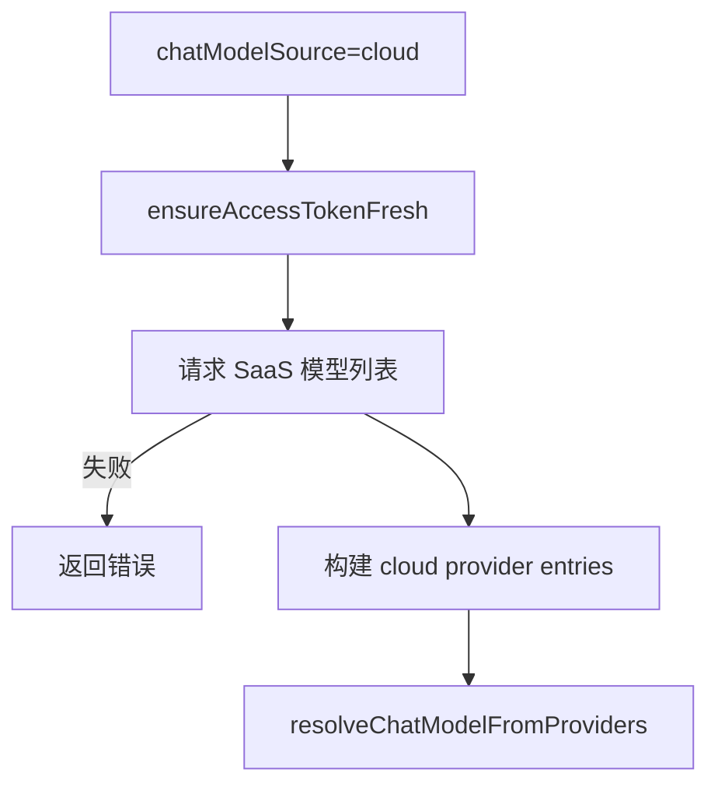

# Chat 流程（/ai/execute）

范围：

* `apps/server/src/routers/aiExecuteRoutes.ts`

* `apps/server/src/ai/pipeline/*`

* `apps/server/src/ai/application/services/chatStream/*`
* `apps/server/src/ai/infrastructure/*`
* `apps/server/src/ai/shared/context/*`

本文档描述统一入口 `/ai/execute` 的完整链路（命令、技能、聊天流与图片请求）。

## /ai/execute（统一入口）

核心参数：

* `intent`: `chat` / `image` / `command` / `utility`

* `responseMode`: `stream` / `json`

### SSE 聊天流（intent=chat，responseMode=stream）

主流程：

1. 解析 JSON 并归一化字段（`aiExecuteRoutes.ts`）。
2. 命令解析：仅当输入首部匹配 `/summary-history` 或 `/summary-title` 才触发。
3. 技能解析：从用户文本提取 `/skill/NAME`，按“当前项目 -> 父项目 -> 工作空间”解析。
4. 追加 `data-skill` parts 到用户消息，并写入 `selectedSkills`。
5. 初始化请求上下文（AsyncLocalStorage、abort signal、assistant message id）。
6. 确保 session preface 存在并保存最后一条消息。
7. 加载消息链，替换相对路径附件为 data URL。
8. 解析模型（显式模型优先，后按输入能力与历史偏好）。
9. 将 UI messages 转为 model messages（`messageConverter.ts` 注入 data-skill）。
10. 通过 ToolLoopAgent 流式返回 SSE，结束时落库 assistant 消息。

关键模块：

* 请求解析：`apps/server/src/routers/aiExecuteRoutes.ts`

* 管线入口：`apps/server/src/ai/pipeline/aiPipeline.ts`

* 上下文与通用流程：`apps/server/src/ai/shared/context/requestContext.ts`、`apps/server/src/ai/application/services/chatStream/chatStreamHelpers.ts`

* 持久化：`apps/server/src/ai/infrastructure/repositories/messageStore.ts`

* 消息链与附件：`apps/server/src/ai/infrastructure/repositories/messageChainLoader.ts`、`apps/server/src/ai/infrastructure/adapters/attachmentResolver.ts`

* 模型解析：`apps/server/src/ai/resolveChatModel.ts`、`apps/server/src/ai/application/services/chatStream/modelResolution.ts`

* 数据注入：`apps/server/src/ai/pipeline/messageConverter.ts`

* 流式与 SSE：`apps/server/src/ai/application/services/chatStream/streamOrchestrator.ts`

### /summary-title（session command）

1. 检测到 `/summary-title` 后不写入消息。
2. 从右侧叶子节点加载消息链并构建模型上下文。
3. 追加“标题生成”提示词后调用 LLM 生成标题。
4. 更新 `chatSession.title`。
5. SSE 返回 `data-session-title`（transient）与 finish。

### 图片请求（intent=image）

* `responseMode=stream`：仍通过聊天流（SSE）返回图片 part。

* `responseMode=json`：走 `runChatImageRequest`，返回 `{ sessionId, message }`。

图片生成子流程（共享）：

* 解析提示词（文本 + 图片 + 可选 mask）。

* 解析图片模型（`chatModelId`）。

* 若为图片编辑，进行遮罩规范化并上传至 S3。

* 调用 `generateImage`，生成图片并写入相对路径。

## 持久化与元数据

* `saveMessage` 使用物化路径保存消息，并合并 usage / timing 等 metadata。

* session error 存于 `chatSession.errorMessage`，成功后清空。

## 图片生成子流程（共享）

该流程被 `/chat/sse`（图片标签分支）与 `/ai/image` 共用：

* 从最后一条 user 消息解析提示词（文本 + 图片 + 可选 mask）。

* 校验 `chatModelId` 并解析图片模型。

* 若包含 mask，按模型要求生成 alpha/grey 遮罩并上传到 S3。

* 从 metadata 解析图片参数（数量、尺寸、比例、provider options）。

* 调用 `generateImage`，生成图片并保存为相对路径。

## 持久化与元数据

* `saveMessage` 使用物化路径保存消息，并合并 usage / timing 等 metadata。

* `createChatStreamResponse` 与 `createImageStreamResponse` 写入耗时与用量信息。

* session error 存于 `chatSession.errorMessage`，成功后清空。

## 模型构建流程（通过 model id 构建模型对象）

该流程说明如何从 `chatModelId`/`imageModelId` 构建出 AI SDK 模型实例。

关键入口：

* 聊天模型：`apps/server/src/ai/resolveChatModel.ts`

* 图片模型：`apps/server/src/ai/resolveImageModel.ts`

* 显式模型定义：`apps/server/src/ai/application/services/chatStream/modelResolution.ts`

核心逻辑（通用）：

1. 解析模型 id，要求 `{profileId}:{modelId}` 格式。
2. 读取 provider 配置（`getProviderSettings`），聊天模型会合并 CLI provider。
3. 从配置或注册表获取模型定义（包含 tags / providerId）。
4. 根据 providerId 选择适配器（`PROVIDER_ADAPTERS`），构建模型实例。
5. 若未显式指定模型，则按候选列表做 fallback；显式指定时不做 fallback。

聊天模型特殊点：

* 若 `chatModelSource=cloud`，先从 SaaS 拉取模型列表，再构建 provider entries。

* 未显式指定模型时，会根据输入能力（文本/图片/编辑）过滤候选模型。

图片模型特殊点：

* 不区分 cloud/local，仅从本地 provider 配置构建。

* `custom` provider 强制走 `openai` 适配器。

### 流程图（模型构建）

```mermaid
flowchart TD
  A[输入 chatModelId/imageModelId] --> B[解析 profileId 与 modelId]
  B -->|无效| B1[返回错误]
  B --> C[读取 provider 配置]
  C --> D[获取模型定义]
  D --> E[选择 adapter(PROVIDER_ADAPTERS)]
  E --> F[build AI SDK 模型实例]
  F -->|失败| F1[候选 fallback 或报错]
  F --> G[返回 model + modelInfo + modelDefinition]
```

### 聊天模型云端路径（可选）


