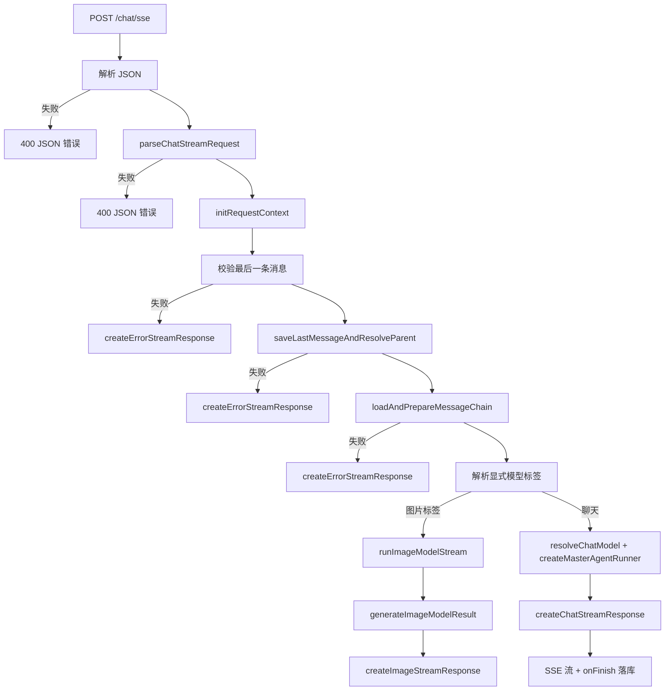
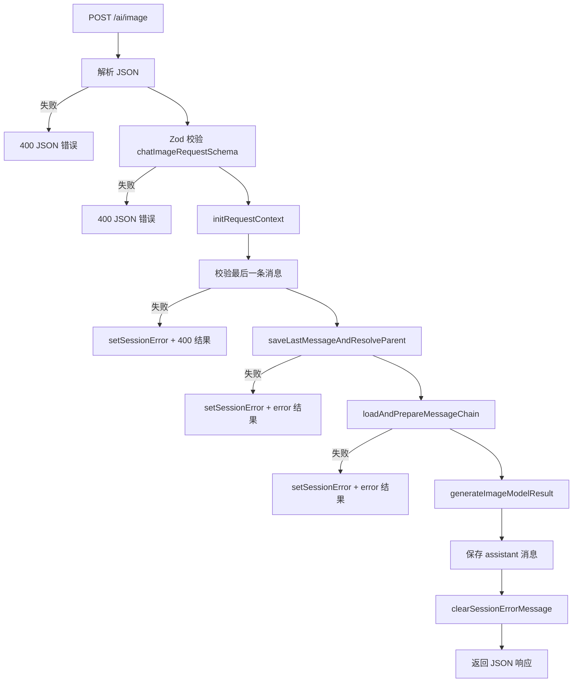

# Chat 流程（SSE + Image）

范围：

* `apps/server/src/routers/chatStreamRoutes.ts`

* `apps/server/src/routers/chatImageRoutes.ts`

* `apps/server/src/ai/chat-stream/*`

本文档描述 `/chat/sse` 与 `/ai/image` 的完整链路，包括校验、持久化、模型解析与响应输出。

## /chat/sse（SSE 聊天流）

主流程：

1. 解析 JSON 并在 `parseChatStreamRequest` 中归一化字段。
2. 初始化请求上下文（AsyncLocalStorage、abort signal、assistant message id）。
3. 校验最后一条消息（必须包含 `role` 与 `id`）。
4. 保存最后一条消息并确定父节点关系。
5. 加载消息链，并将相对路径附件替换为 data URL 供模型使用。
6. 解析模型路由：

   * 若显式模型带 `image_generation` 或 `image_edit` 标签，进入图片流程。

   * 否则根据输入能力与历史偏好解析聊天模型。
7. 通过 SSE 返回流式响应，并在结束时落库 assistant 消息。

关键模块：

* 请求解析：`apps/server/src/routers/chatStreamRoutes.ts`

* 上下文与通用流程：`apps/server/src/ai/chat-stream/requestContext.ts`、`apps/server/src/ai/chat-stream/chatStreamHelpers.ts`

* 持久化：`apps/server/src/ai/chat-stream/messageStore.ts`

* 消息链与附件：`apps/server/src/ai/chat-stream/messageChainLoader.ts`、`apps/server/src/ai/chat-stream/attachmentResolver.ts`

* 模型解析：`apps/server/src/ai/resolveChatModel.ts`、`apps/server/src/ai/chat-stream/modelResolution.ts`

* 流式与 SSE：`apps/server/src/ai/chat-stream/streamOrchestrator.ts`

错误处理：

* 请求非法或最后一条消息缺失 -> `createErrorStreamResponse` + 写入 session error。

* 模型解析失败 -> SSE 错误流。

* 流式过程中异常 -> 持久化错误 + SSE error finish。

### 流程图（SSE）



### /chat/sse 内的图片分支

图片分支与 `/ai/image` 共用同一生成流程：

* 解析提示词（文本 + 图片 + 可选 mask）。

* 解析图片模型（基于 `chatModelId`）。

* 若为图片编辑，进行遮罩规范化并上传至 S3。

* 调用 `generateImage` 生成图片，构建 data URL part 与持久化相对路径 part。

* SSE 输出图片 part 与元数据。

## /ai/image（JSON 图片请求）

主流程：

1. 解析 JSON，并用 `chatImageRequestSchema` 严格校验。
2. 初始化请求上下文（AsyncLocalStorage、abort signal、assistant message id）。
3. 校验最后一条消息（必须包含 `role` 与 `id`）。
4. 保存最后一条消息并确定父节点关系。
5. 加载消息链，并将相对路径附件替换为 data URL。
6. 调用 `generateImageModelResult` 生成图片结果。
7. 保存 assistant 消息（图片 part + revised prompt 元数据）。
8. 返回 JSON `{ sessionId, message }`。

关键模块：

* 请求校验：`apps/server/src/routers/chatImageRoutes.ts`

* Schema：`apps/server/src/ai/chat-stream/chatImageTypes.ts`

* 图片生成：`apps/server/src/ai/chat-stream/chatStreamService.ts`（generateImageModelResult）

* 提示词解析：`apps/server/src/ai/chat-stream/imagePrompt.ts`

* 图片编辑规范化：`apps/server/src/ai/chat-stream/imageEditNormalizer.ts`

* 图片落盘：`apps/server/src/ai/chat-stream/imageStorage.ts`

错误处理：

* Zod 校验失败 -> 400 JSON 错误。

* 最后一条消息非法 -> 写 session error + 400 结果。

* 生成失败 -> 写 session error + `{ ok: false, status, error }`。

### 流程图（/ai/image）



## 图片生成子流程（共享）

该流程被 `/chat/sse`（图片标签分支）与 `/ai/image` 共用：

* 从最后一条 user 消息解析提示词（文本 + 图片 + 可选 mask）。

* 校验 `chatModelId` 并解析图片模型。

* 若包含 mask，按模型要求生成 alpha/grey 遮罩并上传到 S3。

* 从 metadata 解析图片参数（数量、尺寸、比例、provider options）。

* 调用 `generateImage`，生成图片并保存为相对路径。

## 持久化与元数据

* `saveMessage` 使用物化路径保存消息，并合并 usage / timing 等 metadata。

* `createChatStreamResponse` 与 `createImageStreamResponse` 写入耗时与用量信息。

* session error 存于 `chatSession.errorMessage`，成功后清空。

## 模型构建流程（通过 model id 构建模型对象）

该流程说明如何从 `chatModelId`/`imageModelId` 构建出 AI SDK 模型实例。

关键入口：

* 聊天模型：`apps/server/src/ai/resolveChatModel.ts`

* 图片模型：`apps/server/src/ai/resolveImageModel.ts`

* 显式模型定义：`apps/server/src/ai/chat-stream/modelResolution.ts`

核心逻辑（通用）：

1. 解析模型 id，要求 `{profileId}:{modelId}` 格式。
2. 读取 provider 配置（`getProviderSettings`），聊天模型会合并 CLI provider。
3. 从配置或注册表获取模型定义（包含 tags / providerId）。
4. 根据 providerId 选择适配器（`PROVIDER_ADAPTERS`），构建模型实例。
5. 若未显式指定模型，则按候选列表做 fallback；显式指定时不做 fallback。

聊天模型特殊点：

* 若 `chatModelSource=cloud`，先从 SaaS 拉取模型列表，再构建 provider entries。

* 未显式指定模型时，会根据输入能力（文本/图片/编辑）过滤候选模型。

图片模型特殊点：

* 不区分 cloud/local，仅从本地 provider 配置构建。

* `custom` provider 强制走 `openai` 适配器。

### 流程图（模型构建）

```mermaid
flowchart TD
  A[输入 chatModelId/imageModelId] --> B[解析 profileId 与 modelId]
  B -->|无效| B1[返回错误]
  B --> C[读取 provider 配置]
  C --> D[获取模型定义]
  D --> E[选择 adapter(PROVIDER_ADAPTERS)]
  E --> F[build AI SDK 模型实例]
  F -->|失败| F1[候选 fallback 或报错]
  F --> G[返回 model + modelInfo + modelDefinition]
```

### 聊天模型云端路径（可选）


