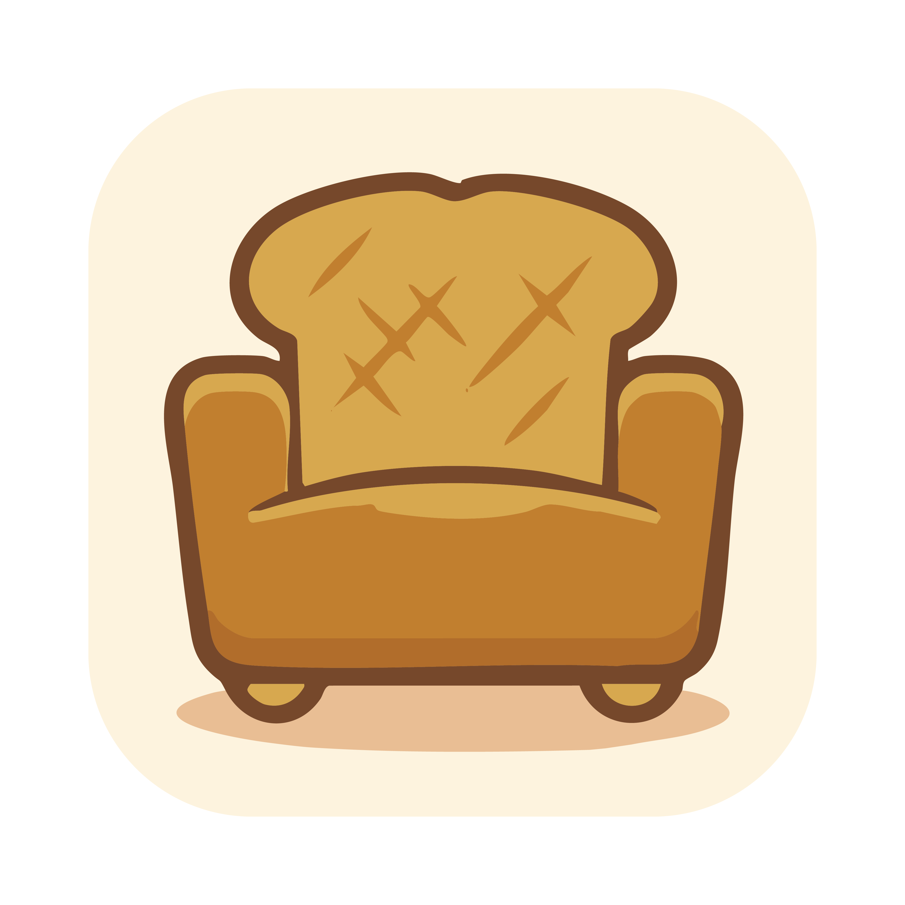
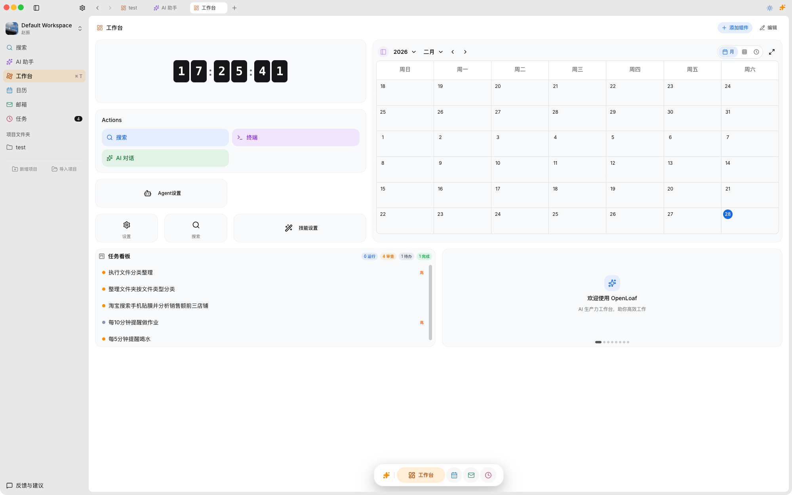
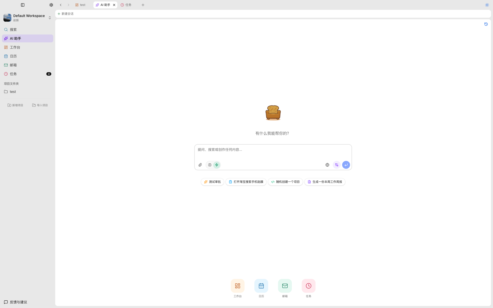
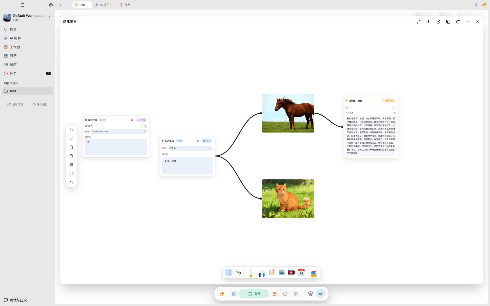

<div align="center">
  
  <h1>OpenLoaf</h1>
  <p><strong>Open-Source AI Knowledge Base & Smart Workspace</strong></p>
  <p>Local-first, privacy-focused AI workspace — structured docs + multi-model chat + cross-platform desktop. Your data never leaves your device.</p>

  <a href="https://github.com/OpenLoaf/OpenLoaf/blob/main/LICENSE"></a>
  <a href="https://github.com/OpenLoaf/OpenLoaf/releases"></a>
  

  <br /><br />
  <a href="https://github.com/OpenLoaf/OpenLoaf/releases/latest">Download for macOS / Windows / Linux</a>
  <br /><br />
  <strong>English</strong> | <a href="../README.md">简体中文</a>
</div>

---

> **⚠️ Note: This project is still in early development. Features and APIs may change at any time — please use with caution in production environments.** If you encounter any bugs or have suggestions, feel free to submit feedback via the "Feedback & Suggestions" button in the bottom-left corner of the app. We take every piece of feedback seriously.

---

## About

OpenLoaf is a modern, full-stack AI knowledge base and smart workspace application. It combines **Notion**-style hierarchical document management with **ChatGPT/Claude**-level AI conversation, creating a second brain that doesn't just chat — it retains knowledge.

Everything in OpenLoaf is organized around **Projects**. Each project is a self-contained folder — documents, conversations, files, tasks, and AI context all live together in one place. Switch between projects seamlessly, and AI always knows exactly which project you're working on.

> **Why "OpenLoaf"?** The logo is a bread-shaped sofa — "Loaf" means both a loaf of bread and lounging around. We want using OpenLoaf to feel as cozy as sinking into a sofa.

<div align="center">
  
  <br />
  <sub>Workspace: clock, calendar, task board, and quick actions at a glance</sub>
</div>

---

## Features

### AI Agents

More than a chatbot — OpenLoaf's AI can **actually get things done**. Built-in system agents include a Document Assistant, Terminal Assistant, Browser Assistant, Email Assistant, Calendar Assistant, and more. The AI understands your intent, breaks down tasks, chains tools together, and collaborates across agents to complete multi-step workflows autonomously. Just give the command — AI handles the rest.

<div align="center">
  
  <br />
  <sub>AI automatically invokes the Terminal Assistant to organize files, then reports back</sub>
</div>

### AI Chat

Built-in multi-model AI chat supporting **OpenAI**, **Anthropic Claude**, **Google Gemini**, **DeepSeek**, **Qwen**, **xAI Grok**, and local models via **Ollama**. The AI is aware of your full project context — file structure, document content, conversation history — truly understanding your project. Supports file attachments, web search, custom system prompts, and one-click model switching to compare answer quality.

### Infinite Canvas (Board)

A ReactFlow-powered infinite canvas — not just a whiteboard, but your **visual thinking space**. Supports free-form drag-and-drop layouts, sticky notes, image/video nodes, freehand drawing, AI image generation (text-to-image), AI video generation, and image content understanding. Mind maps, flowcharts, and inspiration walls can all coexist on a single canvas.

<div align="center">
  
  <br />
  <sub>Canvas with AI image generation, video creation, freehand drawing, and sticky notes</sub>
</div>

### AI Image & Video Generation

Turn ideas into visuals instantly. OpenLoaf integrates AI-powered **text-to-image generation** and **AI video generation** directly into the canvas and chat. Generate illustrations, concept art, or marketing visuals from text prompts, then drag them onto your canvas for further editing. AI can also **understand image content** — describe what's in a photo, extract text, or answer questions about visual materials. All generation happens through your own API keys — no third-party services store your creative output.

### Rich Text Editor

A powerful block-based editor built on [Plate.js](https://platejs.org/). Supports headings, lists, blockquotes, code blocks, LaTeX formulas, tables, media embeds, bi-directional links, and more. A WYSIWYG editing experience with a rich toolbar and keyboard shortcuts makes writing and organizing documents effortless. Freely structure your notes, project docs, and research materials through infinitely nested pages.

### Kanban Task Management

A Trello-style board view managing the full task lifecycle through **To Do → In Progress → Review → Done** columns. Supports drag-and-drop sorting, priority labels (Urgent / High / Medium / Low), trigger modes (manual / scheduled / conditional), and due date reminders. AI can automatically create tasks and submit them for review — just approve or send back with one click, and let AI do the work for you.

### All-in-One Productivity Suite

No more switching between apps — everything you need is built in:

- **Terminal** — A full shell emulator right inside OpenLoaf. AI agents can run commands directly — create directories, move files, execute scripts — with natural language instructions, always confirming before execution.
- **Email** — Multi-account email management with IMAP sync, rich-text composing, and AI-assisted drafting, summarization, and key info extraction.
- **Calendar** — Schedule management with **native system calendar sync** (macOS Calendar / Google Calendar). Day / week / month views, AI-powered scheduling, and smart reminders.
- **File Manager** — Grid / list / column views, drag-and-drop upload, file preview (images, PDFs, Office docs, code). AI can read and operate on your project files directly.
- **Workspace Widgets** — Customizable dashboard with clock, calendar, task summary, quick actions, and agent settings — your mission control at a glance.

---

## Use Cases

- **Research & Writing** — Collect references, take structured notes, chat with AI about your materials, and produce polished documents — all within one project folder.
- **Software Development** — Manage specs and design docs, use AI to generate code snippets, run commands in the terminal, and track tasks on the kanban board.
- **Creative Design** — Brainstorm on the infinite canvas, generate images and videos with AI, organize visual assets in the file manager, and iterate with AI feedback.
- **Project Management** — Create a project per client or initiative, manage tasks through the kanban workflow, schedule meetings on the calendar, and coordinate via email — without leaving OpenLoaf.
- **Personal Knowledge Base** — Build your second brain: clip web content, write journals, link ideas with bi-directional references, and let AI help you connect the dots across your knowledge.

---

## Privacy & Security

OpenLoaf is built with a **local-first, privacy-by-design** philosophy. Your data stays on your device — always.

- **100% Local Storage** — All documents, conversations, files, and databases are stored on your local filesystem (`~/.openloaf/`). Nothing is uploaded to any cloud server.
- **Bring Your Own Key (BYOK)** — You connect your own API keys for AI models (OpenAI, Claude, Gemini, etc.). OpenLoaf never proxies your requests through a third-party server — API calls go directly from your machine to the model provider.
- **Offline-Capable** — Core features (editor, file manager, task board) work fully offline. Connect local models via Ollama for a completely air-gapped AI experience.
- **No Telemetry, No Tracking** — OpenLoaf does not collect analytics, usage data, or any form of telemetry. What happens on your machine stays on your machine.
- **Open Source & Auditable** — The entire codebase is open under AGPLv3. You can inspect, audit, and verify every line of code that touches your data.

> **TL;DR** — Unlike cloud-based AI tools, OpenLoaf ensures your intellectual property, API keys, and personal data never leave your control.

---

## Quick Start

### Prerequisites

- **Node.js** >= 20
- **pnpm** >= 10 (`corepack enable`)

### Installation

```bash
# Clone the repository
git clone https://github.com/OpenLoaf/OpenLoaf.git
cd OpenLoaf

# Install dependencies
pnpm install

# Initialize the database
pnpm run db:push

# Start the development environment (Web + Server)
pnpm run dev
```

Open your browser at [http://localhost:3001](http://localhost:3001). To launch the desktop app: `pnpm run desktop`.

## Tech Stack

Next.js 16 / React 19 / Electron 40 / Hono + tRPC / Prisma + SQLite / Plate.js / Vercel AI SDK / Yjs / ReactFlow / Turborepo + pnpm

## Roadmap

- [ ] **Full Web Browser Access** — Use OpenLoaf directly from any browser without installing the desktop app (partially available, under active development)
- [ ] More to come...

## Contributing

We warmly welcome community contributions! Here's how:

1. **Fork** this repository
2. Create your feature branch: `git checkout -b feature/my-feature`
3. Commit your changes: `git commit -m 'feat: add my feature'`
4. Push to remote: `git push origin feature/my-feature`
5. Open a **Pull Request**

> Before submitting a PR, please read the [Contributing Guide](../.github/CONTRIBUTING.md) and sign the [CLA (Contributor License Agreement)](../.github/CLA.md).

## License

OpenLoaf is dual-licensed:

- **Open Source** — [GNU AGPLv3](../LICENSE): Free to use, modify, and distribute, provided you keep the same license for derivative works.
- **Commercial** — For closed-source commercial use or to waive AGPL requirements, contact us for a commercial license.

---

<div align="center">
  <a href="https://github.com/OpenLoaf/OpenLoaf/issues">Bug Reports & Feature Requests</a>
  <br /><br />
  <sub>OpenLoaf — Redefine your AI collaboration space.</sub>
</div>
