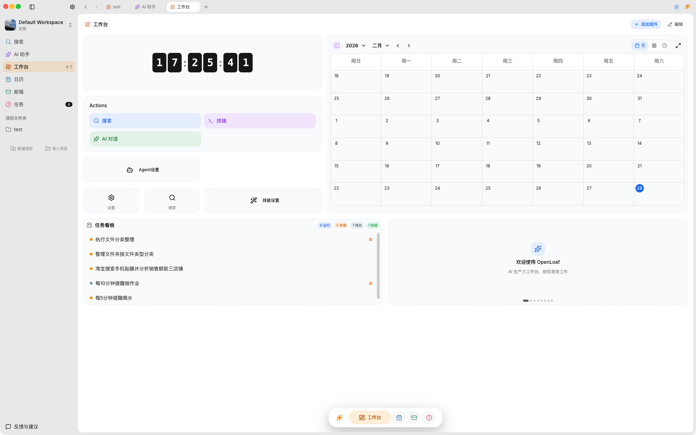
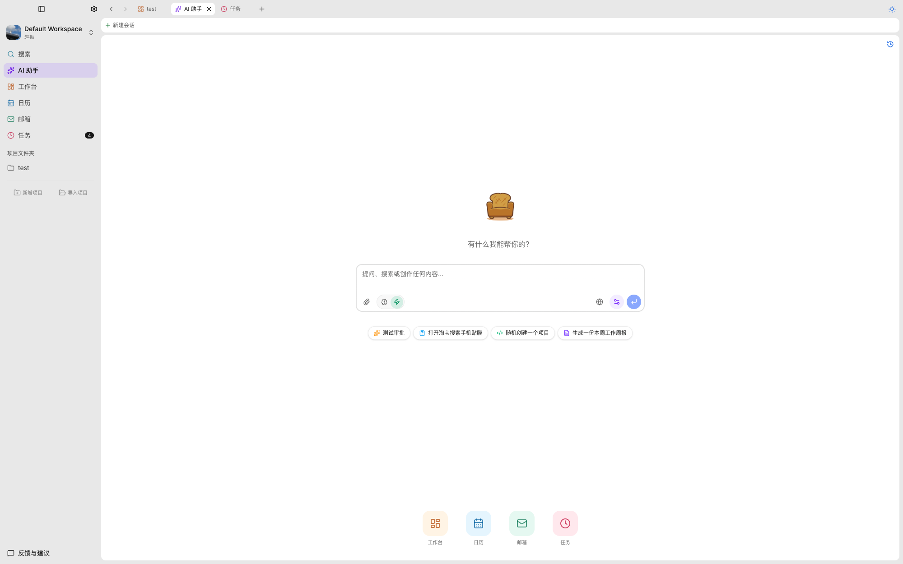
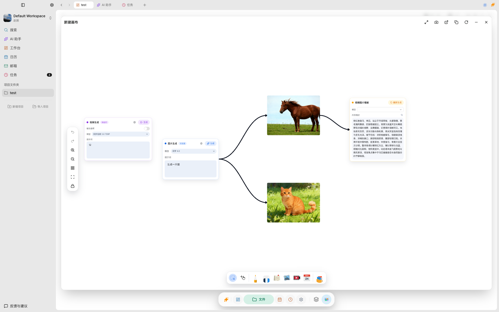

<div align="center">
  
  <h1>OpenLoaf</h1>
  <p><strong>オープンソース AI 生産性デスクトップアプリ - プロジェクト中心・マルチエージェント・ローカルファースト</strong></p>
  <p>各プロジェクトには専用の AI エージェントチーム、メモリ、スキルがあります。プロジェクト間はリンクによって知識を共有し、Secretary Agent がすべてをオーケストレーションします。データはすべてあなたのデバイスに保存されます。</p>

  <p>AI セクレタリー &nbsp;|&nbsp; 独立プロジェクト &nbsp;|&nbsp; プロジェクトリンク &nbsp;|&nbsp; マルチエージェント &nbsp;|&nbsp; キャンバス &nbsp;|&nbsp; メール &nbsp;|&nbsp; カレンダー &nbsp;|&nbsp; タスク</p>

  <blockquote><strong>1つのアプリ、複数のプロジェクトウィンドウ。各プロジェクトには専用の AI チームがあり、プロジェクト間で知識を共有できます。Secretary Agent がすべてをつなぎ、100% ローカルで動作します。</strong></blockquote>

  <a href="https://github.com/OpenLoaf/OpenLoaf/blob/main/LICENSE"></a>
  <a href="https://github.com/OpenLoaf/OpenLoaf/releases"></a>
  

  <br /><br />
  <a href="https://github.com/OpenLoaf/OpenLoaf/releases/latest">macOS / Windows / Linux 版をダウンロード</a>
  <br /><br />
  <a href="./README_en.md">English</a> | <a href="./README.md">简体中文</a> | <strong>日本語</strong>
</div>

---

> **⚠️ このプロジェクトは現在開発中です。機能や API は変更される可能性があります。本番環境での使用にはご注意ください。** バグを発見したりアイデアがある場合は、アプリ内蔵のフィードバックボタンから送信してください。

---

## 概要

OpenLoaf は、**プロジェクトを独立したワークスペース** として扱うことを中心に設計されたローカルファーストの AI 生産性デスクトップアプリです。各プロジェクトは専用のウィンドウで開き、AI アシスタント、ファイルツリー、ターミナル、タスクボード、キャンバスといったフル機能を備えた環境を提供します。

メインウィンドウには **Secretary Agent** がパーソナルアシスタントとして常駐し、質問への回答、カレンダーやメールの管理、複雑なタスクを適切なプロジェクトの AI エージェントへのルーティングを行います。プロジェクト横断的な作業では、プロジェクト間の **リンク** によってメモリとスキルを共有できます。

### 動作の仕組み

```text
あなた（ボス）
  |
  v
Secretary Agent（メインウィンドウ - パーソナルアシスタント）
  |
  |-- シンプルなタスク -> 直接処理
  |-- 単一プロジェクトのタスク -> Project Agent を起動
  `-- プロジェクト横断タスク -> 複数の Project Agent を並列起動
        |
        `-- Project Agent（プロジェクトウィンドウ）
              |
              `-- Worker Agents（探索、計画、コーディングなど）
```

**メインウィンドウ** - あなたのコマンドセンター：
- AI セクレタリーがグローバルタスク（カレンダー、メール、プロジェクト横断クエリ）を処理
- アクティビティタイムラインで最近のプロジェクト、会話、キャンバスを表示
- プロジェクトグリッドでプロジェクトの閲覧と起動

**プロジェクトウィンドウ** - 各プロジェクトの専用環境：
- プロジェクト固有のメモリとスキルを持つ AI アシスタント
- ファイルエクスプローラー、ターミナル、タスクボード、キャンバス
- 他のプロジェクトへのリンク（メモリとスキルが自動的に注入）

<div align="center">
  
</div>

---

## 機能

### マルチエージェントアーキテクチャ

OpenLoaf の AI は単一のチャットボットではなく、企業の協業体制をモデルにした **階層型エージェントシステム** です：

| エージェント | 役割 | スコープ |
|-------------|------|---------|
| **Secretary** | メインウィンドウのパーソナルアシスタント | グローバル：カレンダー、メール、プロジェクトルーティング、プロジェクト横断クエリ |
| **Project Agent** | 各プロジェクト専用アシスタント | プロジェクト内：ファイル、コード、ドキュメント、ターミナル、タスク |
| **Worker Agents** | オンデマンドで起動される専門サブエージェント | 特化：探索、計画、コーディング、レビュー |

Secretary は最も効率的な経路を選択します。シンプルな質問には即座に回答し、プロジェクト固有のタスクは対応する Project Agent にルーティングし、複雑なマルチプロジェクトタスクは並列エージェントを起動します。

### 独立プロジェクトウィンドウ

各プロジェクトは専用のウィンドウ（Electron）またはブラウザタブ（Web）で開きます。コンテキスト切り替え不要で、複数のプロジェクトを完全に分離した状態で同時に作業できます。

プロジェクトは **ユーザー定義のタイプラベル**（例：「コード」「ドキュメント」「ナレッジベース」）で視覚的にグループ化できます。タイプはあくまで表示ラベルであり、システム内部ではすべてのプロジェクトを同等に扱います。

### プロジェクトリンク

任意のプロジェクトを他のプロジェクトにリンクできます。リンクすると：
- リンク先プロジェクトの **メモリ** が現在のプロジェクトの AI コンテキストに注入される
- リンク先プロジェクトの **スキル** が現在のプロジェクトのエージェントで利用可能になる
- ナレッジベース、デザインシステムドキュメント、コーディング規約などの複数プロジェクトへの共有に最適

### メモリ＆スキルシステム

3 階層のメモリ構造：

| レベル | パス | 用途 |
|--------|------|------|
| **ユーザー** | `~/.openloaf/memory/` | 個人の好み、習慣、グローバルコンテキスト |
| **プロジェクト** | `<projectPath>/.openloaf/memory/` | プロジェクト固有のアーキテクチャ判断と規約 |
| **リンクプロジェクト** | リンク先プロジェクトから自動ロード | 共有知識（例：コーディング規約、API ドキュメント） |

スキルも同様のパターンに従います。グローバルスキル ＋ プロジェクト固有スキルがあり、AI エージェントが実行時に自動的に検出してロードします。

スキルは `SKILL.md` ファイルで定義される再利用可能な Markdown ワークフローです。`~/.agents/skills/` に配置すればグローバルスキルとして、`<projectPath>/.agents/skills/` に配置すればプロジェクト固有スキルとして使用でき、エージェントが必要に応じて説明文と関連ツール依存関係をロードします。

OpenLoaf は **MCP（Model Context Protocol）** サーバーもサポートしています。`stdio`、`http`、`sse` 経由で外部ツールを接続し、`~/.openloaf/mcp-servers.json`（グローバル）または `<projectPath>/.openloaf/mcp-servers.json`（プロジェクト別）で設定できます。Claude Desktop、Cursor、VS Code、Cline、Windsurf などの JSON 設定をインポートして、GitHub、データベース、ファイルシステム、Slack などの機能をエージェントに公開できます。

### AI チャット

**OpenAI**、**Anthropic Claude**、**Google Gemini**、**DeepSeek**、**Qwen**、**xAI Grok**、および **Ollama** 経由のローカルモデルをサポートするマルチモデル AI チャット。AI はプロジェクトのフルコンテキスト（ファイル構造、ドキュメント内容、会話履歴）を認識し、内蔵メモリによって会話間の知識を保持します。

<div align="center">
  
</div>

### 無限キャンバス

ReactFlow ベースの無限キャンバスで、ビジュアルシンキングを実現します。付箋、画像、動画、フリーハンド描画、AI 画像生成、AI 動画生成、画像内容理解をサポート。マインドマップ、フローチャート、インスピレーションボードを1つのキャンバスにまとめられます。

<div align="center">
  
</div>

### 内蔵生産性ツール

すべてが1つのアプリに統合。ウィンドウの切り替えは不要です：

- **ターミナル** - フル機能のターミナルエミュレーター。AI エージェントはあなたの承認後にコマンドを実行可能
- **メール** - マルチアカウント IMAP メール。AI によるドラフト作成と要約をサポート
- **カレンダー** - ネイティブカレンダー同期（macOS / Google Calendar）。AI によるスケジューリング
- **ファイルマネージャー** - グリッド / リスト / カラム表示、ドラッグ＆ドロップ、ファイルプレビュー（画像、PDF、Office、コード）
- **タスクボード** - カンバンボード（To Do → 進行中 → レビュー → 完了）。優先度ラベルと AI タスク作成をサポート
- **リッチテキストエディター** - [Plate.js](https://platejs.org/) ベースのブロックエディター。LaTeX、テーブル、コードブロック、双方向リンクをサポート

---

## ユースケース

- **ソフトウェア開発** - 各リポジトリをプロジェクトとして管理。共有の「コーディング規約」プロジェクトをリンクして、すべてのリポジトリで一貫した AI 動作を実現
- **研究・執筆** - 「参考資料」プロジェクトをナレッジベースとして作成し、論文プロジェクトにリンク。AI があなたの厳選した情報源から資料を引用
- **コンテンツ制作** - キャンバスでブレインストーミング、AI で画像生成、エディターで執筆、タスクボードで成果物を追跡
- **プロジェクト管理** - クライアントごとに1プロジェクト。Secretary Agent がプロジェクト横断の概要を提供し、カレンダーとメールで連携を維持
- **パーソナルナレッジベース** - メモ、ウェブクリッピング、ジャーナルエントリーを蓄積。ワークプロジェクトにリンクして AI がコンテキストを自動的に結びつける

---

## なぜ OpenLoaf か

### 現在の課題

- **AI ワークフローの断片化** - 1つの作業に5つのウィンドウを切り替える必要がある
- **プロジェクトコンテキストの欠如** - AI は会話間ですべてを忘れる。毎回プロジェクトの背景を説明し直す必要がある
- **プロジェクト間のサイロ化** - プロジェクトが知識を共有できない。コーディング規約プロジェクトがコードリポジトリを助けられない
- **クラウドロックイン** - データは他社のサーバーに保存され、AI モデルを自由に選択できない

### OpenLoaf のアプローチ

- **プロジェクト中心** - 各プロジェクトは AI エージェント、メモリ、スキルを備えた自己完結型の環境
- **知識の共有リンク** - プロジェクトは明示的なリンクによってコンテキストを共有。ナレッジベースがリンクされたすべてのプロジェクトを強化
- **マルチエージェントルーティング** - Secretary Agent がオーケストレーションを担当。シンプルなタスクは高速処理、複雑なタスクは最適な専門エージェントに委譲
- **ローカルファースト** - すべてのデータはローカルに保存（`~/.openloaf/`）。API キーは自前で管理。テレメトリやトラッキングなし
- **箱から出してすぐ使える** - ダウンロード、インストール、起動。サーバー、データベース、Docker は不要

### Loaf = パン + のんびり

OpenLoaf のロゴはパン型のソファです。**Loaf** には「パン」と「のんびりくつろぐ」の両方の意味があります。面倒な作業は AI に任せて、あなたは重要な判断に集中しましょう。

---

## プライバシーとセキュリティ

- **100% ローカルストレージ** - すべてのデータはファイルシステム（`~/.openloaf/`）に保存。クラウドサーバーへのアップロードなし
- **BYOK（Bring Your Own Key）** - AI API キーは自前で設定。API コールはデバイスからモデルプロバイダーに直接送信
- **オフラインで動作** - コア機能は完全オフラインで動作。Ollama を使えば完全に隔離された AI 体験が可能
- **テレメトリなし** - アナリティクス、使用状況データ、トラッキングは一切なし。デバイスで起きたことはデバイスに留まる
- **オープンソース＆監査可能** - AGPLv3 による完全なコードベース。データに触れるすべてのコードを検査可能

---

## クイックスタート

### 前提条件

- **Node.js** >= 20
- **pnpm** >= 10（`corepack enable` を実行）

### インストール

```bash
# リポジトリをクローン
git clone https://github.com/OpenLoaf/OpenLoaf.git
cd OpenLoaf

# 依存関係をインストール
pnpm install

# データベースを初期化
pnpm run db:migrate

# 開発環境を起動（Web + Server）
pnpm run dev
```

[http://localhost:3001](http://localhost:3001) を開いてください。デスクトップアプリは `pnpm run desktop` で起動できます。

---

## アーキテクチャ

```text
+----------------------------------------------------+
|                    OpenLoaf                        |
|                                                    |
|  メインウィンドウ                                   |
|  |-- Secretary Agent（グローバル AI アシスタント）   |
|  |-- アクティビティタイムライン（最近の履歴）        |
|  |-- プロジェクトグリッド（タイプ別全プロジェクト）  |
|  |-- カレンダー、メール、キャンバス（グローバル機能）|
|  `-- 設定                                          |
|                                                    |
|  プロジェクトウィンドウ（プロジェクトごとに1つ）     |
|  |-- Project Agent（プロジェクトスコープ AI）        |
|  |-- ファイルツリー、ターミナル、検索                |
|  |-- タスクボード、キャンバス                        |
|  |-- リンクプロジェクト（共有メモリ / スキル）       |
|  `-- プロジェクト設定＆スキル                       |
|                                                    |
|  データレイヤー                                     |
|  |-- ~/.openloaf/memory/          （ユーザーメモリ）|
|  |-- ~/.openloaf/config.json      （プロジェクト登録）|
|  |-- ~/.openloaf/openloaf.db      （SQLite データベース）|
|  |-- <project>/.openloaf/memory/  （プロジェクトメモリ）|
|  `-- <project>/.agents/skills/    （プロジェクトスキル）|
+----------------------------------------------------+
```

### プロジェクト構成

```text
apps/
  web/          - Next.js 16 フロントエンド（静的エクスポート、React 19）
  server/       - Hono バックエンド、tRPC API
  desktop/      - Electron 40 デスクトップシェル
packages/
  api/          - tRPC ルータータイプ＆共有 API ロジック
  db/           - Prisma 7 データベーススキーマ（SQLite）
  ui/           - shadcn/ui コンポーネントライブラリ
  config/       - 共有環境変数ユーティリティ＆パス解決
```

### 技術スタック

| 分野 | 技術 |
|------|------|
| フロントエンド | Next.js 16 / React 19 / Tailwind CSS 4 |
| バックエンド | Hono + tRPC / Prisma + SQLite |
| デスクトップ | Electron 40 |
| エディター | Plate.js |
| AI | Vercel AI SDK（OpenAI / Claude / Gemini / DeepSeek / Qwen / Grok / Ollama） |
| コラボレーション | Yjs |
| キャンバス | ReactFlow |
| ツールチェーン | Turborepo + pnpm monorepo |

---

## ロードマップ

- [x] マルチエージェントアーキテクチャ（Secretary → Project Agent → Workers）
- [x] 独立プロジェクトウィンドウ
- [x] 共有メモリ / スキルによるプロジェクトリンク
- [x] ユーザー定義プロジェクトタイプによるビジュアルグルーピング
- [x] メインウィンドウのアクティビティタイムライン
- [ ] 完全な Web ブラウザアクセス（デスクトップアプリ不要）
- [ ] 国際化（i18n） - 進行中
- [ ] プロジェクトテンプレートマーケットプレイス
- [ ] WPS / Microsoft Office 連携
- [ ] その他の機能を順次追加中

---

## コントリビューション

1. このリポジトリを **Fork** する
2. フィーチャーブランチを作成：`git checkout -b feature/my-feature`
3. 変更をコミット（[Conventional Commits](https://www.conventionalcommits.org/)）：
   ```bash
   git commit -m "feat(web): add dark mode toggle"
   ```
4. プッシュ：`git push origin feature/my-feature`
5. **Pull Request** を作成

> PR を提出する前に、[コントリビューションガイド](../.github/CONTRIBUTING.md)と[開発ガイド](./DEVELOPMENT_en.md)をお読みいただき、[CLA](../.github/CLA.md) に署名してください。

---

## ライセンス

OpenLoaf はデュアルライセンスを採用しています：

- **オープンソース** - [GNU AGPLv3](../LICENSE)：自由に使用、修正、配布できます。派生物はオープンソースを維持する必要があります
- **商用ライセンス** - クローズドソースの商用利用には、別途商用ライセンスをお問い合わせください

---

<div align="center">
  <a href="https://github.com/OpenLoaf/OpenLoaf/issues">バグ報告＆機能リクエスト</a>
  <br /><br />
  <sub>OpenLoaf - あなたの AI、あなたのプロジェクト、あなたのデータ、あなたのデバイス。</sub>
</div>
