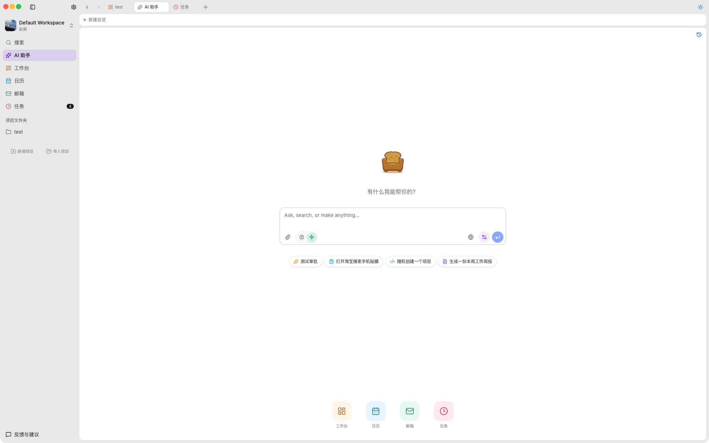
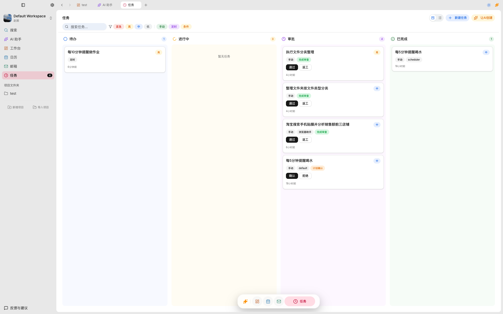
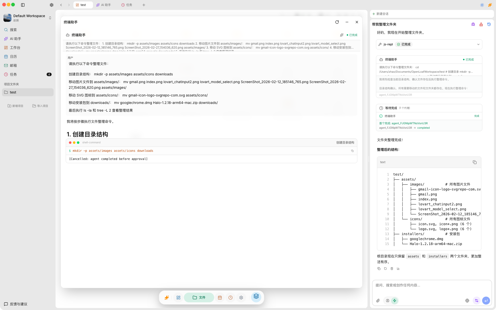
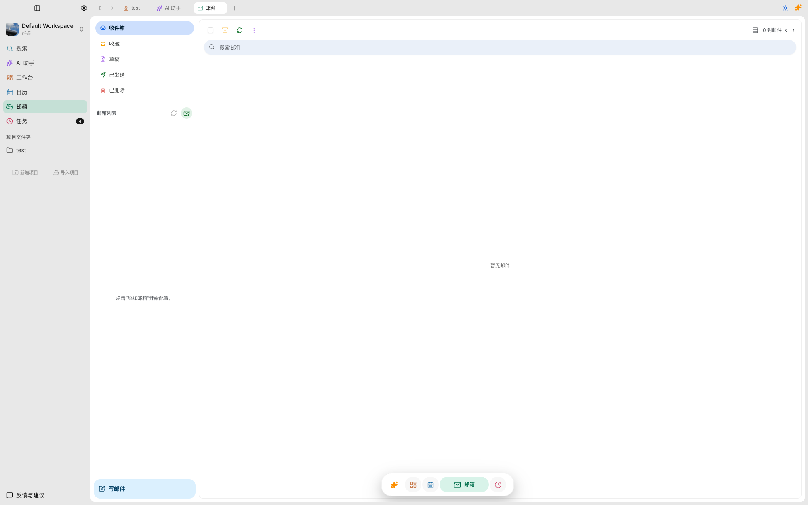
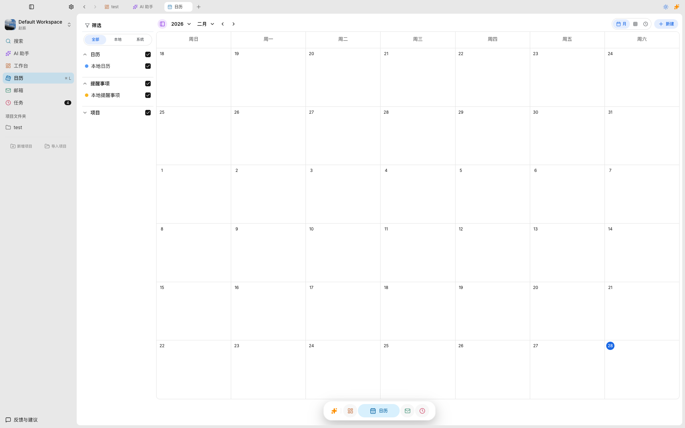
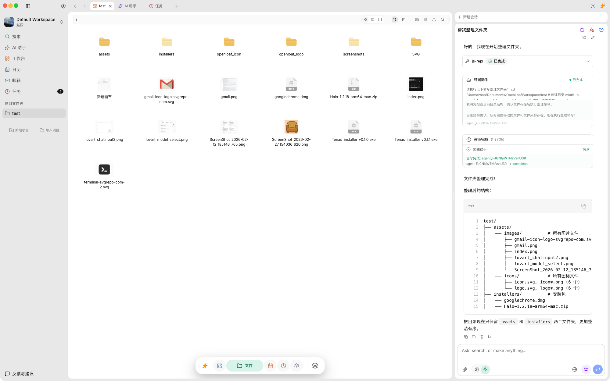
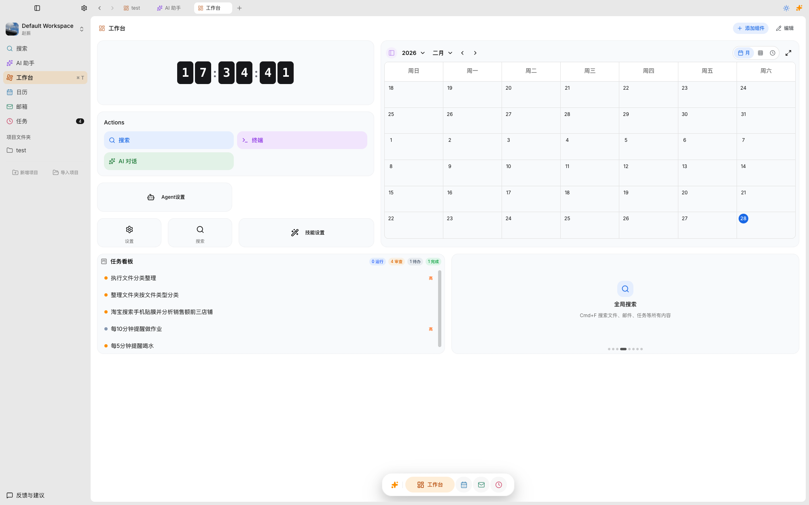

<div align="center">
  
  <h1>OpenLoaf</h1>
  <p><strong>开源 AI 知识库 & 智能工作台</strong></p>
  <p>结构化文档管理 + 多模型 AI 对话 + 跨平台桌面体验，打造你的第二大脑。</p>

  <a href="https://github.com/OpenLoaf/OpenLoaf/blob/main/LICENSE"></a>
  <a href="https://github.com/OpenLoaf/OpenLoaf/releases"></a>
  

  <br />
  <a href="../README.md">English</a> | <strong>简体中文</strong>
</div>

---

## 关于

OpenLoaf 是一款现代化的全栈 AI 知识库与智能工作台应用。它将类似 **Notion** 的层级文档管理能力，与类似 **ChatGPT/Claude** 的深度 AI 对话体验融合在一起，致力于打造一个"不仅能聊天，更能沉淀知识"的第二大脑。

> **为什么叫 OpenLoaf？** Logo 是一个面包形状的沙发 —— Loaf 既有"面包"的意思，也有"懒散地躺着"的含义。我们希望你在使用 OpenLoaf 时，就像窝在沙发上一样舒适惬意。

<!-- TODO: 截图 — 应用全貌总览（展示侧边栏 + 编辑器 + AI 对话的完整界面） -->
<div align="center">
  
</div>

---

## 功能展示

### 富文本编辑器

强大的块状编辑器，支持富文本、表格、代码块、LaTeX 公式、多媒体嵌入、双向链接等，像 Notion 一样自由组织你的内容。

<!-- TODO: 截图 — 编辑器页面（展示不同块类型：标题、列表、代码块、表格、图片等） -->
<div align="center">
  
</div>

### AI 智能对话

内置多模型 AI 对话，支持 OpenAI、Claude、Gemini、DeepSeek、Qwen、Grok 以及 Ollama 本地模型。AI 能感知你的项目上下文，不只是聊天，更是你的智能助手。

<!-- TODO: 截图 — AI 对话界面（展示对话窗口、模型选择、上下文引用） -->
<div align="center">
  
</div>

### AI 智能代理 (Agent)

内置文档、终端、浏览器、邮件、日历等系统代理，AI 可以自动拆解任务、调用工具、独立完成多步骤工作流。

<!-- TODO: 截图 — Agent 执行任务（展示 AI 调用工具、执行命令的过程） -->
<div align="center">
  
</div>

### 无限画板 (Board)

基于 ReactFlow 的无限画板，支持自由布局、思维导图、流程图、图片节点、AI 生成图片等，让创意自由流动。

<!-- TODO: 截图 — 画板页面（展示节点、连线、思维导图或流程图布局） -->
<div align="center">
  
</div>

### 看板任务管理

类似 Trello 的看板视图，拖拽管理任务状态，支持标签、优先级、到期时间，AI 可自动创建和分配任务。

<!-- TODO: 截图 — 看板页面（展示多列看板、任务卡片、拖拽操作） -->
<div align="center">
  
</div>

### 内置终端

完整的终端模拟器，无需切换窗口即可执行命令。AI 也可以直接操作终端完成开发任务。

<!-- TODO: 截图 — 终端界面（展示终端窗口、命令执行） -->
<div align="center">
  
</div>

### 邮件客户端

集成邮件收发与管理，支持多账户、邮件同步、富文本撰写，AI 可辅助撰写和回复邮件。

<!-- TODO: 截图 — 邮件界面（展示收件箱、邮件列表、撰写窗口） -->
<div align="center">
  
</div>

### 智能日历

日程管理与系统日历同步，支持 AI 自动规划日程、智能提醒，多种视图（日/周/月）切换。

<!-- TODO: 截图 — 日历界面（展示月视图或周视图、日程事件） -->
<div align="center">
  
</div>

### 文件管理器

内置文件浏览器，支持拖拽上传、文件预览、目录管理，与编辑器和 AI 深度集成。

<!-- TODO: 截图 — 文件管理器界面（展示文件树、文件预览） -->
<div align="center">
  
</div>

### 桌面小组件

动态小组件系统，可在桌面或应用内展示实时信息：任务进度、日程提醒、快捷操作等。

<!-- TODO: 截图 — 小组件展示（展示几个不同类型的小组件） -->
<div align="center">
  
</div>

---

## 快速开始

### 前提条件

- **Node.js** >= 20
- **pnpm** >= 10（`corepack enable` 即可）

### 安装与运行

```bash
# 克隆仓库
git clone https://github.com/OpenLoaf/OpenLoaf.git
cd OpenLoaf

# 安装依赖
pnpm install

# 初始化数据库
pnpm run db:push

# 启动开发环境（Web + Server）
pnpm run dev
```

打开浏览器访问 [http://localhost:3001](http://localhost:3001)。启动桌面应用：`pnpm run desktop`。

## 技术栈

Next.js 16 / React 19 / Electron 40 / Hono + tRPC / Prisma + SQLite / Plate.js / Vercel AI SDK / Yjs / ReactFlow / Turborepo + pnpm

## 参与贡献

欢迎社区贡献！Fork 仓库 → 创建分支 → 提交 PR。

> 提交前请阅读 [贡献指南](./.github/CONTRIBUTING.md) 并签署 [CLA](./.github/CLA.md)。

## 许可证

双重许可：[AGPLv3](./LICENSE)（开源）/ 商业许可（联系我们）。

---

<div align="center">
  <a href="https://github.com/OpenLoaf/OpenLoaf/issues">Bug 反馈</a> &middot;
  <a href="https://github.com/OpenLoaf/OpenLoaf/discussions">社区讨论</a>
  <br /><br />
  <sub>OpenLoaf — 重新定义你的 AI 协作空间。</sub>
</div>
