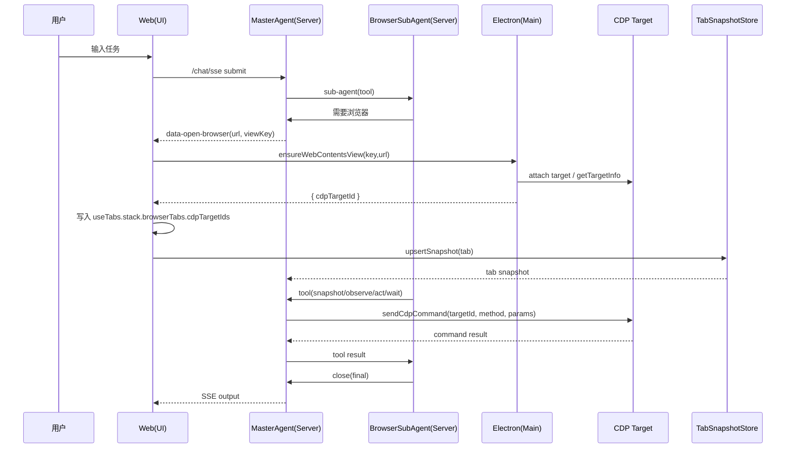

# 浏览器自动化 Agent 构建计划（MVP）

> 目标：在现有 Teatime AI 架构中构建一个可控、可复用的浏览器自动化 SubAgent，具备最小可用的观察与操作能力，并与 open-url + tab snapshot 上报链路打通。

## 0. 关键名词解释

- **MasterAgent**：主代理，负责理解用户目标并决定是否调用子代理。
- **BrowserSubAgent**：浏览器自动化子代理，执行页面观察与操作的工具循环。
- **CDP**：Chrome DevTools Protocol，Server 直接通过它操控页面。
- **cdpTargetId**：CDP 目标标识，一个页面/视图对应一个或多个 targetId。
- **WebContentsView**：Electron 内嵌网页容器，承载实际可见页面。
- **viewKey**：WebContentsView 的稳定标识，绑定到浏览器子标签。
- **TabSnapshot**：由 Web 上报到 Server 的 Tab 快照，包含 stack 与浏览器状态。
- **stack**：Tab 左侧面板的叠层结构，浏览器面板是其中一个 stack item。
- **ToolDef**：工具定义单一事实源（`id/description/parameters/component`）。
- **data-open-browser**：Server 下发给 Web 的 UI data part，用于打开页面。
- **needsApproval**：工具执行审批开关，用于高风险动作。

## 1. 目标范围（MVP）

- 单页面自动化：只处理当前活动 Tab 的单一 WebContentsView。
- 工具集最小化：以 Stagehand 工具集合为基准（dom/hybrid），`open-url` 仅用于触发打开面板。
- 可中断、可审批：危险动作支持 needsApproval，用户手动 stop 可中断并记录。
- 与现有 UI/IPC 链路兼容：沿用 data-open-browser + tab snapshot 上报。

## 2. 角色与执行链路

1. **MasterAgent**：判断需要浏览器操作时调用 `sub-agent` 工具。
2. **BrowserSubAgent**：独立工具循环，执行浏览器相关工具并输出结果。
3. **Web/Electron**：负责打开页面并获取 `cdpTargetId` 列表，上报到 Server。
4. **Server**：持有 `cdpTargetId` 列表并直接使用 CDP 执行浏览器动作。

**时序概览：**
- MasterAgent -> sub-agent(tool)
- sub-agent -> browser tools (ariaTree/screenshot/act/...)
- server -> data-open-browser
- web/electron 打开页面 -> 获取 `cdpTargetId` 列表
- web -> server（routers/tab.ts）上报 `cdpTargetId` 列表
- server 直接通过 CDP 执行 -> tool output -> sub-agent 继续

## 2.1 关键类/方法落点（按链路）

### Web 侧（打开页面 + 写回 cdpTargetId）
- `apps/web/src/components/chat/ChatProvider.tsx`
  - `handleOpenBrowserDataPart(...)`：接收 `data-open-browser` 并调用 `useTabs.getState().pushStackItem(...)` 写入浏览器面板。
- `apps/web/src/hooks/use-tabs.ts`
  - `normalizeBrowserWindowItem(...)`：归一化 `browserTabs` / `activeBrowserTabId`，需要支持 `cdpTargetIds` 列表写入。
  - `pushStackItem(...)`：把浏览器面板状态写入 tab.stack（单一事实源）。
- `apps/web/src/components/browser/browser-types.ts`
  - `BrowserTab`：将 `cdpTargetId?: string` 改为 `cdpTargetIds: string[]`（或 `cdpTargetIds?: string[]`）。
- `apps/web/src/components/browser/ElectrronBrowserWindow.tsx`
  - `buildViewKey(...)`：构造 viewKey（稳定标识）。
  - `ensureWebContentsView` effect：调用 `window.teatimeElectron.ensureWebContentsView(...)`，拿到 `cdpTargetId`。
  - `updateBrowserState(...)`：把 `cdpTargetIds` 写回当前 browserTab，并触发 `upsertTabSnapshotNow(...)`。
- `apps/web/src/lib/tab-snapshot.ts`
  - `upsertTabSnapshotNow(...)`：将完整 `tab` 快照写回服务端（包含 stack 内的 browserTabs/cdpTargetIds）。

### Electron 侧（生成 cdpTargetId）
- `apps/electron/src/preload/index.ts`
  - `ensureWebContentsView(...)`：暴露给 Web 的 IPC API。
- `apps/electron/src/main/ipc/index.ts`
  - `registerIpcHandlers(...)`：注册 `teatime:webcontents-view:ensure`。
  - `getCdpTargetId(...)`：通过 `webContents.debugger` 获取 targetId。

### Server 侧（存储 + 读取）
- `apps/server/src/routers/tab.ts`
  - `TabRouterImpl.createRouter().upsertSnapshot`：接收 Web 上报的 tab 快照。
  - 这里应改为写入 `TabSnapshotStoreAdapter`（而非 `ChatContextAdapter`），确保后续读取一致。
- `apps/server/src/modules/tab/TabSnapshotStoreAdapter.ts`
  - `tabSnapshotStore.upsert(...)`：存储 tab 快照。
  - `tabSnapshotStore.get(...)`：读取 tab 快照。
  - 需新增工具函数：从 tab.stack 中提取 `cdpTargetIds`（例如 `extractCdpTargetIdsFromTab(tab: Tab)`）。

### Server 侧（CDP 连接与执行）
- 新增模块（建议）：`apps/server/src/modules/browser/cdpSessionPool.ts`
  - `getCdpTargetIdsByTabId(sessionId, clientId, tabId)`：从 `TabSnapshotStoreAdapter` 读取。
  - `openCdpSession(targetId)`：建立与 CDP 的会话（可维护简单池）。
  - `sendCdpCommand(targetId, method, params)`：执行 CDP 命令。
- Browser 工具执行：`apps/server/src/ai/tools/browser/*`
  - `snapshot/observe/extract/act/wait` 直接调用 `sendCdpCommand(...)`，不再经由 Web 代理。

## 3. 工具清单与约束

### 3.1 工具定义（ToolDef）
**按 Stagehand 工具集合对齐（仅保留 dom/hybrid 模式）：**
- `act`
- `ariaTree`
- `click`
- `clickAndHold`
- `close`
- `dragAndDrop`
- `extract`
- `fillForm`
- `fillFormVision`
- `goto`
- `keys`
- `navback`
- `screenshot`
- `scroll`
- `search`（可选，需 BRAVE_API_KEY）
- `think`
- `type`
- `wait`
- `open-url`（仅用于触发打开面板，不属于 Stagehand 核心工具）

**统一要求：**
- ToolDef 使用 `id` 作为唯一事实源。
- tool 输入用 zod 约束，输出统一 `{ ok, data, error? }`。

### 3.2 工具执行行为
- `ariaTree/screenshot/extract`：Server 通过 CDP 获取页面内容或结构化信息。
- `act/click/type/dragAndDrop/scroll/keys`：Server 通过 CDP 执行动作。
- `wait/navback/goto`：Server 通过 CDP 控制导航与等待。
- `close`：明确结束任务并返回最终总结。

### 3.3 需要审批的动作
- 跳转外链、下载、表单提交等敏感动作：`needsApproval: true`。
- 低风险动作（滚动、读取）默认不需要审批。

## 4. Prompt 设计（参考 Stagehand，按本项目适配）

采用结构化系统提示：

- `<goal>`：用户目标
- `<page>`：当前 URL / tab
- `<tools>`：列出工具能力与限制
- `<strategy>`：dom 优先 ariaTree -> act；hybrid 优先 screenshot -> click/type
- `<completion>`：必须调用 close

策略核心：
- dom：优先使用 ariaTree 获取结构化上下文，再 act。
- hybrid：优先使用 screenshot 获取坐标，再 click/type；ariaTree 兜底。

## 5. 上下文压缩策略

- 仅保留最近 1 次 ariaTree、最近 2 次 screenshot。
- 超长文本剪裁（如 10k 字符），避免上下文爆炸。
- 旧的 observe/snapshot 用占位文本替换。

## 6. 数据协议与通道

### 6.1 Server -> Web
- data part：`data-open-browser`
- payload：`{ tabId, url, title?, viewKey, panelKey }`

### 6.2 Web -> Server
- tRPC：`tab.upsertSnapshot`
- payload：`{ sessionId, clientId, tabId, seq, tab }`

## 7. 子代理执行模型

- SubAgent 内部使用 ToolLoopAgent。
- `maxSteps` 默认为 10～15。
- 多步循环，模型决定工具调用时机与次数。
- 成功结束必须调用 close。

## 8. 可观测性与稳定性

- 记录：每次工具调用、tool output、stop 原因。
- 出错时：写入 message parts + metadata，不影响历史回放。
- 用户手动 stop：追加 `data-manual-stop`。

## 9. 测试计划

1. **open-url 路径**：从聊天触发，浏览器面板打开正确页面。
2. **cdpTargetId 上报**：打开页面后，`cdpTargetId` 列表写入 useTabs 并同步到 Server。
3. **ariaTree/screenshot**：Server 直接 CDP 调用返回页面摘要与元素候选。
4. **act**：Server 直接 CDP 点击 / 输入 / 滚动成功。
5. **wait**：`load` / `textIncludes` / `timeout`。
6. **审批**：触发 needsApproval，允许/拒绝后继续执行。
7. **stop**：手动中断后前后端一致显示。

## 10. 后续迭代方向（非 MVP）

- 结构化 DOM/ARIA Tree 采集（替换简易 snapshot）。
- 动作缓存与重放（类似 Stagehand act cache）。
- 多 Tab / 多窗口调度。
- 更精细的风险分级与审批策略。
- UI 层提供可视化回放与动作轨迹。

## 10. 执行计划（Plan / TODO）

### 10.1 数据结构调整
- [x] `BrowserTab.cdpTargetIds`：从单值改为列表（`apps/web/src/components/browser/browser-types.ts`）。
- [x] `use-tabs.normalizeBrowserWindowItem(...)`：支持 `cdpTargetIds` 写入与合并。
- [x] `ElectrronBrowserWindow`：写回 `cdpTargetIds` 并触发 `upsertTabSnapshotNow(...)`。

### 10.2 快照链路修正
- [x] `routers/tab.ts`：`upsertSnapshot` 写入 `TabSnapshotStoreAdapter`（替换 `ChatContextAdapter`）。
- [x] `TabSnapshotStoreAdapter`：提供提取 `cdpTargetIds` 的 helper。

### 10.3 Server CDP 执行能力
- [x] 新增 `apps/server/src/modules/browser/cdpSessionPool.ts`：管理 targetId 的连接与复用。
- [x] 新增 `apps/server/src/modules/browser/cdpClient.ts`：封装 `sendCdpCommand`。
- [x] 浏览器工具（`snapshot/observe/act/extract/wait`）改为直接调用 CDP。

### 10.4 验证与回归
- [ ] 打开 URL 后 `cdpTargetIds` 正确上报并持久化。
- [ ] Server 直接 CDP 调用成功（无需 Web 代理）。
- [ ] 手动 stop / 审批流程在新链路下仍可用。

### 10.5 模式与模型能力约束
- [ ] 仅支持 `dom` / `hybrid`，不实现 CUA。
- [ ] 检测模型是否支持图片理解；不支持则强制 `dom` 模式。

## 11. 时序图（完整浏览器控制流程）

## 12. Stagehand 工具定义参考（源码摘录）

> 来源：`/Users/zhao/Documents/01.Code/Github/stagehand/packages/core/lib/v3/agent/tools/*.ts`

### 12.1 工具集总览（Stagehand 原始实现参考）

Stagehand 在 `createAgentTools(...)` 中构建 ToolSet，并根据 `mode` 做过滤（本项目仅作参考，不直接照搬）：  
- `mode=dom`：移除坐标类工具（click/type/dragAndDrop/clickAndHold/fillFormVision）  
- `mode=hybrid`：移除 `fillForm`，保留坐标类工具  
- `search` 仅在 `BRAVE_API_KEY` 存在时启用  

工具列表：  
`act`, `ariaTree`, `click`, `clickAndHold`, `close`, `dragAndDrop`, `extract`, `fillForm`, `fillFormVision`, `goto`, `keys`, `navback`, `screenshot`, `scroll`, `search`, `think`, `type`, `wait`

### 12.2 各工具定义（输入/输出/行为要点）

**act**  
- 描述：自然语言动作（点击/输入）  
- 输入：`{ action: string }`  
- 输出：`{ success, action, playwrightArguments?, error? }`  
- 执行：`v3.act(action)` + 记录回放步骤（Action）  

**ariaTree**  
- 描述：获取当前页面 ARIA 混合树文本  
- 输入：`{}`  
- 输出：`{ content, pageUrl }`  
- 特殊：`toModelOutput` 把内容作为 text content 注入模型  

**click**  
- 描述：坐标点击（推荐用于可见元素）  
- 输入：`{ describe, coordinates:[x,y] }`  
- 输出：`{ success, describe, coordinates, error? }`  
- 特殊：坐标归一化 + 记录 XPath 回放  

**clickAndHold**  
- 描述：坐标点击并按住  
- 输入：`{ describe, duration, coordinates:[x,y] }`  
- 输出：`{ success, describe, error? }`  
- 特殊：dragAndDrop 同点 + 记录 XPath 回放  

**close**  
- 描述：任务完成并关闭  
- 输入：`{ reasoning, taskComplete }`  
- 输出：`{ success, reasoning, taskComplete }`  

**dragAndDrop**  
- 描述：坐标拖拽  
- 输入：`{ describe, startCoordinates:[x,y], endCoordinates:[x,y] }`  
- 输出：`{ success, describe, error? }`  
- 特殊：记录起止 XPath 回放  

**extract**  
- 描述：按 instruction + schema 结构化抽取  
- 输入：`{ instruction, schema?: string }`  
- 输出：`{ success, result?, error? }`  
- 特殊：schema 以字符串形式传入并 `eval` 成 zod  

**fillForm**  
- 描述：DOM 模式多字段表单填充  
- 输入：`{ fields: [{ action, value }] }`  
- 输出：`{ success, actions, playwrightArguments }`  
- 特殊：先 `observe` 再批量 `act`，记录回放  

**fillFormVision**  
- 描述：坐标模式多字段表单填充  
- 输入：`{ fields: [{ action, value, coordinates:{x,y} }] }`  
- 输出：`{ success, actions?, playwrightArguments?, error? }`  
- 特殊：逐字段 click+type，记录 XPath 回放  

**goto**  
- 描述：导航到 URL  
- 输入：`{ url }`  
- 输出：`{ success, url, message?, error? }`  
- 特殊：`page.goto(url, { waitUntil: "domcontentloaded" })`  

**keys**  
- 描述：发送键盘输入（焦点元素）  
- 输入：`{ method:"press"|"type", value, repeat? }`  
- 输出：`{ success, method, value, times, error? }`  
- 特殊：支持组合键/多次重复  

**navback**  
- 描述：返回上一页  
- 输入：`{ reasoningText }`  
- 输出：`{ success }`  
- 特殊：`page.goBack({ waitUntil: "domcontentloaded" })`  

**screenshot**  
- 描述：截屏（PNG base64）  
- 输入：`{}`  
- 输出：`{ base64, timestamp, pageUrl }`  
- 特殊：`toModelOutput` 把图片作为 media 注入模型  

**scroll / scrollVision**  
- 描述：滚动页面  
- 输入：  
  - `scroll`：`{ direction, percentage? }`（DOM 模式）  
  - `scrollVision`：`{ direction, coordinates?, percentage? }`（hybrid 模式）  
- 输出：`{ success, message, scrolledPixels }`  
- 特殊：坐标版可对嵌套滚动区域滚动  

**search**  
- 描述：Brave Web 搜索  
- 输入：`{ query }`  
- 输出：`{ data?:{results}, error?, timestamp }`  
- 特殊：仅在 `BRAVE_API_KEY` 存在时启用  

**think**  
- 描述：内部思考，不执行动作  
- 输入：`{ reasoning }`  
- 输出：`{ acknowledged, message }`  

**type**  
- 描述：坐标输入（点击后输入）  
- 输入：`{ describe, text, coordinates:[x,y] }`  
- 输出：`{ success, describe, text, error? }`  
- 特殊：记录 XPath 回放  

**wait**  
- 描述：等待固定毫秒数  
- 输入：`{ timeMs }`  
- 输出：`{ success, waited }`  

### 12.3 Stagehand 与本项目的对齐点（执行策略，按需适配）

- **结构化工具集**：参考 Stagehand 的工具集合与 mode 过滤策略（dom/hybrid），按本项目命名与结构落地。  
- **执行层对齐**：以 CDP 实现 `act/observe/extract` 等工具，但输入/输出语义仅作参考。  
- **回放记录**：参考 `recordAgentReplayStep` 的数据结构设计（可先存空实现）。  

## 13. Stagehand 提示词设计（工具使用时机与策略，参考）

> 来源：`/Users/zhao/Documents/01.Code/Github/stagehand/packages/core/lib/v3/agent/prompts/agentSystemPrompt.ts`

### 13.1 系统提示词结构

- `<identity>`：Web 自动化助手身份  
- `<task>`：目标 + 实际日期  
- `<page>`：起始 URL  
- `<mindset>`：动作谨慎、目标严格  
- `<guidelines>`：先理解页面、必要时截图、完成后必须 close  
- `<page_understanding_protocol>`：页面理解流程（dom/hybrid 不同）  
- `<navigation>`：优先直达 URL，不确定时用 search  
- `<tools>`：工具清单（按 mode 过滤）  
- `<strategy>`：工具选择优先级 + 通用策略  
- `<roadblocks>`：captcha/弹窗（仅 Browserbase 环境）  
- `<completion>`：完成时总结信息  

### 13.2 工具使用时机（Stagehand 原则，参考）

**通用规则**
- 必须先“理解页面状态”，再进行操作。  
- 任务完成必须调用 `close`，失败也要调用 `close(taskComplete: false)`。  
- 只有在“明确需要结构化数据”时才用 `extract`。  
- 动作应保持原子化，执行后验证再继续。  

**DOM 模式（mode=dom）**
- **优先 act**：所有点击/输入都用 `act`。  
- **先 ariaTree**：优先使用 ariaTree 获取全页上下文（不依赖滚动）。  
- screenshot 仅用于“视觉确认”。  
- 如果 ariaTree 能找到元素，就直接 act，不需要滚动。  

**Hybrid 模式（mode=hybrid）**
- **优先 click/type**：元素可见时用坐标工具。  
- **必须先 screenshot**：获取视觉坐标参考。  
- ariaTree 作为“不可见元素”或“全局上下文”补充。  
- 只有元素在 ariaTree 中但不在截图里才使用 act。  

**表单输入**
- 多字段表单优先 `fillForm`（DOM）或 `fillFormVision`（Hybrid）。  
- 分散输入/验证码等场景优先 `keys`。  

**导航**
- URL 确定则直接 `goto`。  
- URL 不确定则优先 `search`（若启用 BRAVE）。  

### 13.3 补充说明（策略细节）

- `extract` 仅用于结构化结果，不用于阅读页面内容。  
- `keys` 适合快捷键、Tab/Enter、验证码等连续输入。  
- `scroll` 只用于需要视图滚动时；DOM 模式优先 ariaTree。  
- **模式约束**：本项目仅支持 `dom` / `hybrid`，不包含 CUA。  
- **模型能力约束**：不支持图片理解的模型只能使用 `dom` 模式。  

## 14. Stagehand 参考项（带代码路径）

> 仅列出 Stagehand 现有实现中对稳定性与可控性影响最大的部分，作为参考项，并给出原始源码路径（本地 Stagehand 仓库）。  
> 路径基于：`/Users/zhao/Documents/01.Code/Github/stagehand`  

### 14.1 动作回放与缓存
- **动作回放记录**：`packages/core/lib/v3/agent/utils/actionMapping.ts`  
- **Act 缓存与复用**：`packages/core/lib/v3/cache/ActCache.ts`  
- **act 入口与缓存集成**：`packages/core/lib/v3/v3.ts`  

### 14.2 页面上下文与活动页管理
- **active page 管理**：`packages/core/lib/v3/understudy/context.ts`  
- **Frame/Locator 抽象**：`packages/core/lib/v3/understudy/frame.ts`、`packages/core/lib/v3/understudy/frameLocator.ts`  
- **响应/导航追踪**：`packages/core/lib/v3/understudy/response.ts`  

### 14.3 坐标与定位归一化
- **坐标归一化**：`packages/core/lib/v3/agent/utils/coordinateNormalization.ts`  
- **XPath 处理**：`packages/core/lib/v3/agent/utils/xpath.ts`  
- **坐标工具对接点**：  
  - `packages/core/lib/v3/agent/tools/click.ts`  
  - `packages/core/lib/v3/agent/tools/type.ts`  
  - `packages/core/lib/v3/agent/tools/dragAndDrop.ts`  
  - `packages/core/lib/v3/agent/tools/clickAndHold.ts`  

### 14.4 上下文压缩策略
- **AI SDK 路径消息压缩**：`packages/core/lib/v3/agent/utils/messageProcessing.ts`  
- **图像压缩（CUA，仅参考）**：`packages/core/lib/v3/agent/utils/imageCompression.ts`  

### 14.5 多步执行与完成策略
- **Step 控制与 close 判定**：`packages/core/lib/v3/handlers/v3AgentHandler.ts`  
- **stop 条件**：`packages/core/lib/v3/handlers/v3AgentHandler.ts`  

### 14.6 错误处理与超时
- **SDK 错误类型**：`packages/core/lib/v3/types/public/sdkErrors.ts`  
- **act/extract 超时处理**：`packages/core/lib/v3/tests/timeouts.spec.ts`  

### 14.7 可观测性与指标
- **LLM logging middleware**：`packages/core/lib/v3/flowLogger.ts`  
- **AI SDK 客户端封装**：`packages/core/lib/v3/llm/aisdk.ts`  
- **指标统计入口**：`packages/core/lib/v3/v3.ts`  

### 14.8 结构化抽取与 schema 评估
- **extract 工具实现**：`packages/core/lib/v3/agent/tools/extract.ts`  
- **schema 执行逻辑**：`packages/core/lib/v3/agent/tools/extract.ts`  

### 14.9 搜索工具（可选）
- **Brave 搜索工具**：`packages/core/lib/v3/agent/tools/search.ts`  
- **工具启用条件**：`packages/core/lib/v3/agent/tools/index.ts`  

codex resume 019b43f3-06d6-75c2-be37-b90b66aece16