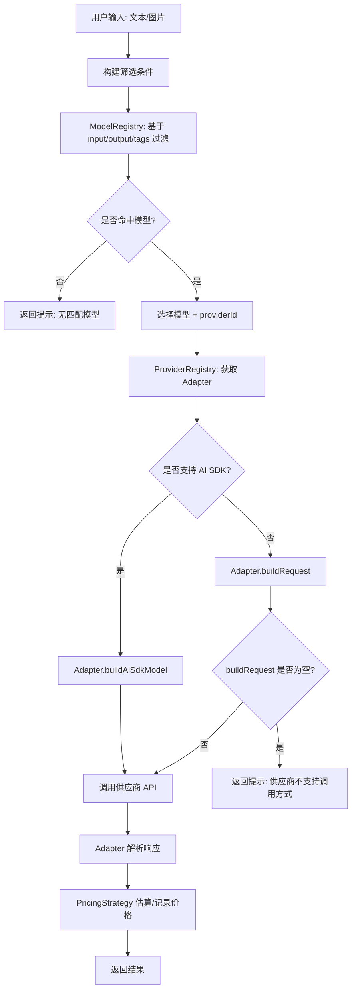
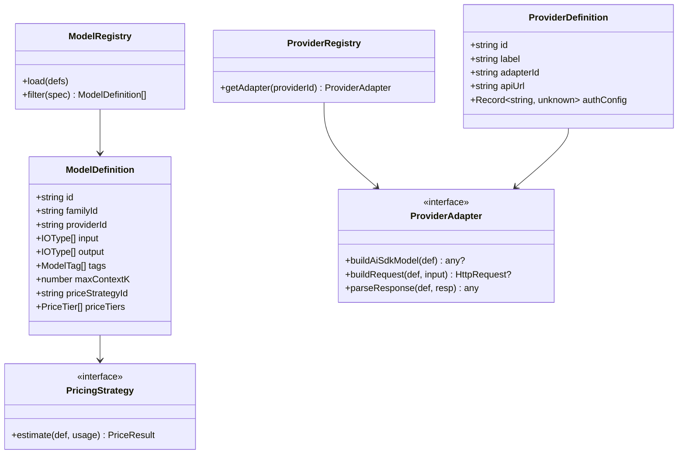

# 模型与供应商可扩展架构设计（草案）

本文档描述一个可扩展的模型接入架构，满足以下约束：

- tags 必须严格枚举，用于筛选模型。
- 通过 tag 进行模型筛选，不引入独立 operation 列表。
- 价格策略支持：
  1) 输入 input + 输入缓存 input + 输出 input 的计费。
  2) 超过指定上下文后，输入/缓存/输出价格切换到新的档位。
- 支持不同供应商的同名模型，且调用方式/价格可以不同。
- 模型可从 JSON/DB/网络加载并生成可调用对象。

---

## 1. 总体流程



---

## 2. 核心设计要素

### 2.1 ModelDefinition（纯数据）

模型定义用于存储在 JSON/DB，不包含业务逻辑。

```ts
type IOType = "text" | "image" | "audio" | "video";

type ModelTag =
  | "文生图"
  | "图生图"
  | "图片编辑"
  | "文本生成"
  | "视频生成"
  | "语音识别"
  | "语音输出";

type PriceTier = {
  minContextK: number;
  input: number;
  inputCache: number;
  output: number;
};

type ModelDefinition = {
  id: string;              // 全局唯一 ID
  familyId: string;        // 同一模型族 ID
  providerId: string;      // 供应商 ID
  input: IOType[];
  output: IOType[];
  tags: ModelTag[];
  maxContextK: number;     // 仅用于价格策略判断
  priceStrategyId: string; // 价格策略 ID
  priceTiers: PriceTier[]; // 价格档位
};
```

### 2.2 ProviderDefinition（供应商元信息）

```ts
type ProviderDefinition = {
  id: string;       // qwen / openrouter / xai ...
  label: string;
  adapterId: string;
  apiUrl: string;
  authConfig?: Record<string, unknown>; // 认证信息原始配置，由 Provider 自行解析
};
```

---

## 3. 行为层设计模式

### 3.1 Strategy（价格策略）

价格策略不写死在模型或调用层，实现可插拔。

```ts
type Usage = {
  contextK: number;
  inputTokens: number;
  inputCacheTokens: number;
  outputTokens: number;
};

type PriceResult = {
  inputCost: number;
  inputCacheCost: number;
  outputCost: number;
  total: number;
};

interface PricingStrategy {
  estimate(def: ModelDefinition, usage: Usage): PriceResult;
}
```

**策略说明**
- `priceTiers` 根据 `contextK` 匹配。
- 每档包含 input / inputCache / output 的价格。
- 保证“超过上下文阈值后价格变化”。

### 3.2 Adapter（供应商适配）

不同供应商（甚至同一供应商不同 API）由 Adapter 处理。

```ts
interface ProviderAdapter {
  buildAiSdkModel(def: ModelDefinition): unknown | null;
  buildRequest(def: ModelDefinition, input: unknown): HttpRequest | null;
  parseResponse(def: ModelDefinition, resp: HttpResponse): unknown;
}
```

**应用场景**
- Qwen 文生图/图编辑：参数结构由 Adapter 负责拼装。
- Xai 图片编辑 API：Adapter 直接走专用端点。
- OpenRouter：同模型不同 API Key 和价格策略。
 - 若 `buildAiSdkModel` 与 `buildRequest` 同时为空，应返回“不支持调用方式”的错误。

---

## 4. 过滤逻辑（Specification 模式）

```ts
type ModelSpec = (def: ModelDefinition) => boolean;

const byInput = (input: IOType[]): ModelSpec => (def) =>
  input.every((t) => def.input.includes(t));

const byTag = (tag: ModelTag): ModelSpec => (def) =>
  def.tags.includes(tag);

const andSpec = (...specs: ModelSpec[]): ModelSpec => (def) =>
  specs.every((spec) => spec(def));
```

**示例**
- 用户输入：文本 + 图片
- 需求：图片编辑

```ts
const spec = andSpec(byInput(["text", "image"]), byTag("图片编辑"));
const matches = registry.filter(spec);
```

---

## 5. 类图



---

## 6. 数据加载与实例化

### 6.1 JSON 示例

```json
{
  "providers": [
    {
      "id": "qwen",
      "label": "阿里百炼",
      "adapterId": "qwenAdapter",
      "apiUrl": "https://dashscope.aliyuncs.com/api/v1",
      "authConfig": {
        "apiKey": "${DASHSCOPE_API_KEY}"
      },
      "models": [
        {
          "id": "qwen-image-edit-plus",
          "familyId": "qwen-image-edit",
          "providerId": "qwen",
          "input": ["text", "image"],
          "output": ["image"],
          "tags": ["图片编辑", "图生图"],
          "maxContextK": 0,
          "priceStrategyId": "tiered_token",
          "priceTiers": [
            { "minContextK": 0, "input": 1.2, "inputCache": 0.3, "output": 2.4 },
            { "minContextK": 64, "input": 1.5, "inputCache": 0.4, "output": 2.8 }
          ]
        }
      ]
    }
  ]
}
```

### 6.2 Registry 初始化流程

```mermaid
flowchart LR
  A[JSON/DB (providers + models)] --> B[ModelRegistry.load]
  A --> C[ProviderRegistry.load]
  B --> D[ModelDefinition 列表]
  C --> E[ProviderDefinition 列表]
```

---

## 7. 当前落地计划（阶段一）

- 先在 Web 端定义静态 JSON，后续切换为云端加载。  
  - 计划文件：`apps/web/src/lib/model-registry/providers/*.json`
- models 挂在 providers 下，方便供应商维度管理与覆盖。  
- ModelDefinition 仅使用 input/output/tags 进行筛选，不引入 operation。
- ProviderAdapter 提供双通道调用：
  - `buildAiSdkModel` 返回 ai‑sdk 模型（可为 null）
  - `buildRequest` 走自定义 HTTP 调用（可为 null）
- 认证信息由 Provider 自行解析，不在上层进行假设。

---

## 8. Chat Stream 接入建议

1) `/chat/sse` 解析请求（`sessionId` / `messages` / `chatModelId`）。  
2) `chatModelId` 采用 `{profileId}:{modelId}`，优先解析显式模型。  
3) 若显式模型 tags 包含 `image_output`，走图片流：`resolveImageModel` -> `generateImage` -> SSE 输出 `file` + `data-revised-prompt`。  
4) 否则按 required tags + 历史偏好调用 `resolveChatModel`，优先 `buildAiSdkModel`，为空直接报错。  
5) 统一写入 usage/timing/agent metadata。

---

## 9. 扩展新供应商的步骤

1) 新增 ProviderDefinition（JSON/DB）。  
2) 实现 ProviderAdapter（处理调用差异）。  
3) 若价格规则不同，新增 PricingStrategy。  
4) 模型数据指向新的 providerId 与 priceStrategyId。  

---

## 10. 待确认事项

- priceTiers 是否需要支持按“地域”维度区分。  
- maxContextK 的单位是否固定为 K 或直接以 token 数存储。  
