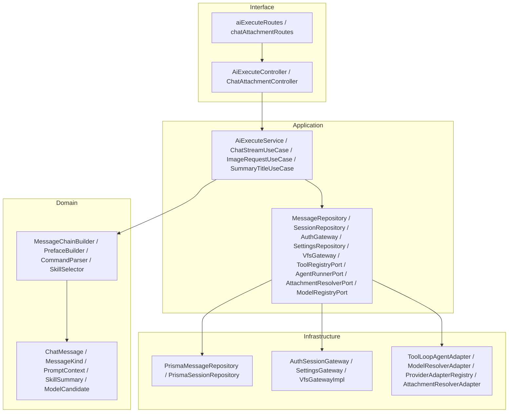
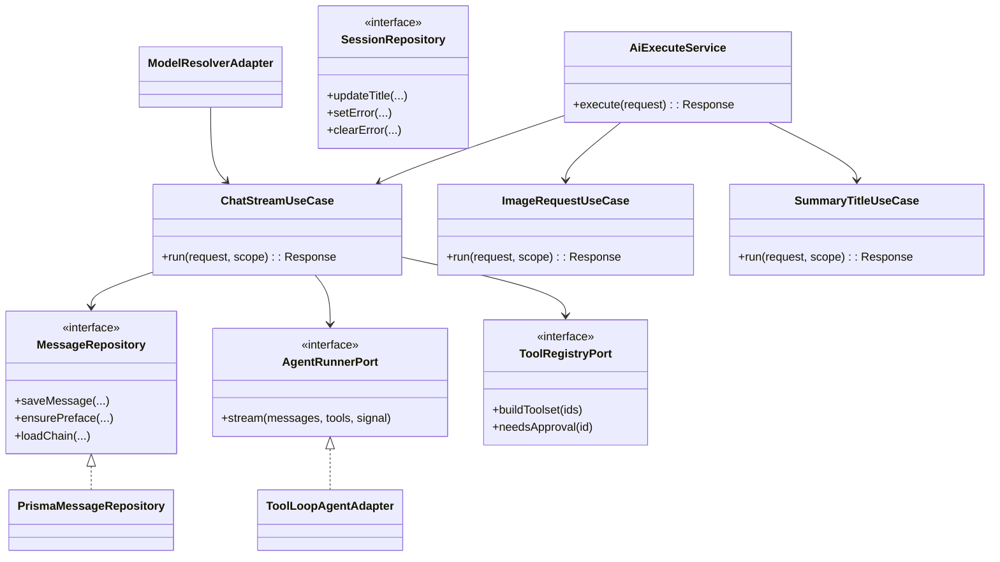
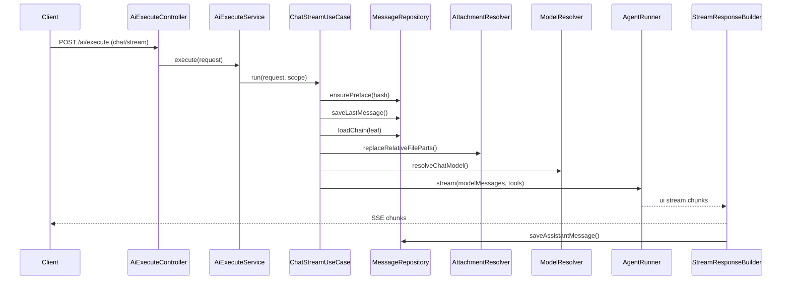

# AI 源码 OOP 化重构设计

目标：在不改变现有功能与行为的前提下，将 AI 相关源码进行面向对象分层重构，明确职责边界、提升可维护性与可测试性，并纳入与 AI 强耦合的模块（settings/auth/vfs 等）。

## 1. 范围与约束

- 范围：`apps/server/src/ai` 全量重构，纳入强耦合模块 `apps/server/src/modules/*` 与 `packages/api` 的相关类型契约。
- 不变：SSE 输出结构、消息持久化顺序、模型解析策略、工具审批策略、`session_preface` 的 hash 去重写入、技能解析顺序（project → parent → workspace）。
- 技术基线：AI SDK v6（ToolLoopAgent、tool()、ToolSet、ModelMessage 结构），现有 Prisma、Hono、tRPC。

## 2. 分层架构（包图）

## 3. 关键类与端口（类图）

## 4. 核心流程编排（时序图）

## 5. 数据访问与事务边界

- `MessageRepository.saveMessage` 内部保留单事务写入（path/materialized tree 与 title 更新一致）。
- `ensurePreface` 保持 “session 为空才插入” 规则，并以 `prefaceHash` 判断是否更新。
- `loadMessageChain` 仍按右侧叶子链加载；`MessageChainBuilder` 继续按 compact_summary 截断并过滤 compact_prompt。
- Application 层通过 `RequestScope` 显式传递 sessionId/workspaceId/projectId/boardId/assistantMessageId/selectedSkills，逐步淡化 AsyncLocalStorage。

## 6. 模型与工具 OOP 化

- `ModelResolver` 作为 Application Service，依赖 `ModelRegistryPort + ProviderAdapterRegistry + SettingsRepository`，保持现有 fallback/requiredTags 文案。
- `ProviderAdapter` 体系保留：OpenAI/Anthropic/Qwen/Volcengine/CLI，支持 AI SDK 或自定义请求。
- `ToolRegistryPort` 统一返回 ToolSet（AI SDK v6 约束），审批策略仍由 `systemToolMeta`/riskType 判定。
- `AgentRunnerPort` 封装 ToolLoopAgent 的构建与 stream，保证 messages/tool-call/tool-result 结构不变。

## 7. SSE、错误处理与可观测性

- `StreamResponseBuilder` 统一 SSE 输出，保持 `data-step-thinking` 与 metadata 合并逻辑（usage + timing + agent + plan + abort）。
- `ErrorPolicy` 将异常映射为用户可读文案，复用现有 `formatInvalidRequestMessage` / `formatImageErrorMessage` 语义。
- `AiExecutionTracer` 记录阶段耗时与关键上下文，默认实现复用 logger。

## 8. 文件结构与迁移策略

### 结构建议
- `domain/`：实体与领域服务
- `application/`：UseCase + Ports
- `infrastructure/`：Repository/Gateway/Adapter
- `interface/`：Controller/Routes
- `composition/`：依赖装配

### 迁移策略（两阶段）
1) **兼容阶段**：新增分层目录与类实现，`apps/server/src/ai/index.ts` 继续 re-export 旧路径，功能不变。  
2) **清理阶段**：系统性迁移 import 路径、删除旧模块、收敛重复逻辑。

## 9. 风险与验证

- 风险：路径迁移导致循环依赖、SSE chunk 结构变化、模型 fallback 行为变化。
- 验证：  
  - 对比 SSE 输出（start/text/finish/metadata）  
  - 对比 messageKind 与 prefaceHash 更新行为  
  - 手工验证 /summary-title、图片生成、技能注入  
  - 运行 `pnpm check-types`

## 10. 参考与依据

- AI SDK v6：ToolLoopAgent、tool()、ToolSet、ModelMessage/tool-call/tool-result 结构  
- 项目文档：`docs/system-tools-design.md`、`docs/model-provider-architecture.md`、`apps/server/src/ai/chat-flow.md`  
- Codex SDK：`/Users/zhao/Documents/01.Code/Github/codex/sdk/typescript/src/thread.ts` 的 OOP 对外 API 形态  
- Stagehand 参考：`docs/stagehand-core-agent.md`（AI SDK tool-calling agent 结构）
