# AI 源码 OOP 化重构设计

目标：在不改变现有功能与行为的前提下，将 AI 相关源码进行面向对象分层重构，明确职责边界、提升可维护性与可测试性，并纳入与 AI 强耦合的模块（settings/auth/vfs 等）。

## 1. 范围与约束

- 范围：`apps/server/src/ai` 全量重构，纳入强耦合模块 `apps/server/src/modules/*` 与 `packages/api` 的相关类型契约。
- 不变：SSE 输出结构、消息持久化顺序、模型解析策略、工具审批策略、`session_preface` 的 hash 去重写入、技能解析顺序（project → parent → workspace）。
- 技术基线：AI SDK v6（ToolLoopAgent、tool()、ToolSet、ModelMessage 结构），现有 Prisma、Hono、tRPC。

## 2. 分层架构（包图）


## 3. 关键类与端口（类图）

```mermaid
classDiagram
  class AiExecuteService {
    +execute(request): Response
  }
  class ChatStreamUseCase
  class ImageRequestUseCase
  class SummaryHistoryUseCase
  class SummaryTitleUseCase
  class SummaryProjectUseCase
  class UpdateProjectSummaryUseCase
  class SummaryDayUseCase
  class ContextExpansionUseCase
  class HelperProjectUseCase
  class HelperWorkspaceUseCase
  class VideoRequestUseCase
  class BackgroundTaskService
  class MessageRepository
  class SessionRepository
  class SchedulerPort
  class TaskStatusRepository

  AiExecuteService --> ChatStreamUseCase
  AiExecuteService --> ImageRequestUseCase
  AiExecuteService --> SummaryHistoryUseCase
  AiExecuteService --> SummaryTitleUseCase
  AiExecuteService --> SummaryProjectUseCase
  AiExecuteService --> UpdateProjectSummaryUseCase
  AiExecuteService --> SummaryDayUseCase
  AiExecuteService --> ContextExpansionUseCase
  AiExecuteService --> HelperProjectUseCase
  AiExecuteService --> HelperWorkspaceUseCase
  AiExecuteService --> VideoRequestUseCase
  BackgroundTaskService --> SchedulerPort
  BackgroundTaskService --> TaskStatusRepository
```



## 4. 核心流程编排（时序图）


## 4.1 aiExecuteRoutes / chatAttachmentRoutes 完整流程图

### aiExecuteRoutes（统一入口）

```mermaid
flowchart TD
  A[POST /ai/execute] --> B[解析与校验请求]
  B -->|无效| E[返回错误响应]
  B --> C[提取最后一条消息/解析命令/解析技能]
  C --> D{命令在输入首部?}

  D -- /summary-title --> ST[SummaryTitleUseCase<br/>不落库]
  ST --> ST1[加载右侧叶子链]
  ST1 --> ST2[构造标题 prompt]
  ST2 --> ST3[generateText]
  ST3 --> ST4[更新 session.title]
  ST4 --> R1[SSE data-session-title]

  D -- /summary-history /summary-day /summary-project /update-project-summary --> SH[Summary*UseCase<br/>压缩/总结流]
  SH --> SH1[写入 compact_prompt]
  SH1 --> SH2[加载链路 + 构建模型链]
  SH2 --> SH3[模型选择]
  SH3 --> SH4[Agent stream]
  SH4 --> SH5[保存 compact_summary]
  SH5 --> R2[SSE stream]

  D -- /expand-context-* --> EC[ContextExpansionUseCase<br/>一次性返回 text]
  EC --> EC1[构造扩展 prompt]
  EC1 --> EC2[generateText]
  EC2 --> R3[JSON/SSE 一次性文本]

  D -- /helper-project /helper-workspace --> HP[Helper*UseCase<br/>一次性返回 text]
  HP --> HP1[构造推荐 prompt]
  HP1 --> HP2[generateText]
  HP2 --> R3

  D -- 否 --> I{intent}

  I -- chat --> CS[ChatStreamUseCase]
  CS --> CS1[ensure preface<br/>保存最后一条消息]
  CS1 --> CS2[加载链路 + 构建模型链]
  CS2 --> CS3[解析模型<br/>必要时路由图片流]
  CS3 --> CS4[Agent stream]
  CS4 --> CS5[保存 assistant]
  CS5 --> R2

  I -- image --> IM{responseMode}
  IM -- json --> IJ[ImageRequestUseCase(JSON)]
  IJ --> IJ1[解析 prompt + 归一化编辑]
  IJ1 --> IJ2[S3 上传（编辑模式）]
  IJ2 --> IJ3[generateImage]
  IJ3 --> IJ4[保存图片 + metadata]
  IJ4 --> R4[JSON response]

  IM -- stream --> IS[ImageRequestUseCase(Stream)]
  IS --> IS1[解析 prompt + 归一化编辑]
  IS1 --> IS2[S3 上传（编辑模式）]
  IS2 --> IS3[generateImage]
  IS3 --> IS4[保存图片 + metadata]
  IS4 --> R2

  I -- video --> VR[VideoRequestUseCase]
  VR --> VR1[解析 prompt + 选择模型]
  VR1 --> VR2[生成视频]
  VR2 --> VR3[保存输出]
  VR3 --> R2

  I -- utility --> UT[UtilityUseCase (reserved)]
  UT --> R4
```

### chatAttachmentRoutes（附件上传与预览）

```mermaid
flowchart TD
  A1[POST /chat/attachments] --> B1[解析 multipart body]
  B1 -->|无效| E1[400 Invalid multipart body]
  B1 --> C1[校验 workspaceId/sessionId/file]
  C1 -->|缺失| E2[400 Missing required upload fields]
  C1 --> D1[检查 workspace 是否存在]
  D1 -->|不存在| E3[400 Workspace not found]
  D1 --> F1{文件类型}
  F1 -- 上传文件 --> G1[校验大小 <= MAX_CHAT_IMAGE_BYTES]
  G1 -->|过大| E4[413 Image too large]
  G1 --> H1[saveChatImageAttachment<br/>压缩 + 落盘]
  F1 -- 相对路径 --> H2[saveChatImageAttachmentFromPath<br/>压缩 + 落盘]
  H1 --> I1[返回 JSON {url, mediaType}]
  H2 --> I1

  A2[GET /chat/attachments/preview] --> B2[校验 path]
  B2 -->|无效| E5[400 Invalid preview path]
  B2 --> C2[getFilePreview]
  C2 -->|不存在| E6[404 Preview not found]
  C2 -->|过大| E7[413 Preview too large]
  C2 --> D2{includeMetadata?}
  D2 -- 是 --> M1[multipart/mixed<br/>metadata + binary]
  D2 -- 否 --> M2[binary response]
```

## 5. 数据访问与事务边界

- `MessageRepository.saveMessage` 内部保留单事务写入（path/materialized tree 与 title 更新一致）。
- `ensurePreface` 保持 “session 为空才插入” 规则，并以 `prefaceHash` 判断是否更新。
- `loadMessageChain` 仍按右侧叶子链加载；`MessageChainBuilder` 继续按 compact_summary 截断并过滤 compact_prompt。
- Application 层通过 `RequestScope` 显式传递 sessionId/workspaceId/projectId/boardId/assistantMessageId/selectedSkills，逐步淡化 AsyncLocalStorage。

## 6. 模型与工具 OOP 化

- `ModelResolver` 作为 Application Service，依赖 `ModelRegistryPort + ProviderAdapterRegistry + SettingsRepository`，保持现有 fallback/requiredTags 文案。
- `ProviderAdapter` 体系保留：OpenAI/Anthropic/Qwen/Volcengine/CLI，支持 AI SDK 或自定义请求。
- `ToolRegistryPort` 提供原子工具注册；`ToolsetAssembler` 负责按 Command/Agent 的 `ToolsetSpec` 组装 ToolSet（可 include/exclude/风险等级过滤）。
- `AgentRunnerPort` 封装 ToolLoopAgent 的构建与 stream，保证 messages/tool-call/tool-result 结构不变。

## 7. SSE、错误处理与可观测性

- `StreamResponseBuilder` 统一 SSE 输出，保持 `data-step-thinking` 与 metadata 合并逻辑（usage + timing + agent + plan + abort）。
- `ErrorPolicy` 将异常映射为用户可读文案，复用现有 `formatInvalidRequestMessage` / `formatImageErrorMessage` 语义。
- `AiExecutionTracer` 记录阶段耗时与关键上下文，默认实现复用 logger。

## 8. 文件结构与迁移策略

### 最终文件结构

```
apps/server/src/ai/
  composition/
    AiModule.ts
  interface/
    controllers/
      AiExecuteController.ts
      ChatAttachmentController.ts
    routes/
      aiExecuteRoutes.ts
      chatAttachmentRoutes.ts
  application/
    ports/
      AgentRunnerPort.ts
      AttachmentResolverPort.ts
      AuthGateway.ts
      MessageRepository.ts
      ModelRegistryPort.ts
      SchedulerPort.ts
      SettingsRepository.ts
      TaskStatusRepository.ts
      ToolRegistryPort.ts
      VfsGateway.ts
    services/
      BackgroundTaskService.ts
      ModelSelectionService.ts
      ToolsetAssembler.ts
    use-cases/
      AiExecuteService.ts
      ChatStreamUseCase.ts
      ImageRequestUseCase.ts
      SummaryHistoryUseCase.ts
      SummaryTitleUseCase.ts
      ContextExpansionUseCase.ts
      HelperProjectUseCase.ts
      HelperWorkspaceUseCase.ts
      SummaryProjectUseCase.ts
      SummaryDayUseCase.ts
      UpdateProjectSummaryUseCase.ts
      VideoRequestUseCase.ts
  domain/
    entities/
      ChatMessage.ts
      MessageKind.ts
      ProjectSummary.ts
      ScheduleJob.ts
      TaskStatus.ts
      PromptContext.ts
      SkillSummary.ts
      ModelCandidate.ts
    services/
      CommandParser.ts
      MessageChainBuilder.ts
      PrefaceBuilder.ts
      PromptBuilder.ts
      SkillSelector.ts
    value-objects/
      AttachmentRef.ts
      ModelSelectionSpec.ts
      ToolsetSpec.ts
  infrastructure/
    adapters/
      AgentRunnerAdapter.ts
      AttachmentResolverAdapter.ts
      ModelRegistryAdapter.ts
      ProviderAdapterRegistry.ts
      SchedulerAdapters.ts
      ToolRegistryAdapter.ts
    gateways/
      AuthSessionGateway.ts
      SettingsGateway.ts
      VfsGatewayImpl.ts
    repositories/
      PrismaJobRepository.ts
      PrismaMessageRepository.ts
      PrismaSessionRepository.ts
      PrismaTaskStatusRepository.ts
  shared/
    errors/
      AiError.ts
      ErrorCode.ts
      ErrorMapper.ts
      ErrorPolicy.ts
    logging/
      AiLogger.ts
      LogContext.ts
      TraceSpan.ts
```

### 迁移策略（两阶段）
1) **兼容阶段**：新增分层目录与类实现，`apps/server/src/ai/index.ts` 继续 re-export 旧路径，功能不变。  
2) **清理阶段**：系统性迁移 import 路径、删除旧模块、收敛重复逻辑。

## 9. 继承体系与基类设计（精简继承 + 策略组合）

继承仅保留两层：`BaseUseCase` 与 `BaseStreamUseCase`。其余流程差异通过策略组合实现，避免多层基类导致的隐式流程与维护成本。

- `BaseUseCase`
  - `execute(request)`：统一入口
  - `validateRequest()`：参数校验
  - `buildScope()`：构建 RequestScope
  - `handleError()`：错误映射
- `BaseStreamUseCase`（继承 `BaseUseCase`）
  - `buildStream()` / `attachMetadata()` / `persistAssistant()`

策略类（组合）：
- `CommandExecutionStrategy`：summary-title / expand-context / helper
- `CompactionStrategy`：summary-history / summary-day / summary-project
- `ModelSelectionService`：统一模型选择（显式/偏好/候选）
- `ToolsetAssembler`：按 Command/Agent 组装工具集
- `PromptBuilder`：master/summary/expansion prompts
- `PipelineStrategy`：chat/image/video 的核心流程


## 10. SummaryHistory / SummaryTitle 详细计划

- SummaryHistory（`/summary-history`）
  - 归属：`SummaryHistoryUseCase`（`application/use-cases`）
  - 流程：
    1) `CommandParser` 仅在输入首部识别命令
    2) 写入 `compact_prompt`（messageKind=compact_prompt，parent=leaf）
    3) `MessageChainBuilder` 构建模型链（preface + latest compact_summary + 之后消息）
    4) 解析模型（`ModelSelectionService` + `ModelSelectionSpec`）
    5) 运行 Agent → 保存 `compact_summary`（assistantMessageKind）


- SummaryTitle（`/summary-title`）
  - 归属：`SummaryTitleUseCase`（`application/use-cases`）
  - 特点：不落库消息，仅更新 `chatSession.title`
  - 流程：右侧叶子链 → 构造标题 prompt → `generateText` → `updateTitle`

## 11. 模型匹配与自动模型选择（合并为单一服务）

统一由 `ModelSelectionService` 处理，输入 `ModelSelectionSpec`，输出 `ModelSelectionResult + DecisionTrace`：

- 显式模型：严格解析，不做 fallback
- 自动模型：按 requiredTags（文本/图片/编辑）过滤候选
- 偏好模型：若历史链存在且满足 requiredTags，优先
- 失败策略：按候选顺序尝试，直至成功或抛出明确错误


## 12. 图片处理与 S3 上传

归属 `ImageRequestUseCase`（`application/use-cases`），拆分策略类：

- `ImagePromptResolver`：解析文本/图片/mask
- `ImageEditNormalizer`：图片编辑强制转换为 S3 URL（alpha/grey mask）
- `S3StorageGateway`：统一 `ai-temp/chat/<sessionId>/` 上传
- `ImageModelRunner`：调用 `generateImage` 或 provider request
- `ImageResultPersister`：保存 `.tenas/chat/...` 或 `imageSaveDir`


## 13. 提示词拼接与上下文构建

`PromptContextService` 负责收集 workspace/project/account/python/skills/rules，`PromptBuilder` 负责拼接，保证 session_preface 的稳定格式与 hash 去重逻辑。


## 14. SubAgent 继承与执行体系

- `BaseSubAgent` 提供 `buildTools()` / `buildInstructions()` / `createAgent()`
- `BrowserSubAgent` 继承并固定工具集与 prompt
- `BaseSubAgentRunner` 统一 UI 事件流（start/delta/end/error）
- `SubAgentRegistry` 统一注册与白名单校验
- `SubAgentTool` 只做路由与参数校验


## 15. 实施计划（细化）

1) **Phase 0：安全与基线**
   - 记录当前 SSE 结构、模型选择错误文案、prefaceHash 更新行为（作为回归基线）。
2) **Phase 1：引入分层与端口**
   - 新增 `domain/`、`application/ports/`，用 Adapter 包装现有函数（不改行为）。
   - 引入统一异常与日志基类（`BaseUseCase` 错误/日志挂钩）。
3) **Phase 2：聊天流迁移**
   - `ChatStreamUseCase` 替代 `chatStreamService` 内部流程，保留 API 入口与输出格式。
4) **Phase 3：图片流迁移**
   - `ImageRequestUseCase` + `ImageEditNormalizer` + `S3StorageGateway` 组合，覆盖生成/编辑。
5) **Phase 4：命令与技能**
   - `SummaryHistoryUseCase` / `SummaryTitleUseCase` 与 `CommandParser` 迁移。
6) **Phase 5：SubAgent 体系**
   - 引入 `BaseSubAgentRunner` 与 `SubAgentRegistry`，保持 UI 事件不变。
7) **Phase 6：清理与路径收敛**
   - 移除旧模块、收敛 import 路径、补齐文档与回归核对。

## 16. 统一异常管理（本次必须）

### 数据结构（字段清单）

```ts
type ErrorCode =
  | "invalid_request"
  | "model_not_found"
  | "model_build_failed"
  | "tool_execution_failed"
  | "storage_not_configured"
  | "storage_failed"
  | "attachment_not_found"
  | "timeout"
  | "aborted"
  | "unknown";

type AiErrorContext = {
  requestId?: string;
  sessionId?: string;
  workspaceId?: string;
  projectId?: string;
  userId?: string;
  toolId?: string;
  toolCallId?: string;
  modelId?: string;
  providerId?: string;
  commandId?: string;
  taskId?: string;
};

class AiError extends Error {
  code: ErrorCode;
  context?: AiErrorContext;
  cause?: unknown;
}
```

### 处理策略

- `ErrorMapper`：`AiError | unknown` → 用户可读文案（复用现有错误文本语义）
- `ErrorPolicy`：统一 HTTP/SSE 输出格式与 `chatSession.errorMessage` 更新规则
- `BaseUseCase.handleError()`：唯一入口，保证一致性

## 17. 统一日志管理（本次必须）

### 数据结构（字段清单）

```ts
type LogLevel = "debug" | "info" | "warn" | "error";

type LogContext = {
  requestId?: string;
  sessionId?: string;
  workspaceId?: string;
  projectId?: string;
  userId?: string;
  agentId?: string;
  modelId?: string;
  providerId?: string;
  toolId?: string;
  toolCallId?: string;
  commandId?: string;
  taskId?: string;
};

type TraceSpan = {
  name: string;
  startAt: number;
  endAt?: number;
  durationMs?: number;
  attrs?: Record<string, unknown>;
};

type LogEntry = {
  level: LogLevel;
  message: string;
  context?: LogContext;
  span?: TraceSpan;
  error?: { name: string; message: string; stack?: string };
};

interface AiLogger {
  log(entry: LogEntry): void;
  debug(message: string, context?: LogContext): void;
  info(message: string, context?: LogContext): void;
  warn(message: string, context?: LogContext): void;
  error(message: string, context?: LogContext): void;
}
```

### 处理策略

- `BaseUseCase.execute()` 自动注入 `LogContext`
- `TraceSpan` 覆盖解析/模型选择/工具执行/持久化/外部请求

## 18. 可靠性评估与加固建议

- **隐式上下文风险**：`RequestScope` 与 AsyncLocalStorage 混用 → 以 `RequestScope` 为主，AsyncLocal 仅做兼容层。
- **策略分散风险**：模型/命令/提示词规则散落 → 引入 `SpecRegistry` 统一注册与选择。
- **长链路失败风险**：S3/模型/工具任一失败导致不透明 → 统一 `ErrorCode` + 可读文案。
- **并发可观测性风险**：后台任务无状态 → `TaskStatusRepository` + UI 订阅通道。
- **SubAgent 可控性风险**：UI writer 依赖隐式注入 → `BaseSubAgentRunner` 统一注入与输出。

## 19. 未来功能占位（本次不实现）

### 19.1 计划命令与 UseCase

| Command | 归属 UseCase | 说明 | 触发 |
| --- | --- | --- | --- |
| `/summary-project` | SummaryProjectUseCase | 总结整个项目，指定工具/模型/提示词 | 手动 + 定时 |
| `/update-project-summary` | UpdateProjectSummaryUseCase | 更新项目总结（增量） | 手动 + 定时 |
| `/summary-day` | SummaryDayUseCase | 总结某一天的工作与变更 | 手动 |
| `/expand-context-*` | ContextExpansionUseCase | 一次性扩展上下文，直接返回 text，不落库 | 手动 |
| `/helper-project` | HelperProjectUseCase | 项目级推荐 | 手动 |
| `/helper-workspace` | HelperWorkspaceUseCase | 工作空间级推荐 | 手动 |

### 19.2 定时与外部调度（双通道）

- `SchedulerPort`：统一调度入口  
  - `InProcessSchedulerAdapter`（内部定时器）  
  - `ExternalSchedulerAdapter`（外部调度触发，如 webhook/任务系统）  
- `JobRepository`：持久化任务配置与执行记录  
- `SchedulePolicy`：定义周期（周更/日更）与触发窗口  


### 19.3 视频生成接口

- `VideoRequestUseCase` / `VideoModelSelector` / `VideoPromptResolver`
- `VideoStorageGateway`（S3 或本地）
- `VideoResultPersister`（输出路径与元数据）


### 19.4 后台 LLM 任务可视化

- `BackgroundTaskService`：统一执行后台 LLM 作业  
- `TaskStatusRepository`：任务状态（queued/running/success/failed）  
- `TaskEvents`：UI 订阅当前运行任务基本信息  


## 20. 风险与验证

- 风险：路径迁移导致循环依赖、SSE chunk 结构变化、模型 fallback 行为变化。
- 验证：  
  - 对比 SSE 输出（start/text/finish/metadata）  
  - 对比 messageKind 与 prefaceHash 更新行为  
  - 手工验证 /summary-title、图片生成、技能注入  
  - 运行 `pnpm check-types`

## 21. 参考与依据

- AI SDK v6：ToolLoopAgent、tool()、ToolSet、ModelMessage/tool-call/tool-result 结构  
- 项目文档：`docs/system-tools-design.md`、`docs/model-provider-architecture.md`、`apps/server/src/ai/chat-flow.md`  
- Codex SDK：`/Users/zhao/Documents/01.Code/Github/codex/sdk/typescript/src/thread.ts` 的 OOP 对外 API 形态  
- Stagehand 参考：`docs/stagehand-core-agent.md`（AI SDK tool-calling agent 结构）
