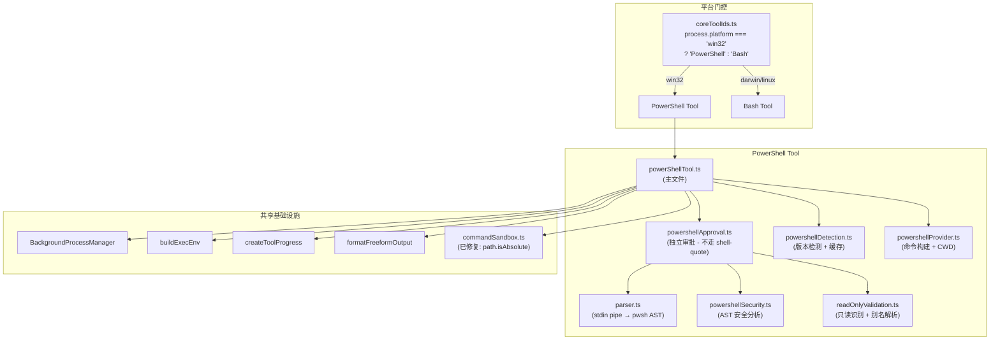
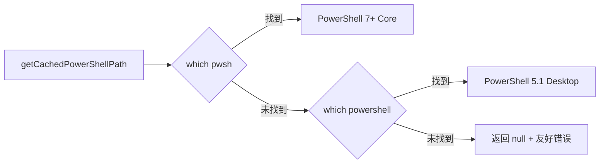
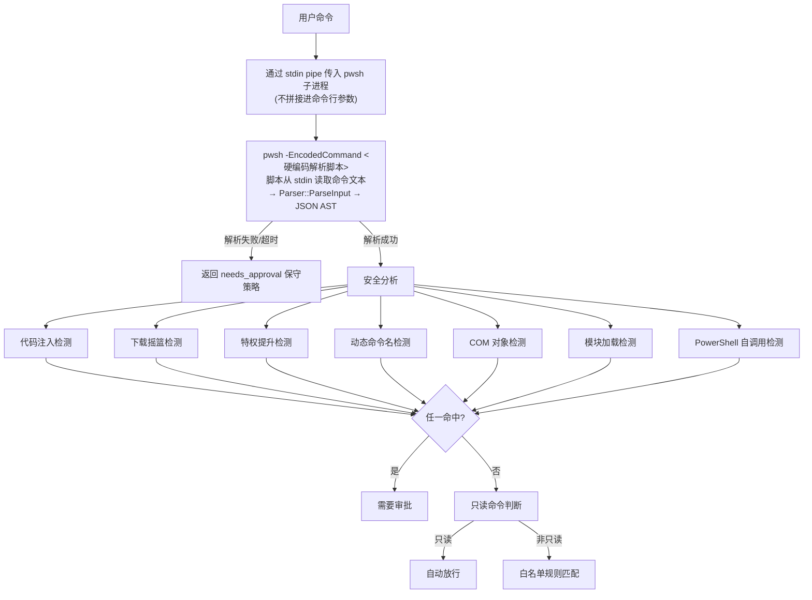
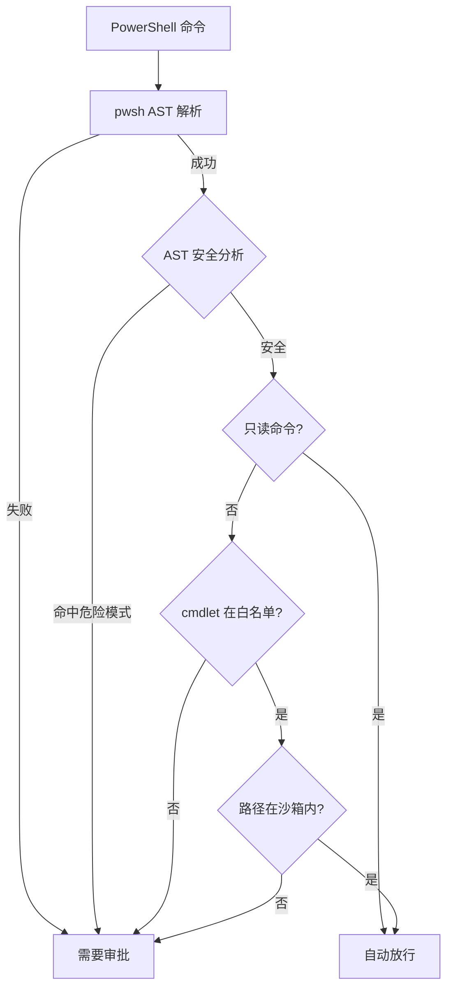
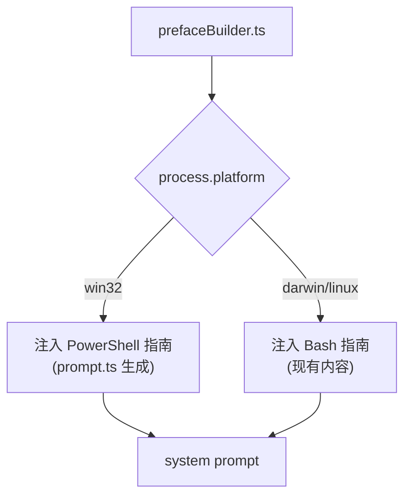
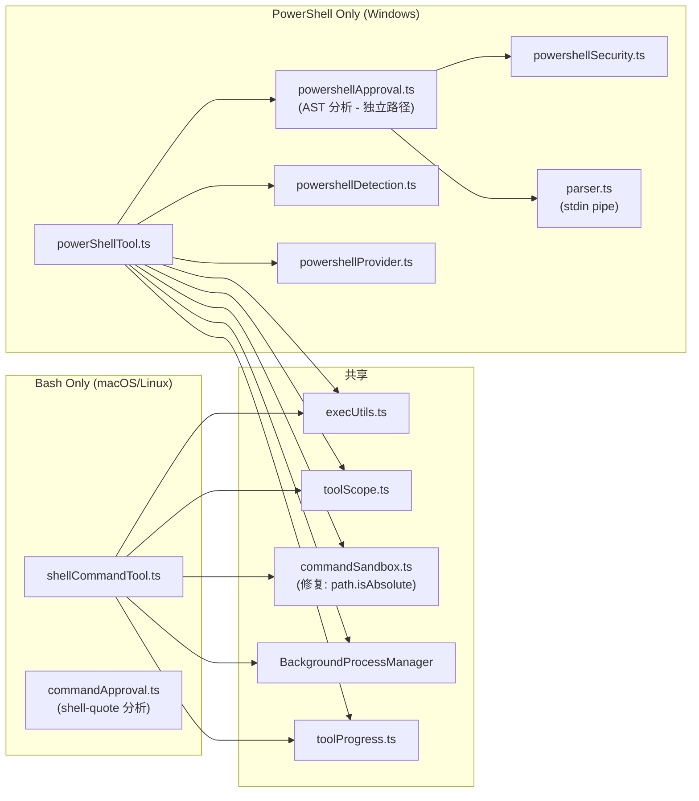

# PowerShell Tool 完整复刻计划书

> **场景类型**: backend-api / infrastructure
> **创建日期**: 2026-04-13
> **版本**: v1.1
> **状态**: 评审修订

---

## 1. 背景与目标

OpenLoaf 当前的 Bash 工具在 Windows 上通过 `buildShellCommand()` 简单地将命令转发给 `powershell.exe -Command`，缺乏 PowerShell 原生的安全分析、版本适配和权限控制。Claude Code 已实现了完整的 PowerShell 工具，包含 AST 级安全检测、双版本适配、Git hook 防护等子系统。本项目目标是将 Claude Code 的 PowerShell 工具完整复刻到 OpenLoaf，使 Windows 用户获得与 macOS/Linux 用户同等的安全性和体验。

**核心策略**：PowerShell 与 Bash 是**平台互斥**的替代关系 — Windows 注册 PowerShell，macOS/Linux 注册 Bash。

**成功指标**

| 指标 | 目标值 | 衡量方式 |
|------|--------|----------|
| Windows 命令执行成功率 | >=95% | AI 测试用例通过率 |
| 安全检测覆盖率 | 与 Claude Code 对等 | 危险命令检测单元测试 |
| PS 7+ / 5.1 双版本兼容 | 两个版本均可正常运行 | CI 矩阵测试 |
| Agent prompt 平台适配 | 无需用户干预 | 自动检测平台并切换工具集 |

---

## 2. 功能范围

### P0 - 必须实现

- [ ] PowerShell 工具核心：`powerShellTool.ts`（tool 定义 + 命令执行）
- [ ] 工具定义：`runtime.ts` 中新增 `powerShellToolDef`（inputSchema / outputSchema）
- [ ] 平台门控：`coreToolIds.ts` 使用内联条件表达式 `process.platform === 'win32' ? 'PowerShell' : 'Bash'`（保持常量导出，零破坏性）
- [ ] PowerShell 版本检测：检测 `pwsh`(7+) vs `powershell`(5.1)，缓存路径；**检测结果同时控制 AST 解析器和命令执行器的二进制路径**
- [ ] PowerShell Provider：构建执行命令（`-NoProfile -NonInteractive -Command`），CWD 持久化（仅前台串行 tool 调用使用文件持久化，后台任务沿用 spawn `cwd` 参数）
- [ ] **独立审批系统**：`powershellApproval.ts` — Windows 平台命令审批**完全绕过** `shell-quote`，100% 由 pwsh AST 分析结果驱动（`needsApprovalForPowerShell()`）
- [ ] **AST 安全分析**：解析脚本通过 `-EncodedCommand` 硬编码传入 pwsh，**待分析命令通过 stdin pipe 传入**（切断命令注入路径），检测注入/提权/COM 等
- [ ] 工具注册：注册到 `TOOL_REGISTRY`，别名映射 `'shell-command'` 按平台指向 `'Bash'` 或 `'PowerShell'`
- [ ] **修复现有跨平台缺陷**：`commandSandbox.ts:29` 的 `expanded.startsWith("/")` 改为 `path.isAbsolute(expanded)`，修复 Windows 沙箱逻辑失效
- [ ] Agent prompt 适配：PowerShell 语法指南**按平台动态注入**（在 `prefaceBuilder.ts` 中条件拼接），不写入静态 .md 模板，Windows 注入 PS 指南，非 Windows 注入 Bash 指南

### P1 - 应该实现

- [ ] Git hook 注入防护：检测裸仓库攻击 + git 内部路径写入 + git 执行的复合攻击
- [ ] 破坏性命令告警：`Remove-Item -Recurse -Force`、`Format-Volume`、`git push --force` 等
- [ ] 退出码语义解释：`robocopy` 位域、`findstr` grep 语义等 Windows 特有退出码
- [ ] PS 5.1 语法适配：prompt 中**只写最小差异清单（5 条以内）**，执行失败时在 tool result 中追加具体语法修正提示（后置纠正模式，类似 `detectUnquotedCjkPaths`）
- [ ] Sleep 检测：阻止 `Start-Sleep N`（N>=2）作为首条语句
- [ ] 后台任务 `shellTask.ts` 的二进制路径由版本检测结果统一控制（不再硬编码 `powershell.exe`）

### P2 - 可以推迟

- [ ] Windows 沙箱策略：企业策略要求沙箱但 Windows 原生不支持时的拒绝执行逻辑
- [ ] 路径约束检查：NTFS 特有的尾部空格/点号剥离、PS Provider 前缀（`FileSystem::`）；路径比较显式使用 `path.win32`
- [ ] `modeValidation`：`acceptEdits` 模式下自动允许 `Set-Content` 等写入 cmdlet
- [ ] 危险 cmdlet 分类细化：脚本文件执行、模块加载、网络 cmdlet、别名劫持等完整分类
- [ ] 大输出持久化：>64MB 截断 + 复制到 tool-results 目录

---

## 3. 方案设计

### 3.1 整体架构

PowerShell 工具采用与 Bash 工具**同构**的架构——一个主文件 + 独立审批文件——共享后台任务管理和进度报告基础设施，新增 PowerShell 特有的安全分析和版本适配。



### 3.2 文件结构

新增文件位于 `apps/server/src/ai/tools/powershell/` 目录：

| 文件 | 职责 | 阶段 |
|------|------|------|
| `powerShellTool.ts` | 主工具定义（tool + execute + validateInput） | P0 |
| `powershellDetection.ts` | pwsh/powershell 路径检测与缓存 | P0 |
| `powershellProvider.ts` | Shell Provider（命令构建 + CWD 持久化） | P0 |
| `powershellApproval.ts` | **独立审批入口**（AST 驱动，不走 shell-quote） | P0 |
| `powershellSecurity.ts` | AST 级安全分析（注入/提权/COM/模块加载等） | P0 |
| `readOnlyValidation.ts` | 只读命令识别 + cmdlet 别名规范化（80+ 映射） | P0 |
| `parser.ts` | PowerShell AST 解析（**stdin pipe** 传入命令） | P0 |
| `dangerousCmdlets.ts` | 危险 cmdlet 分类常量 | P0 |
| `prompt.ts` | PowerShell prompt 动态生成（版本适配语法指导） | P0 |
| `gitSafety.ts` | Git hook 注入防护 | P1 |
| `destructiveWarning.ts` | 破坏性命令告警 | P1 |
| `commandSemantics.ts` | 退出码语义解释（robocopy/findstr 等） | P1 |

修改的已有文件：

| 文件 | 修改内容 |
|------|----------|
| `packages/api/src/types/tools/runtime.ts` | 新增 `powerShellToolDef` |
| `apps/server/src/ai/tools/toolRegistry.ts` | 注册 PowerShell 工具 + 平台条件别名 |
| `apps/server/src/ai/shared/coreToolIds.ts` | 内联条件：`process.platform === 'win32' ? 'PowerShell' : 'Bash'` |
| `apps/server/src/ai/tools/commandSandbox.ts` | **`startsWith("/")` → `path.isAbsolute()`**（修复 Windows 沙箱失效） |
| `apps/server/src/ai/tools/execUtils.ts` | 新增 Windows PATH 补齐（`C:\Windows\System32` 等） |
| `apps/server/src/ai/services/background/shellTask.ts` | 二进制路径由版本检测结果控制，不再硬编码 `powershell.exe` |
| `apps/server/src/ai/services/background/BackgroundProcessManager.ts` | 新增 `spawnPowerShell` 方法 |
| `apps/server/src/ai/agent-templates/templates/master/index.ts` | prefaceBuilder 按平台条件注入 PS/Bash 指南 |

### 3.3 核心模块设计

#### 3.3.1 平台门控（零破坏性方案）

`coreToolIds.ts` **保持 `as const` 常量导出不变**，仅将数组中的 `'Bash'` 替换为内联条件表达式：

```
process.platform === 'win32' ? 'PowerShell' : 'Bash'
```

所有消费方（`agentFactory.ts`、`chatStreamService.ts` 等）无需改动。`TOOL_ALIASES` 中 `'shell-command'` 的映射同样按平台条件切换。

#### 3.3.2 版本检测与适配



检测结果缓存在模块级变量中。**关键约束**：检测到的 PowerShell 路径同时用于：
1. AST 解析器（`parser.ts` 调用同一个二进制）
2. 前台命令执行（`powerShellTool.ts`）
3. 后台任务执行（`shellTask.ts`）

保证 AST 解析结果与运行时行为一致。

#### 3.3.3 AST 安全分析流水线（修订：stdin pipe 防注入）



**关键安全设计**：
- 解析脚本本身通过 `-EncodedCommand`（base64 UTF-16LE）硬编码传入，不可被用户命令影响
- 待分析的用户命令通过 `child.stdin.write()` + `child.stdin.end()` 传入，**彻底切断命令注入路径**
- 解析脚本从 `$input` 读取 stdin 内容，调用 `Parser::ParseInput`，输出 JSON 到 stdout

#### 3.3.4 独立审批系统（不走 shell-quote）



**与 Bash 审批的关键区别**：
- Bash：`shell-quote` POSIX token 分析 → 白名单匹配
- PowerShell：pwsh AST JSON → 安全分析 → cmdlet 别名解析 → 白名单匹配
- 两条路径**完全互斥**，在 `powerShellTool.ts` 的 `needsApproval` 中直接调用 `needsApprovalForPowerShell()`，**不经过** `commandApproval.ts`

#### 3.3.5 cmdlet 别名解析表

所有命令在权限匹配前通过 `resolveToCanonical()` 规范化：

| 别名 | 规范 cmdlet |
|------|------------|
| `ls`, `dir`, `gci` | `Get-ChildItem` |
| `cat`, `type`, `gc` | `Get-Content` |
| `rm`, `del`, `ri` | `Remove-Item` |
| `cd`, `chdir`, `sl` | `Set-Location` |
| `cp`, `copy`, `cpi` | `Copy-Item` |
| `mv`, `move`, `mi` | `Move-Item` |
| `grep`, `sls` | `Select-String` |
| `ps`, `gps` | `Get-Process` |
| `kill`, `spps` | `Stop-Process` |

完整别名表约 80+ 条。

#### 3.3.6 PowerShell Provider（命令构建）

Provider 在命令末尾追加 CWD 持久化逻辑（**仅前台串行 tool 调用**）：

```
; $_ec = if ($null -ne $LASTEXITCODE) { $LASTEXITCODE } elseif ($?) { 0 } else { 1 }
; (Get-Location).Path | Out-File -FilePath '<cwdFile>' -Encoding utf8 -NoNewline
; exit $_ec
```

后台任务不使用文件持久化 CWD，沿用 spawn `cwd` 参数（无竞态风险）。

非沙箱模式：直接 `-Command` 传参
沙箱模式：`-EncodedCommand`（base64 UTF-16LE）避免引号腐蚀

#### 3.3.7 Prompt 动态注入（不修改静态模板）



PowerShell 语法指南在 `prompt.ts` 中生成，内容包括：
- 最小差异清单（5 条以内）：无 `&&`/`||`（5.1）、`-and`/`-or` 替代、`Get-ChildItem` vs `ls` 等
- 执行失败时在 tool result 中追加具体语法修正提示（后置纠正，省 token）
- **不写入** `prompt-v5.en.md` / `prompt-v5.zh.md` 静态模板

#### 3.3.8 Git 安全防护（P1）

检测两种攻击向量：

| 攻击 | 检测方式 |
|------|----------|
| 裸仓库攻击 | CWD 包含 `HEAD` + `objects/` + `refs/` 但无 `.git/HEAD` |
| Git 内部路径写入 | 复合命令先 `Set-Content hooks/pre-commit` 再 `git commit` |

路径规范化流程：冒号绑定参数提取 → 引号移除 → 反引号转义移除 → PS Provider 前缀剥离 → NTFS 尾部空格/点号 → `posix.normalize` → CWD 重入检测 → 全小写

### 3.4 与现有 Bash 工具的关系



**关键设计原则**：
- Bash 的 `commandApproval.ts`（`shell-quote` POSIX 分析）保持不动，**Windows 平台不调用**
- PowerShell 的 `powershellApproval.ts`（pwsh AST 分析）是完全独立的审批路径
- 两条审批路径**互斥切换**，由工具本身的 `needsApproval` 决定

---

## 4. 实施计划

| 阶段 | 内容 | 交付物 | 依赖 |
|------|------|--------|------|
| P1 跨平台修复 | 修复 `commandSandbox.ts` Windows 路径检测 + `shellTask.ts` 硬编码路径 | `commandSandbox.ts` 修改, `shellTask.ts` 修改 | 无 |
| P2 基础设施 | 版本检测 + Provider + AST 解析器（stdin pipe）+ cmdlet 别名表 | `powershellDetection.ts`, `powershellProvider.ts`, `parser.ts`, `dangerousCmdlets.ts` | 无 |
| P3 安全子系统 | AST 安全分析 + **独立审批**（不走 shell-quote）+ 只读识别 | `powershellSecurity.ts`, `powershellApproval.ts`, `readOnlyValidation.ts` | P2 |
| P4 核心工具 | PowerShell tool 实现 + toolDef + 注册 + 平台门控（内联条件） | `powerShellTool.ts`, `runtime.ts`, `toolRegistry.ts`, `coreToolIds.ts` | P2, P3 |
| P5 Prompt 适配 | 动态注入 PS 指南（prefaceBuilder 条件拼接） + 后置语法纠正 | `prompt.ts`, `prefaceBuilder.ts` 修改 | P4 |
| P6 辅助功能 | 退出码语义 + 破坏性告警 + Sleep 检测 + Git 防护 + 后台任务 | `commandSemantics.ts`, `destructiveWarning.ts`, `gitSafety.ts`, `BackgroundProcessManager` 修改 | P4 |
| P7 测试 | 单元测试 + AI 行为测试 | `__tests__/powershell*.test.ts` | P4 |

**风险项**

| 风险 | 影响 | 缓解措施 |
|------|------|----------|
| AST 解析依赖 pwsh 可执行文件 | 未安装 pwsh 时安全分析不可用 | 解析失败时回退到需要审批（保守策略） |
| PS 5.1 与 7+ 行为差异 | 部分 cmdlet 行为不一致 | 版本检测后分支处理 + 失败后置纠正 |
| 开发环境为 macOS | 无法本地运行 PowerShell 测试 | 使用 pwsh（跨平台安装）+ CI Windows 矩阵 |
| stdin pipe 传入 AST 解析的延迟 | 每次审批需启动 pwsh 子进程 | 结果缓存（相同命令不重复解析）+ 解析超时兜底 |

---

## 5. 评审记录

| 日期 | 角色 | 结论 | 关键意见 |
|------|------|------|----------|
| 2026-04-13 | arch | WARN | `commandSandbox.ts:29` 硬编码 Unix 路径；12 文件过多建议精简；`coreToolIds` 用内联条件更简洁 |
| 2026-04-13 | security | WARN | AST 解析调用本身是注入入口需 stdin pipe；沙箱路径检测 Windows 失效；`shell-quote` 不理解 PS 语法 |
| 2026-04-13 | edge | BLOCKER | `shell-quote` 无法解析 PS 语法导致审批不可靠；`shellTask.ts` 硬编码路径与版本检测不一致 |
| 2026-04-13 | ai-cost | WARN | PS 指南不应写进静态模板浪费 token；harness 中 `Bash` 引用需条件替换；语法差异用后置纠正更省 |

**v1.1 修订要点**（针对评审反馈）：
1. BLOCKER 修复：PS 审批完全绕过 `shell-quote`，独立 AST 路径
2. 安全修复：AST 解析器用 stdin pipe 传入命令，切断注入
3. 跨平台修复：`commandSandbox.ts` 改 `path.isAbsolute()`
4. 架构简化：`coreToolIds` 保持常量 + 内联条件，零破坏性
5. Token 优化：prompt 动态注入 + 后置语法纠正
6. 一致性修复：版本检测结果统一控制所有执行路径

---
