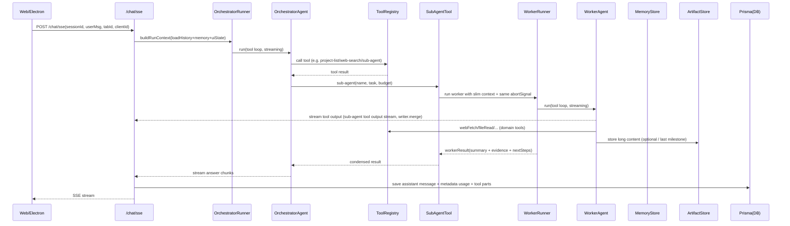
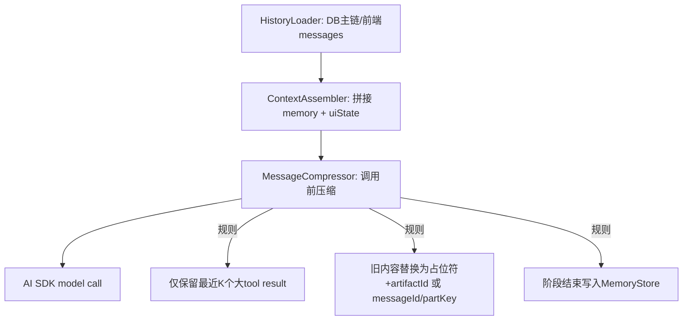
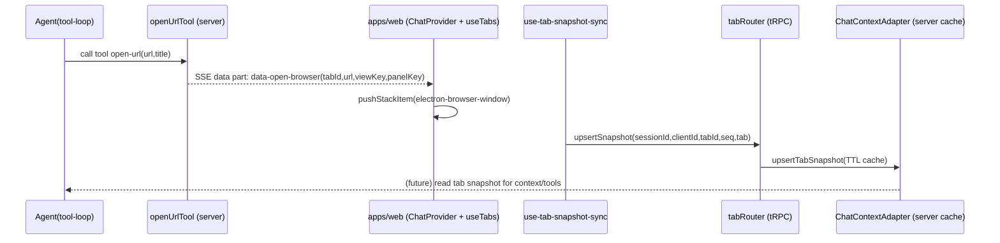
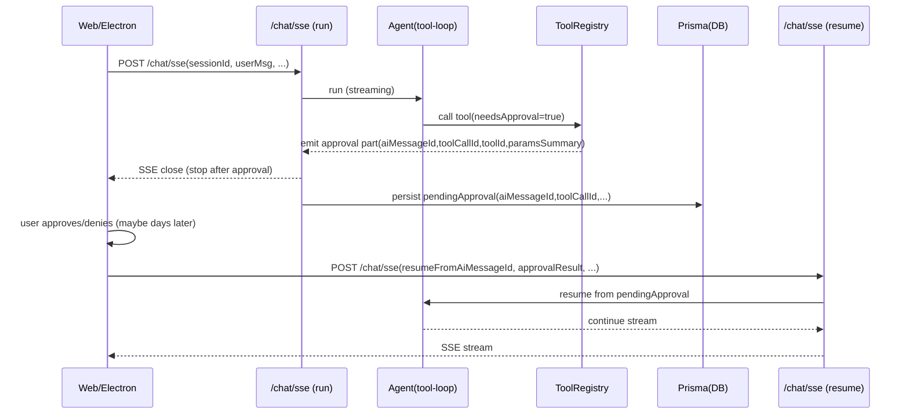

# Server AI 重构方案（V2：参考 Stagehand + Orchestrator/Worker）

> 适用范围：仅针对本仓库 `apps/server` 的 AI 核心重构设计（包含与 AI 强绑定的 UI/stream 协议：`open-url`、sub-agent worker stream 合并、断点续传/强制中断、审批交互）。  
> 目标：参考 `docs/stagehand-core-agent.md` 中 Stagehand 的 AI SDK 组织方式（instructions 构建、调用前压缩、tools 管理），并结合 `docs/mutli-agent.md` 的 orchestrator/worker 原则，重新设计 server 侧 AI 架构。  
> 约束：本文只给出方案，不写代码；本次开发以“先做最小闭环”为主，不需要兼容老版本（可以先重命名旧代码，再创建新实现，最后删除旧实现）。

---

## 0. 需求与目标（你要解决的问题）

你要对当前 `apps/server` 的 AI 能力做系统性重构，重点从以下四个角度出发：

1. **Agent 管理**：从“硬编码单一 MasterAgent”升级为“可注册、可配置、可组合”的多 agent（orchestrator/worker）体系；最好能与 DB 中的配置/定义打通。
2. **Instructions 编写**：从“短字符串提示词”升级为“结构化、可维护、可测试”的 prompt builder，明确委派、预算、工具边界、完成条件。
3. **内容压缩**：引入“调用前压缩 + 长会话 memory（结构化）+ ArtifactStore（后置实现）”组合策略，避免长对话/大 tool 输出把上下文撑爆。
4. **Tools 管理**：从“散落对象合并”升级为“ToolRegistry + ToolPacks + Policy（风险/审批/模式/作用域）”的统一治理，严格以 ToolDef.id 为 key。

### 0.1 必须保留的现有关键链路（V2 不能破坏）

1. **`open-url` 工具与“server 控制 web + web 回传状态”链路必须保留**  
   - 业务规则不变：打开浏览器面板/切换 UI viewKey，并触发 web 侧回传 tab snapshot（实现文件路径允许调整）。  
   - server 发起：`apps/server/src/ai/tools/browser/openUrl.ts`（写入 `data-open-browser`）  
   - web 执行 UI 打开：`apps/web/src/components/chat/ChatProvider.tsx`（`handleOpenBrowserDataPart`）  
   - web 同步 tab 状态给 server：`apps/web/src/hooks/use-tab-snapshot-sync.ts` → `apps/server/src/routers/tab.ts` → `apps/server/src/modules/chat/ChatContextAdapter.ts`  
   - 说明：这条链路决定了“AI 能影响 UI（打开浏览器/切换 viewKey）”以及“server 能读到 web 的最新状态（tab snapshot）”，后续任何 browser worker / browser-command 都依赖它。
2. **AI SDK 流式入口与自定义断点续传/强制中断必须保留**  
   - 主 SSE：`apps/server/src/modules/chat/ChatSseRoutes.ts`（`createUIMessageStream` + `createAgentUIStream`）  
   - 断线续传 buffer：`apps/server/src/modules/chat/StreamStoreAdapter.ts`（replay chunks）  
   - 强制中断：`POST /chat/sse/:id/stop` → abortSignal（同一 abortSignal 必须能中止 orchestrator 与 worker）。
3. **worker 被 orchestrator 当作 tool 调用，且 worker 输出必须 merge 到同一个 SSE**  
   - 输出形式：worker 的 chunk 必须以“stream tool output”的方式写入主 SSE（而不是新开 assistant message / 另开 SSE/WS）。  
   - 语义以 ToolDef 为准：`packages/api/src/types/tools/subAgent.ts`（描述里明确 “流式输出合并到当前对话中”）。
4. **审批交互走 SSE（停止/续跑）**  
   - 当遇到 `needsApproval` 的工具调用时：server 在 SSE 中输出 `approval` part 后立即停止当前 SSE。  
   - 用户在页面上完成审批后：前端把“审批结果 + 对应的 AI messageId”发送回 server；server 允许在任意时间（哪怕几天后）继续后续执行。

---

## 1. 当前 server AI 现状盘点（作为重构基线）

### 1.1 入口与运行形态

- SSE 入口：`apps/server/src/modules/chat/ChatSseRoutes.ts`
  - 使用 `createUIMessageStream` + `createAgentUIStream` 驱动 agent
  - 断线续传：`apps/server/src/modules/chat/StreamStoreAdapter.ts`（Keyv + EventEmitter + buffer 上限）
- Agent：`apps/server/src/ai/agents/MasterAgent.ts`
  - `ToolLoopAgent` + DeepSeek 模型
  - instructions 目前较短，缺少明确的“委派/预算/压缩/工具策略”

### 1.2 上下文/持久化/消息树

- DB 消息树：`apps/server/src/modules/chat/ChatRepositoryAdapter.ts`
  - 物化路径 `path`，支持分支与“最右叶子”的选择
- schema：`packages/db/prisma/schema/chat.prisma`
  - `ChatSession` / `ChatMessage` / `SubAgentDefinition`
- Tab UI 快照：`apps/server/src/modules/chat/ChatContextAdapter.ts`（TTL cache）
  - tRPC 写入/读取：`apps/server/src/routers/tab.ts`

### 1.3 Tools 的定义与实现

- ToolDef（单一事实来源）：`packages/api/src/types/tools/*.ts`
  - system：`packages/api/src/types/tools/system.ts`
  - db：`packages/api/src/types/tools/db.ts`
  - browser：`packages/api/src/types/tools/browser.ts`
  - sub-agent：`packages/api/src/types/tools/subAgent.ts`
- server 侧工具实现：`apps/server/src/ai/tools/*`
  - system 工具包含安全边界（allowlist、路径白名单、输出截断）：`apps/server/src/ai/tools/system/*`
  - db 工具目前以 project CRUD 为主：`apps/server/src/ai/tools/db/project.ts`
  - UI side-effect 示例：`apps/server/src/ai/tools/browser/openUrl.ts`（通过 UI stream data part 打开浏览器面板；web 侧处理见 `apps/web/src/components/chat/ChatProvider.tsx` 与 `apps/web/src/components/chat/message/tools/OpenUrlTool.tsx`）
  - sub-agent 工具当前禁用：`apps/server/src/ai/tools/subAgent/tool.ts`

### 1.4 已存在但未贯通的能力线索

- 已定义 UI Event 协议（runtime WS 校验用）：`packages/api/src/types/event.ts`
- 已预留 UI data parts：
  - `sub-agent` / `open-browser` / `browser-command`（以及本方案新增的 `approval`）：`packages/api/src/types/message.ts`
- DB 已有 `SubAgentDefinition`：`packages/db/prisma/schema/chat.prisma`
  - 说明：本项目已经具备“DB 驱动 sub-agent”的结构基础，但 server 端还没有真正启用。

---

## 2. 设计参考：Stagehand 与 Orchestrator/Worker 的可迁移点

### 2.1 Stagehand（AI SDK 路径）的关键模式（见 `docs/stagehand-core-agent.md`）

- **结构化系统提示词（system/instructions builder）**：按“目标/环境/工具/策略/完成条件”分段生成。
- **调用前压缩**：在每次发给模型前，压缩历史中“体积最大的 tool result”（如 screenshot/ariaTree）——只保留最近 N 个，其余替换为占位符。
- **工具聚合与过滤**：内置工具 + 用户工具 + integrations（MCP）分层合并，并按 mode 过滤工具集。
- **可选缓存重放**：记录 step/action，命中缓存可跳过模型调用（减少成本，提升稳定性）。

### 2.2 `docs/mutli-agent.md` 的 orchestrator/worker 核心原则

- Lead agent（orchestrator）负责：拆解、分配预算、协调与合并结果。
- Worker（subagent）负责：在自己上下文里“花 token”，并把输出**压缩**成高密度摘要返回。
- 长会话需要 memory：把计划/阶段结论写入外部存储，避免上下文截断导致失忆（本次 memory 需要结构化）。
- 减少“传话损耗”：worker 输出要结构化、可检索；长内容后续落到 ArtifactStore（存本地或 OSS 文件系统，本次放最后做）。

---

## 2.3 本项目必须继承的 AI SDK Streaming 组织方式（V2 的硬约束）

> 这部分不是“可选最佳实践”，而是已经在生产链路里跑通的基建；V2 需要复用其机制并扩展到 worker。

- **主流式驱动**：`apps/server/src/modules/chat/ChatSseRoutes.ts`
  - `createUIMessageStream` 负责 SSE message stream 外壳与错误兜底
  - `createAgentUIStream` 负责把一个 agent 的 tool-loop 输出变成 UIMessageChunk（支持 tools 与 metadata）
  - `writer.merge(uiStream)` 负责把 agent 输出合并到同一个 SSE
- **断点续传/强制中断**：`apps/server/src/modules/chat/StreamStoreAdapter.ts`
  - 通过 append buffer 解决断线重连的 replay（避免 `tee()` 竞态）
  - `POST /chat/sse/:id/stop` 通过 abortSignal 让 agent 协作式退出，并 finalize stream
- **V2 扩展点**：worker 的输出需要“像 sub-agent ToolDef 描述的一样”被 merge 到同一个 writer，并且以“stream tool output”的形式输出；worker 的 chunk 也必须进入同一个 `StreamStoreAdapter` buffer，才能实现“断线续传覆盖 worker 输出”。

---

## 3. 新 AI 架构（V2）总体方案

### 3.1 总体目标形态（最重要的行为约束）

1. **Agent 不再是一个类文件**：而是“注册表 + 运行器 + 配置源（代码/DB）”的组合。
2. **Prompt 不再手写字符串**：通过 PromptBuilder 结构化生成，包含委派/预算/工具边界/完成条件。
3. **上下文不再无限堆叠**：以“调用前压缩”为硬策略；大块内容通过压缩策略 + 结构化 memory 控制体积，必要时把长内容落到 ArtifactStore（本次放最后做）。
4. **Tools 不再散落合并**：统一从 ToolRegistry 导出（key 强制为 `ToolDef.id`），按 ToolPack+Policy 发放给不同 agent。
5. **Orchestrator/Worker 的运行时模型固定**：worker 由 orchestrator 通过 `sub-agent` 这个“工具”调用；worker 的输出以“stream tool output”形式合并进同一条 SSE，并被当前 AI 消息的 `parts` 持久化；主 agent 只需要把 worker 的最终结构化结果用于合并决策。

---

## 4. 组件分层设计（从 agent 管理/提示词/压缩/tools 视角）

### 4.1 Agent 管理层（AgentRegistry + Runner）

#### AgentRegistry（可用 agent 的单一入口）

职责：
- 汇总“可用 agent 定义”
  - 内置（代码内 hard-coded agent）
  - DB 驱动（`SubAgentDefinition`）
- 根据运行模式（normal/readonly/settings）过滤可用 agent 与工具集
- 为每个 agent 产出 `AgentSpec`（模型/工具/预算/提示词生成策略）

建议输出形态（概念）：
- `AgentSpec { id, kind(orchestrator|worker), model, toolPackKeys, promptProfile, limits }`

#### AgentRunner（统一执行器）

职责：
- 统一封装 AI SDK 的 agent 执行（stream/non-stream）
- 采集 token usage、错误、工具调用日志
- 与请求上下文集成（复用 `apps/server/src/common/requestContext.ts`）
- 统一“调用前压缩”入口（在每次模型调用前做 message 压缩）

### 4.1.1 Worker 作为 Tool 的运行与落库模型（关键行为）

> 这部分将 `docs/mutli-agent.md` 的理念落到“本项目的 SSE/DB/UI 现实约束”上。

**约束 A：worker 被当作 tool 调用（调用点在 orchestrator 的 tool-loop 内）**
- ToolDef：`packages/api/src/types/tools/subAgent.ts`（`id: "sub-agent"`）
- V2 要求：启用并替换掉目前禁用的占位实现 `apps/server/src/ai/tools/subAgent/tool.ts`

**约束 B：worker 的 stream 必须 merge 到当前 SSE（而不是另开一条 SSE/WS）**
- worker 执行同样使用 AI SDK 的 `createAgentUIStream`
- worker 输出通过主请求的 `writer.merge()` 合并到同一个 `createUIMessageStream` 内（入口仍然是 `apps/server/src/modules/chat/ChatSseRoutes.ts`）
- **关键规则**：worker 的文本 chunk 必须以“stream tool output（sub-agent tool 的输出流）”的方式写入 SSE（带 `toolCallId`），从 UI 角度它是一段“工具的流式输出”，而不是新的 assistant message。
- 目的：前端看到的是“同一条 SSE 流”里出现 sub-agent 工具的实时输出；断线续传也能完整回放（`apps/server/src/modules/chat/StreamStoreAdapter.ts`）

**约束 C：worker 输出持久化策略（最小闭环）**
- worker 的“流式输出内容”不再单独落一条 `ChatMessage(role=assistant)`；而是作为本轮 AI 消息的 tool parts 随 SSE 一起落库/回放（更贴近“stream tool output”的定位，减少消息树复杂度）。
- worker 的“最终结构化结果”由 `sub-agent` 工具的最终返回值承载（例如 `{ summary, evidence, nextSteps }`），供 orchestrator 合并；该返回值同样作为 tool part 落库。
- 如需可观测性：可以在 `metadata` 中记录 `{ workerName, toolCallId }`（不强制新增 schema/表）。

**约束 D：worker 在 UI 的呈现方式（工具样式 + 自动收缩）**
- worker 输出以 `sub-agent` 工具卡片呈现（tool message + tool output stream），而不是独立 assistant bubble。
- UI 可以对 `sub-agent` 的流式输出默认折叠/自动收起（结束后收起，必要时可展开查看）。

---

### 4.2 Instructions 体系（PromptBuilder）

> 核心目标：像 Stagehand 一样把“工具清单/策略/完成条件/预算规则”写清楚，并保证不同 agent 的 prompt 结构一致可维护。

#### SystemPromptBuilder（结构化 prompt）

建议分段（XML-ish 或 Markdown headings 均可）：
- `Task/Goal`：用户目标、成功标准、输出格式
- `Context`：workspaceId、tabId、sessionId、当前 UI 状态摘要（可选）
- `Tools`：允许的工具清单 + 风险/审批说明（让模型知道边界）
- `Strategy`：
  - orchestrator：拆解/预算/委派/合并规则
  - worker：只做子任务、严格输出 schema、输出尽量短且结构化
- `Completion Contract`：完成时必须包含哪些字段（例如结论/依据/下一步）

#### TaskPromptBuilder（任务描述规范化）

- orchestrator 接到用户消息后，先生成“可委派的子任务描述”（含 scope/output schema/stop condition/allowed tools/budget）
- worker 接到子任务后，严格按 schema 输出（建议 JSON）

---

### 4.3 内容压缩（MessageCompressor + Memory + Artifact）

#### MessageCompressor（调用前压缩：强制）

原则（参考 Stagehand `processMessages`）：
- 对“体积最大、重复出现”的内容做替换/降采样
- 只保留最近 K 个完整内容（K 按 agent 类型配置）
- 更旧内容替换为占位符 + 引用（例如 `memoryKey`、`artifactId`，或“原始 messageId + partKey”）

建议优先处理的“大块源”：
- `webFetch` 返回文本
- `fileRead` 返回文本
- `shell` 输出（虽然已做 8k 截断，但仍可能大量堆叠）
- `sub-agent` 输出（worker 报告）
- `tab snapshot`（如未来把页面结构/DOM/截图引入）

#### ArtifactStore（产物化：存大块内容，最后开发）

用途：
- 存“大块但必须可追溯/可复用”的内容：网页全文、长报告、截图/二进制、结构化 JSON 等
- orchestrator/worker 只把摘要与引用（`artifactId`）带回主上下文，避免 history 膨胀

存储位置（后续落地）：
- 本地文件系统：开发/自托管优先（便于调试）
- OSS 文件系统：生产优先（更稳定、可扩展）

最小设计（建议接口）：
- `putText({ sessionId, mimeType, text, source }) -> { artifactId, byteSize, sha256, storageKey }`
- `putBinary({ sessionId, mimeType, bytes, source }) -> { artifactId, byteSize, sha256, storageKey }`
- `get({ artifactId }) -> { mimeType, bytes | text, meta }`（服务端内部用）
- `getSignedUrl?({ artifactId, expiresInSec }) -> url`（可选：给 web 端展示大文件/图片）

ArtifactId 与元数据（建议）：
- `artifactId`：`art_${ulid}`（全局唯一，便于日志/排障）
- `meta`（JSON）：`{ artifactId, sessionId, createdAt, mimeType, byteSize, sha256, source: { toolId?, toolCallId?, url?, messageId? } }`

本地存储布局（建议）：
- 根目录由配置决定：`ARTIFACT_STORE_ROOT`
- 路径：`{root}/{sessionId}/{artifactId}`（文件内容）+ `{artifactId}.json`（meta sidecar）

安全与限额（建议）：
- 限制单个 artifact 最大字节数；拒绝未知/危险 mimeType（或强制 `application/octet-stream`）
- 文件名/路径只由 server 生成（避免路径穿越）
- 写入前计算 `sha256`，用于去重/校验

#### MemoryStore（长会话记忆：结构化 + 可检索）

用途：
- 保存“计划/阶段结论/关键决策/待办”，可在后续调用中检索
- orchestrator 每个阶段结束写一次 memory（减少长会话截断影响）

结构化建议（概念 schema）：
- `version`：number
- `sessionId`：string
- `goals`：string[]
- `decisions`：`{ id: string; at: string; decision: string; rationale?: string }[]`
- `todos`：`{ id: string; text: string; status: "open" | "done"; owner?: string }[]`
- `facts`：`{ id: string; fact: string; sourceMessageId?: string }[]`
- `openQuestions`：`{ id: string; question: string; context?: string }[]`

写入规则（简化版）：
- 只允许 orchestrator 写入；worker 只产出结构化 `evidence/summary`，由 orchestrator 归并到 memory。
- memory 更新必须是“增量合并”（不要每轮重写全量自由文本）。

---

### 4.4 Tools 管理（ToolRegistry + ToolPacks + Policy）

#### ToolRegistry（强约束：ToolDef.id 为 key）

职责：
- 以 `packages/api/src/types/tools/*` 为单一事实来源
- server 实现统一在 registry 里注册（禁止在 agent 文件里随手扩散合并）
- 为每个 tool 附带 policy 元信息：
  - `riskType`（复用 `packages/api/src/types/toolResult.ts`）
  - `needsApproval`
  - `scope`（workspace/tab/session）
  - `costHint`（用于 prompt 里压缩工具描述）

#### ToolPacks（按 agent 发放最小集合）

建议的包（概念）：
- `pack:orchestrator-base`：只含委派/读取/汇总相关工具（避免 orchestrator 过度执行细节）
- `pack:worker-research`：webFetch/webSearch/fileRead 等（只读为主）
- `pack:worker-project`：project CRUD（含审批）
- `pack:ui-control`：所有 UI side-effect 工具（必须走审批/模式开关）
  - 必须包含并保持 `open-url`：ToolDef `packages/api/src/types/tools/browser.ts`，实现 `apps/server/src/ai/tools/browser/openUrl.ts`

#### ApprovalGateway（统一审批入口）

目标：
- 把 `needsApproval` 变成可交互流程，而不是仅靠模型“自觉”
- **审批通道只走 SSE（本次不接入 runtime ws UiEvent）**

规则（停止/续跑）：
1. 当模型调用到 `needsApproval` 的工具时，server 在 SSE 中输出一个 `approval` data part（包含 `aiMessageId`、`toolCallId`、`toolId`、参数摘要等），随后立即结束当前 SSE（HTTP 连接结束）。  
2. 前端展示审批 UI。用户确认/拒绝后，前端发起**新的 SSE 请求**，把 `approvalResult + aiMessageId`（以及 `toolCallId`/`approvalId`）发送给 server。  
3. server 根据 `aiMessageId` 找到当时的“待审批点”，在任意时间继续执行后续流程（即使隔了几天），并在这条新 SSE 中继续向前端输出剩余内容。

> 关键点：审批是“外部交互断点”，不是在同一条 SSE 上阻塞等待（避免连接超时/页面关闭导致状态丢失）。

---

## 5. Orchestrator/Worker 协议（必须先定规矩）

### 5.1 Orchestrator 的“委派规则/预算规则”（建议写进 prompt）

- 何时委派：需要外部检索/多源验证/长工具链/需要把“细节探索”从主上下文隔离出去
- subagent 数量限制：按复杂度 1~N（给出明确阈值）
- **执行方式：本期 worker 一律同步串行（按顺序一个个跑），未来再升级并行**
- 每个 worker 的预算：最大步数、最大工具调用
- 防重复：每个 worker 的 scope 必须互斥（例如按来源/子主题分工）

### 5.2 Worker 的输出规范（建议 JSON schema）

建议 worker 固定输出：
- `summary`：要点摘要（短）
- `evidence`：证据/来源（URL、引用片段、sourceMessageId、artifactId 等）
- `openQuestions`：未解决点（可选）
- `nextSteps`：建议下一步（可选）

> 重要：worker 不要输出长篇正文；短期可以依赖工具结果自身的截断/压缩策略控制体积，长期把长内容落到 ArtifactStore 并只返回 `artifactId`。

### 5.3 TimeWorker（测试用 worker）定义（用于打通全链路）

> 目标：用一个“几乎零依赖”的 worker，把 orchestrator→sub-agent tool→worker stream merge→落库→UI 展示整条链路跑通。

- Worker 名称建议：`time`（对应 sub-agent 调用参数 `name`）
- Worker 行为：只调用一次 `time-now` 工具并返回当前时间
  - ToolDef：`packages/api/src/types/tools/system.ts`（`timeNowToolDef`，`id: "time-now"`）
  - 工具实现：`apps/server/src/ai/tools/system/timeNow.ts`
- Worker 输出要求：
  - 对 web：流式输出（让 UI worker 卡片能看到实时生成）
  - 对 orchestrator：工具返回值只给“最终总结”（例如 `summary: "现在是 ..."`）

---

## 6. 目标运行态时序图

### 6.1 主对话（orchestrator tool-loop + 委派 worker + worker stream merge）



### 6.2 调用前压缩点（参考 Stagehand 的 `processMessages`）



### 6.3 `open-url`（必须保留）的“server 控制 UI + web 回传状态”时序



> 备注：未来如果补齐 `browser-command` 工具链，web 侧已经具备“执行命令并回传结果”的通道：  
> - web 执行：`apps/web/src/components/chat/ChatProvider.tsx`（`handleBrowserCommandDataPart` → `executeBrowserCommand`）  
> - server 等待/回传：`apps/server/src/modules/tab/BrowserCommandStoreAdapter.ts`（pending promise） + `apps/server/src/routers/tab.ts`（`reportBrowserCommandResult`）

### 6.4 `needsApproval` 审批（SSE 停止/续跑，支持跨天续跑）



---

## 7. 新的文件夹设计方案（建议目录树）

> 目标：本次不需要兼容老版本；可以先把旧实现重命名为 `ai-legacy`，然后直接在 `apps/server/src/ai/` 创建新实现，最后删除旧实现（避免临时维护两套协议/逻辑）。

### 7.1 建议树（以 `apps/server/src/ai/` 为例）

```text
apps/server/src/ai/
  registry/
    agentRegistry.ts          # 聚合内置 agent + DB SubAgentDefinition
    toolRegistry.ts           # tool 注册与元信息（强制 ToolDef.id key）
    toolPacks.ts              # orchestrator/worker 按包发放工具
    policies.ts               # 风险/审批/模式开关策略

  runners/
    orchestratorRunner.ts     # 统一执行 orchestrator（stream）
    workerRunner.ts           # 统一执行 worker（sync serial / future parallel）
    aiSdkMiddleware.ts        # 调用前压缩/注入 usage/可观测性

  prompts/
    systemPromptBuilder.ts    # 结构化 system prompt（类似 Stagehand）
    taskPromptBuilder.ts      # 子任务描述模板（objective/scope/schema/budget）
    profiles.ts               # 不同 agent 的 prompt profile（orchestrator/worker）

  context/
    historyLoader.ts          # 从 DB 拉主链/分支（复用物化路径思想）
    contextAssembler.ts       # 拼接 history + memory + ui state
    messageCompressor.ts      # 调用前压缩（保留最近K个大块）

  memory/
    memoryStore.ts            # 长会话记忆（计划/阶段结论）
    memorySchemas.ts          # memory 的结构化 schema（推荐本次就上）

  artifacts/
    artifactStore.ts          # 产物化存储（本地/OSS 文件系统，最后开发）
    artifactSchemas.ts        # artifact 元数据 schema（可选）

  agents/
    orchestrator/
      orchestratorAgent.ts    # 仅负责拆解/委派/合并（工具最小化）
    workers/
      researchWorker.ts       # 只读检索/压缩
      projectWorker.ts        # 项目数据操作（含审批）
      timeWorker.ts           # 测试用：调用 time-now 返回当前时间（打通 sub-agent 全链路）

  tools/
    delegation/
      subAgentTool.ts         # 真正启用 sub-agent（对接 AgentRegistry/WorkerRunner）
    ui/
      uiTools.ts              # 所有 UI side-effect 工具收口（审批/策略）
```

### 7.2 与现有目录的关系（迁移建议）

- 直接把现有 `apps/server/src/ai/` 重命名为 `apps/server/src/ai-legacy/`（不需要做兼容层）。
- 新的 V2 实现从 `apps/server/src/ai/` 开始重建（必要时从 legacy 复制/改造单个 tool）。
- `apps/server/src/modules/chat/ChatSseRoutes.ts` 直接切换到新 runner（不需要同时支持两套 agent）。

---

## 8. 分阶段落地路径（最小闭环优先）

1. **重命名旧 AI，实现新入口**  
   - 旧代码：`apps/server/src/ai/` → `apps/server/src/ai-legacy/`
   - 新代码：直接在 `apps/server/src/ai/` 创建新 runner/registry（不做兼容）

2. **ToolRegistry 收口（id 强制）**  
   - 所有 tools key 统一为 `xxxToolDef.id`
   - 建议把 tool 元信息（risk/approval/scope）集中维护

3. **启用 sub-agent（同步串行 + stream tool output）**  
   - worker 串行执行（先求稳定）
   - worker 输出以 tool output stream 合并进主 SSE（不另存 ChatMessage）

4. **ApprovalGateway（SSE 停止/续跑）**  
   - `needsApproval` 输出 `approval` part 后结束 SSE
   - 前端回传 `approvalResult + aiMessageId` 后，server 可在任意时间继续执行

5. **PromptBuilder + MessageCompressor + 结构化 MemoryStore**  
   - 结构化提示词：tools/strategy/completion/预算规则
   - 调用前压缩先覆盖 webFetch/fileRead/shell/sub-agent 输出等大块源

6. **ArtifactStore（本地/OSS 文件系统，最后开发）**  
   - 先实现本地文件系统版（便于调试/验证）
   - 后续切换/新增 OSS provider，并用 `artifactId` 在消息/证据里引用

---

## 9. 已确定的规则（本次开发不再讨论）

1. Worker 先采用同步串行（未来再改并行）。
2. ArtifactStore 需要：后续存到本地或 OSS 文件系统；本次放最后开发（先把接口/协议在文档定好）。
3. MemoryStore 采用结构化 schema（可检索、可增量合并）。
4. 审批通道走 SSE：输出 approval part 后停止当前 SSE；前端回传 `approvalResult + aiMessageId`，可在任意时间续跑。
5. `open-url` 业务规则不变（允许调整 ToolDef/实现位置/注册方式，但 UI 行为保持一致）。

---

## Plan / TODO（按步骤）

- [ ] 1) 基础改造与脚手架（为 MVP 准备）
  - [x] 1.1) 将旧实现改名：`apps/server/src/ai/` → `apps/server/src/ai-legacy/`（不做兼容层）
  - [ ] 1.2) 新建 V2 基础目录：`apps/server/src/ai/registry|runners|prompts|context|memory|agents|tools|artifacts`
  - [ ] 1.3) 搭好最小可运行入口：`ChatSseRoutes.ts` 切到新 runner（先只跑通一条主 agent 流）

- [ ] 2) MVP：可用的 tool-loop + worker stream merge + 审批停点（最小闭环）
  - [ ] 2.1) 实现 ToolRegistry（以 `ToolDef.id` 为 key）+ ToolPacks + Policy（包含 `needsApproval` 元信息）
  - [ ] 2.2) 实现 `sub-agent` 工具（server 侧）：worker 同步串行执行，并把 worker 输出 merge 到主 SSE，作为 stream tool output 输出
  - [ ] 2.3) 打通 SSE 审批停点：遇到 `needsApproval` 输出 `approval` part 后结束 SSE，并持久化 pendingApproval（关联 `aiMessageId/toolCallId`）
  - [ ] 2.4) 实现“续跑”入口：前端携带 `approvalResult + aiMessageId` 发起新的 SSE，server 从 pendingApproval 恢复并继续执行
  - [ ] 2.5) 保持 `open-url` 业务规则不变：允许调整 ToolDef/实现/注册，但确保 UI 行为与 tab snapshot 回传链路一致

- [ ] 3) MVP+：稳定性与可观测（把链路跑稳）
  - [ ] 3.1) 断线续传/回放覆盖：确保 worker tool output 与 approval part 都能进入 `StreamStoreAdapter` buffer 并可 replay
  - [ ] 3.2) 强制中断覆盖：`POST /chat/sse/:id/stop` 能中止 orchestrator + worker（同一 abortSignal）
  - [ ] 3.3) 错误兜底与状态落库：审批拒绝/超时/无效 messageId 等场景输出明确的 tool error/result

- [ ] 4) MemoryStore（结构化）接入与压缩策略（让长会话可持续）
  - [ ] 4.1) 定义并落库结构化 memory schema（增量合并，不重写全量自由文本）
  - [ ] 4.2) 接入 orchestrator 的“阶段结束写入”与检索（把关键决策/待办/事实写入）
  - [ ] 4.3) MessageCompressor 覆盖大块来源：webFetch/fileRead/shell/sub-agent 输出

- [ ] 5) ArtifactStore（最后开发：本地/OSS 文件系统）
  - [ ] 5.1) 先实现本地文件系统 provider（`putText/putBinary/get` + meta + 限额 + sha256）
  - [ ] 5.2) 在需要的 tool/worker 中启用：长内容落 `artifactId`，消息里只保摘要 + 引用
  - [ ] 5.3) 增加 OSS provider（可选）：实现 `getSignedUrl` 供前端展示大文件

- [ ] 6) 收尾：删除 legacy 与清理无用实现
  - [ ] 6.1) 确认新链路稳定后移除 `apps/server/src/ai-legacy/` 及相关未使用代码
  - [ ] 6.2) 文档与配置收口：把最终入口/目录结构/关键协议更新到相关 docs
