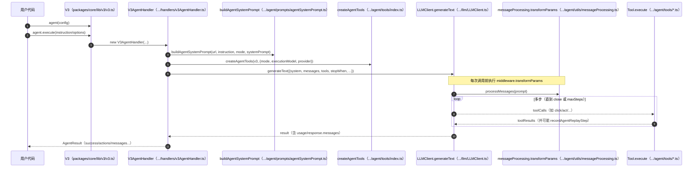
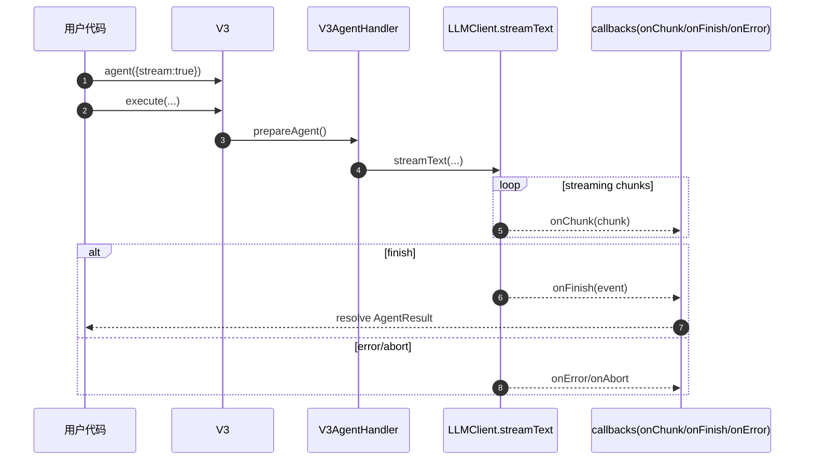
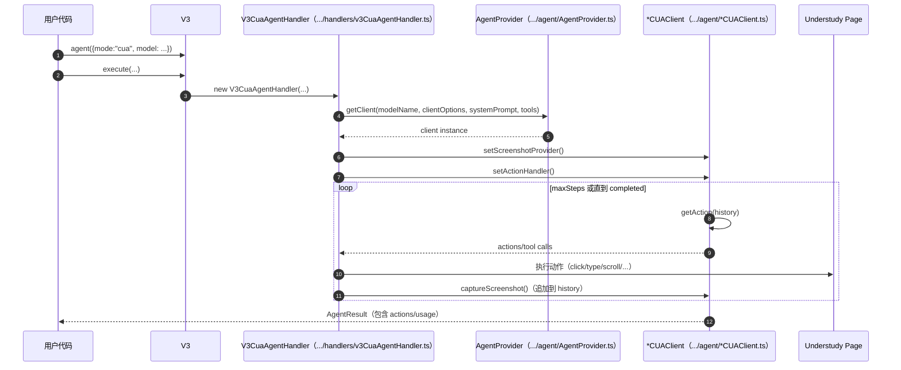
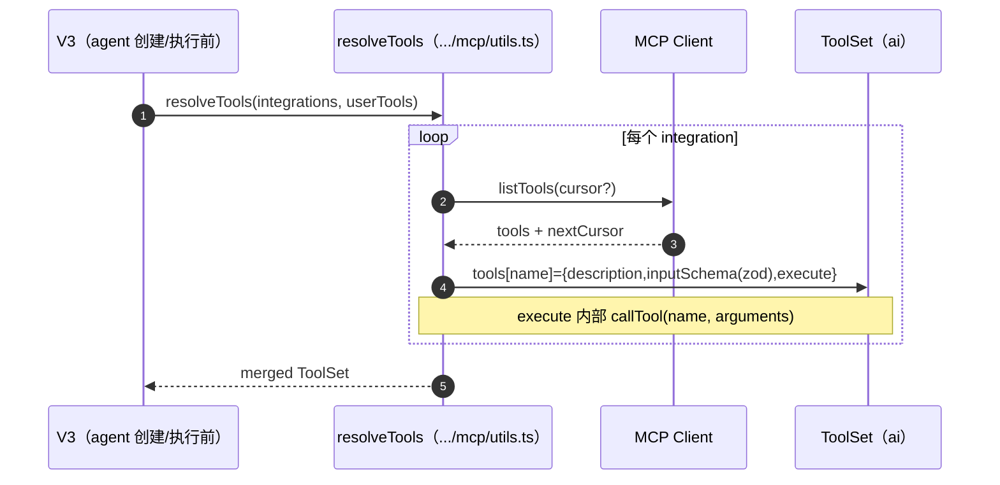

# Stagehand（packages/core）Agent 架构详解（含时序图）

> 版本基线：`@browserbasehq/stagehand@3.0.6`（以本机 `stagehand/packages/core/package.json` 为准）  
> 本文只分析 Stagehand 项目：`/Users/zhao/Documents/01.Code/Github/stagehand/packages/core`  
> **路径约定**：文中所有“代码所在位置（相对路径）”均以 **Stagehand 仓库根目录** 为起点（例如 `packages/core/lib/v3/v3.ts`）。

## 1. 总览：Stagehand 如何“构建一个 agent”

Stagehand 的 v3 agent 有两条核心实现路径：

1. **AI SDK Tool-Calling Agent（默认）**  
   - mode：`"dom"` / `"hybrid"`  
   - 基本形态：LLM 在一个多 step 循环中产生 toolCalls → SDK 执行工具 → 把 toolResults 继续喂回 LLM。  
   - 入口：`packages/core/lib/v3/v3.ts` 的 `V3.agent(options?: AgentConfig)`  
   - 执行器：`packages/core/lib/v3/handlers/v3AgentHandler.ts`（`V3AgentHandler`）

2. **Computer Use Agent（CUA，实验/可选）**  
   - mode：`"cua"`（或已弃用的 `cua: true`）  
   - 基本形态：走各厂商 Computer Use API（OpenAI Responses / Anthropic beta messages / Google GenAI / Microsoft FARA 风格），LLM 直接产出“电脑动作/函数调用” → Stagehand 执行动作 → 追加截图/函数结果 → 再次请求模型，直到完成。  
   - 入口同上：`packages/core/lib/v3/v3.ts` 的 `V3.agent()` 内部分支  
   - 执行器：`packages/core/lib/v3/handlers/v3CuaAgentHandler.ts`（`V3CuaAgentHandler`）  
   - 各 provider client：`packages/core/lib/v3/agent/*CUAClient.ts`

两条路径共同点：

- 都暴露统一的用户接口：`const agent = stagehand.agent({ ...config })`，然后 `await agent.execute(...)`。
- 都会把“本次 instruction + 多轮上下文 + 工具描述/Schema”送进 LLM，循环直到“完成”或达到 `maxSteps`。
- 都有“上下文压缩/截断”策略，避免截图/ARIA tree 把上下文撑爆。
- 都支持“自定义 tools”，并且支持把 MCP（Model Context Protocol）服务端的工具动态加载为本地可调用工具。
- 都支持“缓存/重放”（cache & replay）：把 LLM 产生的动作记录为可重放步骤，命中缓存时不再调用 LLM。

---

## 2. 关键类型与配置（AgentConfig / 执行选项）

### 2.1 AgentConfig（创建 agent 时）

代码位置：`packages/core/lib/v3/types/public/agent.ts`

关键字段（简化说明）：

- `systemPrompt?: string`：自定义系统提示词（AI SDK 路径会注入 `buildAgentSystemPrompt()`；CUA 路径会作为 userProvidedInstructions 传入各 client）。
- `tools?: ToolSet`：用户自定义工具（本地工具集合，AI SDK 的 ToolSet 形状）。
- `integrations?: (Client | string)[]`：MCP integrations（动态拉取 MCP server 的 tool 列表，拼进 ToolSet）。
- `model?: string | AgentModelConfig`：agent 使用的 LLM（AI SDK 路径用它决定推理模型；CUA 路径要求是 CUA model）。
- `executionModel?: string | AgentModelConfig`：仅用于“工具执行”（如 `act` 内部的模型），AI SDK 路径会传入 agent tools。
- `mode?: "dom" | "hybrid" | "cua"`：工具模式/agent 模式。
- `stream?: boolean`：是否以 stream 方式执行（仅 AI SDK 路径使用）。
- `cua?: boolean`：**deprecated**，等价于 `mode:"cua"`。

### 2.2 AgentExecuteOptionsBase（执行 agent 时）

代码位置：`packages/core/lib/v3/types/public/agent.ts`

关键字段：

- `instruction: string`：本次任务指令（用户目标）。
- `maxSteps?: number`：最大循环次数（AI SDK 默认 20；CUA 默认 10，见各 client）。
- `page?: PlaywrightPage | PuppeteerPage | PatchrightPage | V3 Page`：可指定要操作的 page（Stagehand 会 normalize 成内部 V3 Page）。
- `highlightCursor?: boolean`：hybrid 模式下默认会注入 cursor overlay（可关闭）。
- `messages?: ModelMessage[]`：用于“延续对话”（AI SDK 路径的 continuation 机制）。
- `signal?: AbortSignal`：取消执行（AI SDK 路��会向 `generateText/streamText` 传 `abortSignal`）。

---

## 3. AI SDK Tool-Calling Agent：构建与执行细节

### 3.1 入口：V3.agent() 分支选择

代码位置：`packages/core/lib/v3/v3.ts`

核心逻辑：

- 判断 `isCuaMode = options?.mode === "cua" || options?.cua === true`
- 不是 CUA：走 `V3AgentHandler`（AI SDK tool-calling）
- 是 CUA：走 `V3CuaAgentHandler + AgentProvider + *CUAClient`

### 3.2 AI SDK 路径：准备执行上下文（prepareAgent）

代码位置：`packages/core/lib/v3/handlers/v3AgentHandler.ts`

关键步骤（`V3AgentHandler.prepareAgent()`）：

1. 规范化 options：`instructionOrOptions` 允许传字符串或对象。
2. 读取当前页 URL：`initialPageUrl = (await v3.context.awaitActivePage()).url()`（用于 system prompt）。
3. **生成 system prompt**：调用 `buildAgentSystemPrompt({...})`  
   - 代码位置：`packages/core/lib/v3/agent/prompts/agentSystemPrompt.ts`
4. 生成工具集合：`createTools()` → `createAgentTools(...)`  
   - 代码位置：`packages/core/lib/v3/agent/tools/index.ts`
5. 合并工具：`allTools = { ...tools, ...this.mcpTools }`
6. 生成初始 messages：  
   - 若 `options.messages` 存在：`[...options.messages, {role:"user", content: instruction}]`  
   - 否则：`[{role:"user", content: instruction}]`
7. 用 `wrapLanguageModel` 包装底层模型，并加 middleware：
   - `transformParams`：对 prompt 做压缩处理（见 “内容压缩” 章节）  
     - 代码位置：`packages/core/lib/v3/agent/utils/messageProcessing.ts`
   - `SessionFileLogger.createLlmLoggingMiddleware`：记录 LLM 请求/响应（调试）
     - 代码位置：`packages/core/lib/v3/flowLogger.ts`（相关 middleware 工厂）

> 结论：AI SDK 路径的 “agent 构建” 本质是构建一个 `AgentContext`：`{ systemPrompt, allTools, messages, wrappedModel, maxSteps, ... }`。

### 3.3 AI SDK 路径：执行循环（generateText / streamText）

代码位置：`packages/core/lib/v3/handlers/v3AgentHandler.ts`

核心调用（非 streaming）：

- `llmClient.generateText({ model: wrappedModel, system: systemPrompt, messages, tools: allTools, stopWhen, toolChoice:"auto", onStepFinish, ... })`

核心调用（streaming）：

- `llmClient.streamText({ model: wrappedModel, system: systemPrompt, messages, tools: allTools, stopWhen, toolChoice:"auto", onStepFinish, onChunk, onFinish, ... })`

停止条件（`handleStop()`）：

- 如果某一步工具调用中出现 `close`：立即停止
- 否则用 `stepCountIs(maxSteps)` 到达最大步数停止

#### close 工具如何“标记任务完成”

代码位置：`packages/core/lib/v3/handlers/v3AgentHandler.ts`（`createStepHandler`）

当某一步 `toolCall.toolName === "close"`：

- `state.completed = true`
- 如果 `args.taskComplete` 为真：将 `state.finalMessage` 设为已收集 reasoning + close 自带 reasoning

> 这意味着：AI SDK 路径中，“完成”是由 agent 主动调用 `close` 工具来宣告的（提示词里也强制要求这么做）。

### 3.4 actions 如何生成与“脱敏/瘦身”

AI SDK 路径会把每一次 toolCall/toolResult 转成 `AgentAction[]`，最终汇总到 `AgentResult.actions`。

- 映射逻辑：`packages/core/lib/v3/agent/utils/actionMapping.ts`（`mapToolResultToActions()`）
  - `act`：会把底层返回的 `playwrightArguments` 提取出来，便于调试/重放
  - `fillForm`：会拆成一个 `fillForm` action + N 个 `act` action（对应内部 observe 的 deterministic actions）
  - 其他工具：走默认 `createStandardAction`
- 特殊瘦身：
  - `screenshot`：不会把 base64 结果塞进 action（只标记 `result:"screenshotTaken"`），避免 `actions` 过大
  - `ariaTree`：不会把 toolResult 的巨大树结构塞进 action（避免 `actions` 过大）

相关位置：

- action 的生成点：`packages/core/lib/v3/handlers/v3AgentHandler.ts`（`createStepHandler()`）
- 最终消息拼接：`packages/core/lib/v3/handlers/v3AgentHandler.ts`（`consolidateMetricsAndResult()` 会把 input messages + response messages 组合为 `AgentResult.messages`，用于 continuation）

---

## 4. instructions（系统提示词）如何生成：buildAgentSystemPrompt

代码位置：`packages/core/lib/v3/agent/prompts/agentSystemPrompt.ts`

`buildAgentSystemPrompt(options)` 输入：

- `url`：执行起始 URL（来自 active page）
- `executionInstruction`：本次用户 instruction（作为 `<goal><![CDATA[...] ]]>`）
- `mode`：`"dom"` 或 `"hybrid"`（影响工具清单与策略）
- `systemInstructions?: string`：来自 `AgentConfig.systemPrompt`（会注入 `<customInstructions><![CDATA[...] ]]>`）
- `isBrowserbase?: boolean`：Browserbase 环境下开启 captcha 相关提示

输出：一个 XML-ish 的 `<system>...</system>` 文本，关键结构：

- `<task><goal>...</goal><date ...>...</date></task>`
- `<page><startingUrl>...</startingUrl></page>`
- `<tools>...`：按 mode 输出不同工具列表（并按 `BRAVE_API_KEY` 决定是否加入 `search`）
- `<strategy>...`：按 mode 输出不同策略（`hybrid` 优先 click/type；`dom` 优先 ariaTree+act）
- `<completion>...`：要求完成时说明结果，并使用 `close` 结束

**工具清单与环境条件**

- `search`：只有 `process.env.BRAVE_API_KEY` 存在才会：
  - 在 prompt 的 `<tools>` 中出现
  - 在工具注册里出现（见 `createAgentTools`）

---

## 5. 内容压缩（压缩 prompt 体积 / 压缩 history）

Stagehand 对“上下文爆炸”的主要来源（截图、ARIA tree、tool 输出）做了分层处理：

### 5.1 AI SDK 路径：压缩 tool 消息内容（processMessages）

代码位置：`packages/core/lib/v3/agent/utils/messageProcessing.ts`

触发点：`V3AgentHandler.prepareAgent()` 里 `wrapLanguageModel(...middleware.transformParams)`

策略（对 `params.prompt` 的 tool message 进行替换）：

- `screenshot`：**只保留最近 2 次**，更旧的截图 tool result 会被替换为：
  - `"screenshot taken"`
- `ariaTree`：**只保留最近 1 次**，更旧的 ariaTree tool result 会被替换为：
  - `"ARIA tree extracted for context of page elements"`

这样做的目的：

- 让 LLM 保留“最近页面状态”的关键上下文，同时避免把历史截图/ARIA tree 累积进 prompt。

### 5.2 CUA 路径：压缩“历史图像内容”（imageCompression）

代码位置：`packages/core/lib/v3/agent/utils/imageCompression.ts`

#### Anthropic CUA

- 调用点：`packages/core/lib/v3/agent/AnthropicCUAClient.ts`（执行 step 前/构建 nextInputItems 时）
- 策略：`compressConversationImages(items, keepMostRecentCount=2)`
  - 只保留最近 `N` 个“带 image 的 item”，更旧的 image 替换为 `"screenshot taken"`

#### Google CUA

- 调用点：`packages/core/lib/v3/agent/GoogleCUAClient.ts`（`executeStep()` 开头）
- 策略：`compressGoogleConversationImages(history, keepMostRecentCount=2)`
  - 识别 `inlineData` 图片、functionResponse 中的图片数据，并进行替换/清空

#### OpenAI CUA

- 调用点：`packages/core/lib/v3/agent/OpenAICUAClient.ts`（`getAction()`）
- 策略：在请求参数中直接设置 `truncation: "auto"` 交给 OpenAI 侧截断历史（Stagehand 本地未对 OpenAI history 做二次压缩）。

### 5.3 附：日志预览截断（不影响模型）

代码位置：`packages/core/lib/v3/flowLogger.ts`

`formatLlmPromptPreview` / `formatCuaPromptPreview` 只截断用于日志显示的预览字符串，避免 log 文件过大；不会改变真正发给模型的 payload（AI SDK 路径真正改变 payload 的是 `processMessages`）。

---

## 6. tools 如何管理：内置工具、自定义工具、MCP 工具

Stagehand 的“工具管理”可以拆成三层：

1. **内置工具（Stagehand 自带）**
2. **用户自定义工具（AgentConfig.tools）**
3. **MCP 动态工具（AgentConfig.integrations）**

### 6.1 内置工具：tool() + zod + execute()

典型例子：click 工具  
代码位置：`packages/core/lib/v3/agent/tools/click.ts`

模式：

- 使用 `ai` 的 `tool({ description, inputSchema: z.object(...), execute })`
- 在 `execute` 中调用 Stagehand 的 page/understudy 能力，例如 `page.click(x, y)`
- 同时进行日志记录 `v3.logger(...)`
- 以及（关键）把动作记录到 “agent replay”：
  - `v3.recordAgentReplayStep({ type: "act" | "goto" | "wait" | ... })`
  - 这为缓存/重放提供数据来源（见 “缓存与重放”）

内置工具聚合与过滤：  
代码位置：`packages/core/lib/v3/agent/tools/index.ts`

`createAgentTools(v3, options)`：

- 先构建 `allTools`（包括 `act/ariaTree/screenshot/goto/wait/navback/scroll/...`）
- `search` 只有 `BRAVE_API_KEY` 存在才会加入
- 根据 `mode` 调整工具集合（`filterToolsByMode`）：
  - `mode:"dom"`：删除坐标系工具（`click/type/dragAndDrop/clickAndHold/fillFormVision`），保留 `act/fillForm`
  - `mode:"hybrid"`：删除 `fillForm`，保留坐标系工具，并把 `scroll` 切换到 `scrollVisionTool`

#### 坐标归一化（hybrid / 部分 CUA provider）

在坐标系工具中，Stagehand 会对部分 provider 的坐标输出做归一化处理，典型是 Google 模型（常见输出范围为 0-1000）。

- 代码位置：`packages/core/lib/v3/agent/utils/coordinateNormalization.ts`
  - `isGoogleProvider(provider?: string)`
  - `normalizeGoogleCoordinates(x, y)`：把 0..1000 映射到默认 viewport（1288x711）
  - `processCoordinates(x, y, provider)`：按 provider 决定是否归一化

使用点示例：

- `packages/core/lib/v3/agent/tools/click.ts`：`processCoordinates(...)` 后再 `page.click(processed.x, processed.y, ...)`

### 6.2 用户自定义工具：AgentConfig.tools

AI SDK 路径（tool-calling）：

- 合并方式：`allTools = { ...createAgentTools(...), ...mcpTools }`
- 代码位置：`packages/core/lib/v3/handlers/v3AgentHandler.ts`

CUA 路径（各厂商适配）：

- OpenAI：把自定义 tool 变成 Responses API 的 `tools: [{ type:"function", name, function:{...} }]`  
  - 代码位置：`packages/core/lib/v3/agent/OpenAICUAClient.ts`（`getAction()`）
  - 工具执行：遇到 `function_call` 时本地 `tool.execute()`，再回传 `function_call_output`（同文件 `takeAction()`）
- Anthropic：把 Zod schema 转 JSON schema，再作为 `input_schema` 传给 Anthropic `messages.create`  
  - 代码位置：`packages/core/lib/v3/agent/AnthropicCUAClient.ts`（`getAction()`）
- Google：把 ToolSet 转为 `functionDeclarations` 并放进 `generateContentConfig.tools`  
  - 代码位置：`packages/core/lib/v3/agent/GoogleCUAClient.ts`（`updateGenerateContentConfig()`）
  - 转换逻辑：`packages/core/lib/v3/agent/utils/googleCustomToolHandler.ts`（`convertToolSetToFunctionDeclarations()`）
  - 执行逻辑：`executeGoogleCustomTool()` 生成 `functionResponse` 回填给模型（同文件）
- Microsoft（FARA）：这条路径不是“标准 tool calling”，而是把单一 “computer_use” schema 拼进 system prompt，并要求模型输出 `<tool_call>...</tool_call>`  
  - 代码位置：`packages/core/lib/v3/agent/MicrosoftCUAClient.ts`（`generateSystemPrompt()` + `parseThoughtsAndAction()`）

### 6.3 MCP 工具：AgentConfig.integrations（resolveTools）

代码位置：`packages/core/lib/v3/mcp/utils.ts`

工作方式：

1. 遍历 integrations：每个元素可为：
   - MCP Client 实例，或
   - server 连接字符串（通过 `connectToMCPServer()` 连接）
2. 调用 `client.listTools({ cursor })` 拉取工具列表（支持分页）
3. 对每个 MCP tool：
   - `jsonSchemaToZod(tool.inputSchema)`：把 JSON schema 转成本地 zod（Stagehand 工具输入校验统一走 Zod）  
     - 代码位置：`packages/core/lib/utils`（`jsonSchemaToZod` 定义在 Stagehand util，调用点在 `mcp/utils.ts`）
   - 拼进 `ToolSet`：`tools[tool.name] = { description, inputSchema, execute }`
4. `execute(input)` 内部直接 `client.callTool({ name, arguments: input })`

> 结论：MCP 工具在 Stagehand 里被“本地化”为 AI SDK 的 ToolSet 条目，从 agent 视角看与本地 tools 无异。

---

## 7. 缓存与重放（AgentCache）：如何记录步骤、如何命中缓存

Stagehand 的 agent 缓存不是“缓存 LLM 的原始输出”，而是缓存 **可重放的动作序列**（AgentReplayStep），命中缓存时按步骤重放，从而避免再次调用模型。

### 7.1 AgentCache：签名与 cache key

代码位置：`packages/core/lib/v3/cache/AgentCache.ts`

`buildConfigSignature(agentOptions?: AgentConfig)` 会把以下内容序列化进 signature（用于 cache key）：

- v3 默认 model（`v3Model`）与默认 systemPrompt
- agent 是否 CUA（`agent.cua`）
- `agent.model` / `agent.executionModel`（CUA 不使用 executionModel）
- `agent.systemPrompt`
- `toolKeys`（仅 tool 名字列表）
- `integrations`（server 字符串/“client”占位）

同时会对 model options 做敏感字段过滤：`apikey/api_key/api-key`（`SENSITIVE_CONFIG_KEYS`）。

最终 `cacheKey` 由以下内容 sha256 得到：

- `instruction`（trim 后）
- `startUrl`
- `sanitized execute options`（只保留 `maxSteps/highlightCursor` 等安全字段）
- `configSignature`

### 7.2 步骤如何被记录：recordAgentReplayStep

关键方法：`V3.recordAgentReplayStep(step)`  
代码位置：`packages/core/lib/v3/v3.ts`

调用点（不完全列表，见 `rg recordAgentReplayStep`）：

- AI SDK 工具：`packages/core/lib/v3/agent/tools/*.ts`（`act/goto/wait/keys/scroll/click/type/...`）
- CUA handler：`packages/core/lib/v3/handlers/v3CuaAgentHandler.ts`（在动作执行后记录 replay step）

这些 step 最终被 `AgentCache.store()` 写入文件：`agent-<cacheKey>.json`（`CacheStorage` 管理）。

### 7.3 命中缓存：tryReplay / tryReplayAsStream

代码位置：`packages/core/lib/v3/cache/AgentCache.ts`

- `tryReplay(context)`：读取 cache entry，按 `entry.steps` 重放
- `tryReplayAsStream(context)`：把最终结果包一层 “fake stream result”，保证 API 形态一致
  - `createCachedStreamResult()` 会产出一个只 yield 一次 `message` 的 `textStream`

重放执行（`executeAgentReplayStep`）：

- `act`：优先走 deterministic action（`ActHandler.takeDeterministicAction`），否则回退到 `this.act(step.instruction)`
- `fillForm`：重放 observe 结果/动作列表
- `goto/scroll/wait/navback/keys`：按 recorded 参数执行
- `close/extract/screenshot/ariaTree`：重放时直接跳过（这些不会改变页面状态或不需要重放）

---

## 8. 时序图（Mermaid）

### 8.1 AI SDK Agent（execute，非 streaming）



### 8.2 AI SDK Agent（stream）



### 8.3 CUA Agent（以 OpenAI/Anthropic/Google client 为代表的循环）



### 8.4 MCP 工具解析与注入（resolveTools）



### 8.5 缓存命中与重放（AgentCache）

```mermaid
flowchart TD
  A[Agent.execute/stream] --> B{AgentCache enabled?}
  B -- 否 --> C[正常调用 LLM/执行工具]
  B -- 是 --> D[prepareContext: instruction+startUrl+options+signature]
  D --> E{tryReplay 命中?}
  E -- 是 --> F[按 steps 重放: act/goto/scroll/wait/...]
  F --> G[返回 AgentResult(usage=0, metadata.cacheHit=true)]
  E -- 否 --> H[开始录制 beginRecording]
  H --> C
  C --> I{success 且有 steps?}
  I -- 是 --> J[store: agent-<cacheKey>.json]
  I -- 否 --> K[丢弃/不写缓存]
```

---

## 9. 关键“实现细节”索引（按主题汇总路径）

### 9.1 Agent 入口与分支

- `packages/core/lib/v3/v3.ts`：`V3.agent()`，决定走 AI SDK 还是 CUA 路径
- `packages/core/lib/v3/handlers/v3AgentHandler.ts`：AI SDK tool-calling agent 执行器
- `packages/core/lib/v3/handlers/v3CuaAgentHandler.ts`：CUA 执行器（把 screenshot/action 回调注入 client）

### 9.2 instructions / system prompt

- `packages/core/lib/v3/agent/prompts/agentSystemPrompt.ts`：`buildAgentSystemPrompt()`（AI SDK 路径）
- `packages/core/lib/prompt.ts`：`buildGoogleCUASystemPrompt()` / `buildCuaDefaultSystemPrompt()`（CUA 默认提示词片段）
- `packages/core/lib/v3/agent/MicrosoftCUAClient.ts`：`generateSystemPrompt()`（FARA 风格：schema+XML tool_call）

### 9.3 内容压缩（prompt/history）

- `packages/core/lib/v3/agent/utils/messageProcessing.ts`：AI SDK prompt 压缩（保留最近 screenshot/ariaTree）
- `packages/core/lib/v3/agent/utils/imageCompression.ts`：CUA history 图片压缩（Anthropic/Google/OpenAI）

### 9.4 工具管理（内置 tools / 自定义 tools / MCP）

- `packages/core/lib/v3/agent/tools/index.ts`：内置工具注册与按 mode 过滤
- `packages/core/lib/v3/agent/tools/*.ts`：各工具定义（zod + execute）
- `packages/core/lib/v3/mcp/utils.ts`：`resolveTools()`，把 MCP tools 转为本地 ToolSet
- `packages/core/lib/v3/agent/utils/googleCustomToolHandler.ts`：Google CUA 的自定义工具声明与执行适配

### 9.5 缓存/重放

- `packages/core/lib/v3/cache/AgentCache.ts`：cache key、store、tryReplay、replay 执行细节
- `packages/core/lib/v3/v3.ts`：`recordAgentReplayStep()` 等对外挂钩

---

## 10. 实际落地时的注意点（工程视角）

1. **AI SDK 路径依赖 `close` 工具作为“完成信号”**：若模型没调用 close，会被 `maxSteps` 强行截断（结果可能不完整）。
2. **mode 会同时影响“提示词策略”和“可用工具集合”**：`hybrid` 更适合 screenshot+坐标交互，`dom` 更适合 ariaTree+act。
3. **自定义 tools 在 CUA 路径需要“再适配”**：不同 provider 的工具 schema/返回格式不同，Stagehand 已分别实现适配，但新增 provider 或新增 schema 类型时要特别注意。
4. **压缩策略会改变历史可见信息**：例如只保留最近一次 ariaTree，意味着模型对更早页面结构的记忆只能靠文本摘要而非原始树。
5. **缓存是“重放动作”而非“重放模型输出”**：这提升了确定性，但也意味着缓存命中时不会再次“推理”，页面状态变化大时可能需要禁用缓存或加入更强的签名条件。
