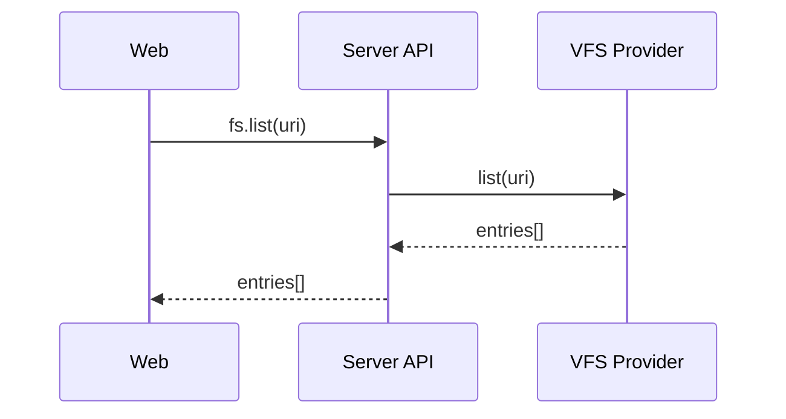
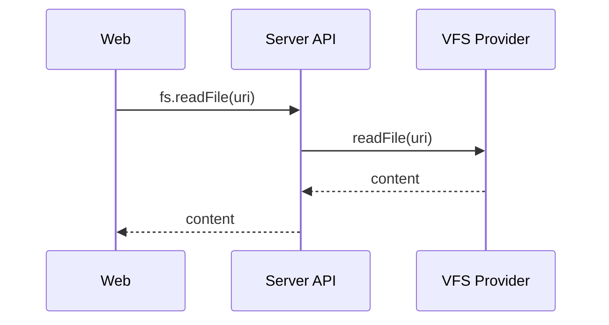
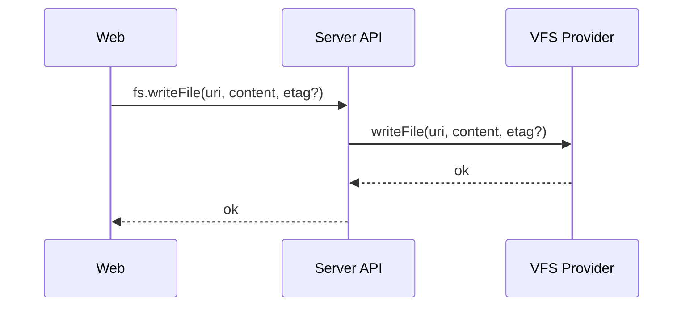
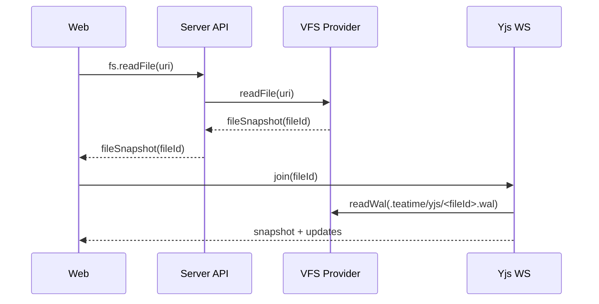
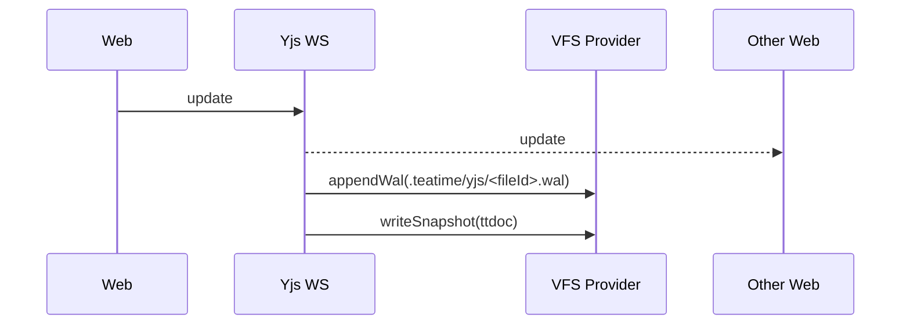

# 项目文件系统化 + Yjs 协作（文件为真）方案

## 目标与约束
- 不使用数据库保存任何项目/内容/协作数据，全部落到文件系统。
- Project 以文件夹为根，单 root。
- Project 配置与 intro 也存文件（随项目移动/拷贝）。
- 默认存储路径：workspace 配置根目录下，每个 Project 一个文件夹。
- 内容搜索默认仅当前 Project root。
- 协作采用 Yjs，多人实时同步。
- 浏览器侧用 IndexedDB 作为缓存。
- 支持 URI 超链接关联（跨本地/远端/容器/WSL 等）。

## 关键决策
- **统一资源标识**：使用 URI（`file://` / `teatime-remote://`）。
- **文件系统为唯一真相**：协作状态、文档内容、项目配置均可仅凭文件恢复。
- **Yjs 持久化纯文件化**：
  - 文档快照写回文件本体（`*.ttdoc/*.ttcanvas/*.ttskill`）。
  - 增量写入 WAL（`.teatime/yjs/<fileId>.wal`），仅作为可靠性与性能加速。
- **fileId 写在文件头**：移动/改名不丢协作链路。

## Project 结构与发现
### 目录结构示意（含附件）
```
<workspaceRoot>/
  <projectRoot>/
    .teatime/
      project.json
      yjs/
        <fileId>.wal
        <fileId>.lock
      index/
        <fileId>.txt
    docs/
      demo.ttdoc
      demo.ttdoc.teatime/
        2f6c.png
        83a1.mp4
      canvas.ttcanvas
      canvas.ttcanvas.teatime/
        9a1f.bin
```

### project.json（项目配置）
```json
{
  "schema": 1,
  "projectId": "proj_xxx",
  "title": "Demo",
  "intro": { "kind": "resource", "targetId": "file://...", "component": "canvas", "pageType": "canvas" },
  "childrenIds": ["sub-project-a", "sub-project-b"]
}
```

### Project Root 计算规则
1) 以 `apps/server/teatime.conf` 中激活 workspace 的 `projects` 映射为准。  
2) `projects` 结构为 `{ [projectId]: "file://..." }`，值即项目 rootUri。  
3) projectId 在 rootUri 下的 `.teatime/project.json` 内声明（用于显示信息）。  
4) `childrenIds` 仍用于递归构建子项目树（子项目目录名）。  
5) 不再使用 `.teatime/<projectId>.ttid` 标记文件。  

workspaceRootUri 已下放为 `workspaces[].rootUri`。

## 文件系统（VFS）设计
统一接口（按 scheme 分发）：
- `stat(uri)`
- `list(uri)`
- `readFile(uri)`
- `writeFile(uri, content)`
- `mkdir(uri)`
- `rename(from, to)`
- `delete(uri)`
- `watch(uri, onChange)`
- `search(uri, query, options)`

Provider 注册表示例：
- `file://`（本地，Electron 主进程）
- `teatime-remote://ssh-remote+host/`（SSH）
- `teatime-remote://dev-container+id/`（容器）
- `teatime-remote://wsl+Ubuntu/`（WSL）

## 自定义文件格式（文件为真）
可协作文件：
```
*.ttdoc / *.ttcanvas / *.ttskill
```

文件本体为 JSON，包含快照（可脱离任何数据库恢复）：
```json
{
  "schema": 1,
  "fileId": "01J8E6H2QZ8Y3E8N9W8Z0F5A7G",
  "type": "ttdoc",
  "title": "文稿标题",
  "snapshot": "base64(yjs-doc)",
  "assets": {
    "img_1": { "path": "./demo.ttdoc.teatime/2f6c.png", "mime": "image/png" },
    "video_1": { "path": "./demo.ttdoc.teatime/83a1.mp4", "mime": "video/mp4" }
  },
  "searchText": "用于全文检索的纯文本"
}
```

### 资源与附件存储规则
- 附件与二进制资源存放在同名目录：`<file>.ttdoc.teatime/`。
- 资源目录后缀固定为 `.teatime`，与文件同级，不做嵌套分组。
- JSON 内部使用相对路径引用，保证移动/拷贝项目不丢资源。
- 文件名建议使用 hash/uuid，避免重名冲突并支持去重。
- 重命名文件时同步重命名资源目录，删除文件时同步删除资源目录。
- 复制文件时复制一份资源目录，避免共享导致误删。

### 复制冲突处理
当发现同一个 `fileId` 对应多个不同 URI：
- 复制出的文件生成新 `fileId` 并回写文件头。
- WAL 以新 `fileId` 重新开始。

## Yjs 协作与持久化流程（纯文件）
### 打开文件
1) 读取 `*.ttdoc` 文件，解析 `snapshot` 与 `fileId`。  
2) 若存在 `.teatime/yjs/<fileId>.wal`，依次回放增量。  
3) 合并生成 Yjs Doc，加入 WS 协作。

### 编辑中
- 客户端产生 update → WS → server 广播。
- server 追加写入 WAL（`.teatime/yjs/<fileId>.wal`）。
- 客户端写入 IndexedDB（缓存/离线）。

### 快照与 GC
- 触发条件：更新数量/体积阈值或定时。
- 合并：`snapshot + wal → 新 snapshot`，回写到文件本体。
- 写入采用 `tmp + rename`，保证原子性。
- 成功后清空 WAL。
- `searchText` 在每次快照合并时重建并写回文件本体。

### 文件移动/改名
只要文件头里的 `fileId` 不变：
- 协作链路不受影响。
- WAL 按 `fileId` 定位，不依赖 URI。

### 文件删除
- 删除文件后，清理：
  - `.teatime/yjs/<fileId>.wal`
  - `.teatime/yjs/<fileId>.lock`

### 并发与锁
- 同一 `fileId` 仅允许一个 server writer，使用 `.lock` 文件做互斥。
- 失败时可降级为只读或拒绝打开。

### WAL 格式与截断策略
- WAL 为追加写文件，内容是 Yjs update 的二进制字节序列。
- WAL 只保存二进制更新，不额外存 JSON 结构。
- 建议具备可恢复结构：文件头 + 追加帧。
- 帧结构建议包含 `length + type + payload + crc`，便于检测尾部半写入。
- 截断触发条件：体积/条数/时间阈值（如 5MB / 500 updates / 30min）。
- 截断流程：`snapshot + wal → 新 snapshot`，用 `tmp + rename` 原子替换文件本体，成功后清空 WAL。

## IndexedDB 缓存（浏览器侧）
用途：提升打开速度与离线恢复。
建议存储：
```json
{
  "fileId": "...",
  "stateVector": "...",
  "updates": [...],
  "cachedAt": "..."
}
```
策略：
- 优先用 IDB 快速恢复，再对比 WAL 补齐。
- IDB 永远不是协作“权威”，仅做本地缓存。

## 搜索方案（参考 VSCode）
VSCode 的内容搜索核心是 **ripgrep**（`rg --json`）。

### 当前 Project root 搜索（默认）
- `rg --json <query> <projectRoot>`
- `searchText` 位于文件本体，可被 `rg` 检索。

### 文本索引（可选）
如需更快/更小体积，可维护派生索引：
- `.teatime/index/<fileId>.txt`
- 快照合并或空闲时更新索引
- 搜索时同时扫描 `.teatime/index/`

### 文件名搜索
直接对目录树进行过滤，不依赖全文索引。

## 超链接关联
文件内可直接存 URI：
- `file://...`
- `teatime-remote://ssh-remote+host/...`

可选：提供 `*.ttlink` 文件作为“链接占位节点”，内容仅为 URI。

## Web 端文件系统展示方案
### 数据来源
- `project.list`：读取 workspace 配置中的 projects 映射。
- `fs.list`：列出指定 URI 的目录内容。
- `fs.stat`：单文件/目录信息（大小、时间、类型）。
- `fs.search`：在当前 project root 内搜索。

### UI 结构（建议）
- 左侧 Sidebar 继续显示项目列表，并把 **项目 root** 作为树的顶层节点。
- 展开项目 root 后，显示该项目的文件系统树（目录/文件）。
- Project Tab（intro/canvas等）保持原有展示逻辑，文件树是资源入口，不改变项目面板结构。

### Tree 节点模型
```ts
type FileNode = {
  uri: string;
  name: string;
  kind: "project-root" | "folder" | "file";
  ext?: string;
  size?: number;
  updatedAt?: string;
  children?: string[];
};
```

### 展示与交互流程
1) 进入 workspace → 扫描项目列表。  
2) 渲染项目 root 节点（未展开时不拉子树）。  
3) 用户展开目录 → 调用 `fs.list(rootUri)` → 填充子节点。  
4) 目录继续 lazy load，减少首屏压力。  

### 点击行为
- 点击 **项目 root**：打开 Project Tab（intro）。  
- 点击 **文件**：根据扩展名打开对应组件：
  - `ttdoc` → 文稿组件（Yjs）
  - `ttcanvas` → 画布组件（Yjs）
  - `ttskill` → 技能组件
  - 其它 → 预览组件
- 点击 **目录**：仅展开/折叠。

### 基础操作（右键/菜单）
- 新建文件/文件夹
- 重命名
- 删除
- 复制 URI/相对路径
- 刷新目录

### 缓存与刷新
- 使用 React Query 或 store 维持：
  - `nodeMap`（uri → node）
  - `expandedMap`（展开状态）
  - `loadingMap`（拉取状态）
- 若 provider 支持 `watch`，则用事件增量更新；否则通过 Refresh 或搜索结果刷新。

### 搜索入口
- 搜索面板默认传入当前 project rootUri。
- 本地 `rg` 扫描该 root。
- 如启用索引，附加扫描 `.teatime/index/`。

### Web 与 Server 通信链路
- 项目列表：Web → `project.list`（tRPC/HTTP）。
- 目录树：
  1) Web 展开目录 → `fs.list({ uri })`
  2) Server 选中 Provider → `list`
  3) Web 缓存节点并渲染
- 普通文件：
  1) Web → `fs.readFile({ uri })`
  2) Web 编辑 → `fs.writeFile({ uri, content })`
- 协作文件（ttdoc/ttcanvas/ttskill）：
  1) Web → `fs.readFile({ uri })` 读取 `fileId + snapshot`
  2) Web → `yjs-ws` 发送 `fileId` 加入协作
  3) Server → 读取文件快照 + 回放 WAL
  4) Server → Web 下发 snapshot + updates
- 搜索：Web → `fs.search({ rootUri, query })`（Server 内部使用 `rg --json`）
- 监听：Web → `fs.watch({ uri })`（SSE/WS 推送）

## 时序图
### 目录展开（lazy load）


### 打开普通文件


### 保存普通文件


### 打开协作文件（ttdoc/ttcanvas）


### 编辑同步与快照


## API 清单（建议）
### fs.*
- `fs.stat({ uri })`
- `fs.list({ uri })`
- `fs.readFile({ uri })`
- `fs.writeFile({ uri, content, etag? })`
- `fs.mkdir({ uri })`
- `fs.rename({ from, to })`
- `fs.delete({ uri })`
- `fs.search({ rootUri, query, options })`
- `fs.watch({ uri })`（SSE/WS）

### project.*
- `project.list()`（读取 workspace projects）

## 方案修改计划（执行清单）
规则：以下清单是落地执行的唯一计划；每完成一步必须在本文件将对应项更新为 `- [x]`；不兼容旧数据，旧代码可直接删除或改名。

- [x] Prisma：在 `packages/db/prisma/schema/chat.prisma` 的 `ChatSession` 添加 `resourceUris` 字段，作为后续资源关联入口。
- [x] Prisma：删除 `packages/db/prisma/schema/schema.prisma` 的 `Tag`/`Page`/`Block`/`Board`/`Snapshot`/`Resource`/`PageChatSession`/`RelationType`，仅保留 `Setting`（Chat 相关模型放在 `packages/db/prisma/schema/chat.prisma`）。
- [x] 清理 DB 种子与脚本：删除 `packages/db/src/seed.ts` 中 Page/Tag 初始化，并移除 `apps/server/scripts/build-prod.mjs` 的 PageChatSession 清理语句。
- [x] 移除 DB 版页面/画布服务与路由：删除 `packages/api/src/services/pageService.ts`/`pageBlockService.ts`/`pageMarkdownService.ts`/`boardService.ts` 与 `packages/api/src/routers/page.ts`/`board.ts`。
- [x] 新增 file-based API：在 server 新增 `project.list`/`fs.*`（文件化实现），替换现有 Page/Board tRPC。
- [ ] Yjs WS 文件化落地：实现快照/WAL 读取与持久化写回。
- [x] 前端文件树替换 PageTree：改造 `apps/web/src/components/layout/sidebar/PageTree.tsx`、`apps/web/src/components/layout/sidebar/Page.tsx`、`apps/web/src/hooks/use-page.ts` 使用 `fs.list`/`fs.stat`，并按扩展名打开 `ttdoc/ttcanvas/ttskill`。
- [x] 项目 Intro/Board 改为文件格式：更新 `apps/web/src/components/project/intro/ProjectIntro.tsx`、`apps/web/src/components/project/intro/ProjectIntroPlate.tsx` 与 `apps/web/src/components/board/core/ProjectBoardCanvas.tsx` 走文件读写与 Yjs。
- [x] Chat 关联改为 resourceUris：调整 `apps/server/src/ai/chat-stream/*`/`packages/api/src/routers/chat.ts` 去掉 `pageChatSession`，并更新 `apps/web/src/components/chat/session/SessionList.tsx` 按 `resourceUris` 过滤。
- [x] Tool/类型同步：更新 `packages/api/src/types/tools/db.ts`（项目相关 tool）与 `packages/api/src/types/message.ts` 的 params 语义，统一使用资源 URI。
- [ ] 搜索/索引落地：在 server 接入 `rg --json` 扫描与 `.teatime/index/` 更新策略，并在 Web 搜索入口调用 `fs.search`。

## 关键注意点
- 统一 URI 规范化，避免路径逃逸。
- `.teatime/` 目录对用户默认隐藏，但不可被忽略（含项目配置与 WAL）。
- 文档附件目录为 `<file>.teatime/`，与项目级 `.teatime/` 是不同概念。
- `fileId` 必须稳定且只存在于可协作文档。
- 远端 Provider 必须支持 `search` 和 `watch` 才能体验接近 VSCode。

## 仓库忽略建议（可选）
建议保留项目配置，忽略派生文件：
```
.teatime/yjs/*.wal
.teatime/yjs/*.lock
.teatime/index/
```
`project.json` 不应被忽略。
